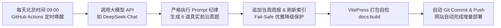

# AI 产品经理实战指南 (AI PM Guide)

<p align="center">
  <strong>专为 AI 产品经理（AI PM）打造的系统化实战知识库、面试指南与持续演进作品集</strong>
</p>

<p align="center">
  <a href="https://github.com/STRUGGLE1999/ai-pm-guide/actions/workflows/daily-interview-sync.yml"></a>
  <a href="https://github.com/STRUGGLE1999/ai-pm-guide/blob/main/LICENSE"></a>
  <a href="https://vitepress.dev/"></a>
</p>

---

## 🌐 线上访问入口

- 🚀 **Netlify 官方镜像**：[https://ai-pm-guide.netlify.app](https://ai-pm-guide.netlify.app)
- 📄 **GitHub Pages 镜像**：[https://struggle1999.github.io/ai-pm-guide/](https://struggle1999.github.io/ai-pm-guide/)
- 💻 **GitHub 仓库**：[STRUGGLE1999/ai-pm-guide](https://github.com/STRUGGLE1999/ai-pm-guide)

---

## 🧭 GitHub 站内全景直达导航 (In-Repo Navigator)

> 💡 **提示**：无需打开外部网站，你可以直接点击下方链接，在 GitHub 网页端无缝跳转阅读所有 Markdown 文档！

### 🎯 1. 面试指南与名企真题复盘（核心推荐）
| 模块 / 页面 | 说明 | GitHub 快速阅读入口 |
| :--- | :--- | :--- |
| **面试指南总览** | 结构化导读与四维准备体系 | [📖 查看总览](./docs/interview/index.md) |
| **5 大黄金答题框架** | 白板设计三问、RAG 评估、成本算账、写操作风控、跨职能协同 | [📐 5 大答题框架](./docs/interview/frameworks.md) |
| **经典分类题库导览** | 横向能力母题库索引 | [🗂️ 分类题库导览](./docs/interview/questions.md) |
| ├─ **AI 技术通识母题** | 模型认知、RAG 切分、Agent 边界、MCP 协议 | [🔬 技术通识题库](./docs/interview/questions/ai-tech.md) |
| ├─ **AI 原生产品设计** | 知识库、智能客服、AI 搜索、创意生成系统方案 | [🎨 原生设计题库](./docs/interview/questions/product-design.md) |
| ├─ **评测体系与数据治理** | 黄金集构建、LLM-as-a-Judge、指标看板设计 | [📊 评测与治理题库](./docs/interview/questions/eval-and-data.md) |
| ├─ **商业价值与 ROI** | 模型选型、单任务成本测算、数据安全合规 | [💰 商业与 ROI 题库](./docs/interview/questions/business-roi.md) |
| └─ **行为面试与团队协同** | 算法博弈、高危事故复盘、跨团队敏捷推进 | [🤝 行为面试题库](./docs/interview/questions/behavioral-projects.md) |
| **名企面经周报专栏总览** | 每周名企真实社招真题复盘与数据索引 | [🔥 面经专栏总览](./docs/interview/experiences/index.md) |
| ├─ **2026 年第 36 周周报** | 字节/阿里/美团/快手可灵/Kimi/小红书/滴滴真题（已扩容至 80+ 题） | [⚡ 2026-W36 周报](./docs/interview/experiences/2026-w36.md) |
| └─ **2026 年第 35 周周报** | 飞书多维表格、通义 Agent 记忆分层、华为金融写操作（40 题） | [⚡ 2026-W35 周报](./docs/interview/experiences/2026-w35.md) |
| **核心连环追问与避坑** | 大厂面试官常见深挖维度与应答策略 | [⚠️ 追问避坑复盘](./docs/interview/experience-summary.md) |
| **4 种 AI PM 角色定位** | 应用型、平台型、策略算法型、商业化型 PM | [👥 角色定位解析](./docs/interview/roles.md) |
| **简历与项目包装指南** | 工业级项目骨架改写范式与表达要点 | [📝 简历项目指南](./docs/interview/resume-projects.md) |

---

### 🧠 2. 概念学习与技术底座
| 专题模块 | 核心内容 | GitHub 快速阅读入口 |
| :--- | :--- | :--- |
| **AI 基础知识图谱** | 大模型、Prompt、RAG、Agent、多模态、MCP 最小技术常识 | [📘 AI 基础图谱](./docs/concepts/ai-basics.md) |
| **产品经理基本功** | 需求分析、用户研究、PRD 编写、指标体系与 ROI | [🛠️ 产品基本功](./docs/concepts/product-basics.md) |
| **AI 产品方法论** | 任务流重构、人机协同边界、置信度门禁 | [📐 产品方法论](./docs/concepts/product-foundations.md) |
| **AI 专项主题进阶** | Function Calling、向量数据库、模型路由、成本工程 | [🚀 AI 专项主题](./docs/concepts/ai-product-topics.md) |
| **模型评估与质量保障** | 离线 Benchmark、线上 A/B 测试、Bad Case 回流闭环 | [📈 模型评估与质量](./docs/concepts/model-evaluation.md) |
| **安全、合规与权限** | 敏感内容过滤、PII 脱敏、企业级 ACL 权限隔离 | [🛡️ 安全合规与权限](./docs/concepts/safety-and-compliance.md) |
| **计算机视觉实战体系** | 图像基础、目标检测、分割、多模态与工业落地 16 讲 | [👁️ 计算机视觉专栏](./docs/concepts/ai-tech/cv/index.md) |
| **深度学习与大模型底层** | 微积分与反向传播、Transformer、Pretrain、SFT 进阶 | [🧬 深度学习专栏](./docs/concepts/ai-tech/deep-learning/index.md) |
| **推理加速与边缘部署** | CUDA 通识、Triton、vLLM、TensorRT-LLM 部署工程 | [⚡ 推理加速专栏](./docs/concepts/ai-tech/deployment/index.md) |

---

### 💼 3. 产品实战案例库
| 垂直案例 | 场景与核心方案 | GitHub 快速阅读入口 |
| :--- | :--- | :--- |
| **AI 企业知识库** | 混合检索、Parent-Child 切块、动态权限注入 | [📚 AI 知识库](./docs/practice/ai-knowledge-base.md) |
| **智能客服 Bot** | 多轮意图路由、兜底降级、人工接管工单闭环 | [🤖 智能客服 Bot](./docs/practice/customer-service-bot.md) |
| **AI 智能搜索** | 语义检索召回、信源冲突裁决、UGC 分流保护 | [🔍 AI 搜索](./docs/practice/ai-search.md) |
| **Agent 工作流** | ReAct 规划循环、单工具熔断、全链路 Trace 观测 | [⚙️ Agent 工作流](./docs/practice/agent-workflow.md) |
| **AIGC 营销内容生成** | 批量素材裂变、A/B 增量归因、低效素材止血 | [✍️ 内容生成工具](./docs/practice/content-generation.md) |
| **销售线索处理 Agent** | 录音结构化提取、CRM 自动回写、商机分级 | [💼 销售 Agent](./docs/practice/sales-agent.md) |
| **会议纪要与待办提取** | 说话人分离、决议待办结构化抽取、飞书/钉钉集成 | [📝 会议纪要助手](./docs/practice/meeting-notes.md) |
| **智能合同审查** | 法律条款合规比对、风险等级高亮、修改建议回写 | [⚖️ 合同审查助手](./docs/practice/contract-review.md) |
| **智能报表与 Copilot** | Text-to-SQL、多维交叉分析、图表自动渲染 | [📊 智能报表助手](./docs/practice/smart-report.md) |
| **垂直行业落地合集** | 医疗、教育、电商智能决策、政务标书、数字陪伴等 | [🏥 行业落地合集](./docs/practice/index.md) |

---

### 🗺️ 4. 学习路线与精选资源
- 🚀 [7 天快速入门 AI 产品经理](./docs/roadmaps/7-day-starter.md)
- 📚 [30 天体系化进阶路线图](./docs/roadmaps/30-day-mastery.md)
- 🔄 [技术背景转型 AI PM 路线](./docs/roadmaps/tech-to-ai-pm.md)
- 🧭 [非技术/业务背景转型 AI PM 路线](./docs/roadmaps/non-tech-to-ai-pm.md)
- 🧰 [AI 工具箱与效率软件推荐](./docs/resources/tools.md)
- 🎓 [精选高质量公开课与经典必读教材](./docs/resources/courses.md)

---

## ⚡ 自动化 CI/CD 与大模型动态生成

本项目配置了完整的 **GitHub Actions 云端定时流水线（Daily Automation Pipeline）**：



- **工作流配置**：[`.github/workflows/daily-interview-sync.yml`](./.github/workflows/daily-interview-sync.yml)
- **核心同步脚本**：[`scripts/daily-interview-sync.mjs`](./scripts/daily-interview-sync.mjs)
- **运行保障**：内置 Fail-Safe 容错引擎，无 Key 或网络异常自动回退到内置名企题库池，确保流水线 100% 稳定运行。

---

## 💻 本地开发与预览

1. **克隆项目到本地**：
   ```bash
   git clone https://github.com/STRUGGLE1999/ai-pm-guide.git
   cd ai-pm-guide
   ```

2. **安装依赖**：
   ```bash
   npm install
   ```

3. **启动本地开发服务器**：
   ```bash
   npm run docs:dev
   ```
   启动后访问 `http://localhost:5173` 即可实时预览。

4. **手动测试每日面经同步脚本**：
   ```bash
   npm run sync:interview
   ```

5. **全站静态打包与构建**：
   ```bash
   npm run docs:build
   ```

---

## 📜 内容原则与价值观

1. **坚持原创与实战重构**：所有面经题目均结合一线业务场景、工程约束（幂等、权限、降级、时效）、指标口径与口述纪律进行了深度二次重构；
2. **纯粹学习分享**：本站不设付费课、不建收费群、不搞商业培训营；
3. **真实客观**：杜绝自吹自擂词汇与虚假数据，数据口述一律遵循「样本是 X、口径是 Y，严禁编造」规范。

---

## 📄 开源许可证 (License)

本项目采用 [Apache-2.0 License](./LICENSE) 开源协议授权。你可以自由地阅读、学习、分发与二次衍生，请保留原作者署名与版权声明。
