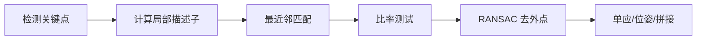

# 第二章 OpenCV 与经典图像处理

<figure class="article-figure">
  
  <figcaption>经典图像处理通常按读取、颜色转换、去噪、边缘、形态学和测量逐步推进，链路透明且容易验证。</figcaption>
</figure>

经典视觉不是“过时技术”。规则明确、环境稳定、样本很少、需要精确测量或解释时，OpenCV 往往比训练大模型更快、更便宜、更可靠。

## 2.1 卷积：局部邻域如何影响一个像素？

二维卷积/相关运算用一个小矩阵（核）在图像上滑动：

$$
Y(i,j)=\sum_m\sum_n X(i+m,j+n)K(m,n)
$$

例如均值核：

$$
K=\frac{1}{9}
\begin{bmatrix}
1&1&1\\
1&1&1\\
1&1&1
\end{bmatrix}
$$

每个输出像素是周围 3×3 像素的平均，因此图像变模糊。卷积核可以检测边缘、锐化、平滑，也构成 CNN 的核心算子。

### 2.1.1 Padding、Stride 与输出大小

对输入大小 $H\times W$、核大小 $K$、填充 $P$、步长 $S$：

$$
H_{out}=\left\lfloor\frac{H+2P-K}{S}\right\rfloor+1
$$

`padding="same"` 常用于保持空间尺寸；步长大于 1 会下采样。

## 2.2 平滑、去噪与锐化

| 方法 | 特点 | 适用 |
|---|---|---|
| 均值滤波 | 简单，会模糊边缘 | 轻度随机噪声 |
| 高斯滤波 | 按距离加权，较自然 | 通用平滑、Canny 前处理 |
| 中值滤波 | 用中位数替代 | 椒盐噪声 |
| 双边滤波 | 同时考虑距离与颜色 | 保边去噪，计算较慢 |
| 非局部均值 | 利用重复纹理 | 更强去噪，成本高 |

```python
import cv2
import numpy as np

img = cv2.imread("image.jpg")
gaussian = cv2.GaussianBlur(img, (5, 5), sigmaX=1.2)
median = cv2.medianBlur(img, 5)
bilateral = cv2.bilateralFilter(img, d=9, sigmaColor=75, sigmaSpace=75)

kernel = np.array([[0, -1, 0],
                   [-1, 5, -1],
                   [0, -1, 0]], dtype=np.float32)
sharpened = cv2.filter2D(img, -1, kernel)
```

> “看起来更清晰”不等于恢复了真实细节。过度锐化会制造光晕和伪边缘。

## 2.3 直方图、对比度与曝光

灰度直方图统计每个亮度值出现的次数。它能帮助判断欠曝、过曝和动态范围。

```python
gray = cv2.cvtColor(img, cv2.COLOR_BGR2GRAY)
hist = cv2.calcHist([gray], [0], None, [256], [0, 256])

equalized = cv2.equalizeHist(gray)
clahe = cv2.createCLAHE(clipLimit=2.0, tileGridSize=(8, 8))
local_equalized = clahe.apply(gray)
```

- 全局直方图均衡化可能把噪声也增强；
- CLAHE 分块增强并限制对比度，常用于低对比度图像；
- 医学影像的窗宽窗位不是简单的“调亮度”，应按专业规范处理。

## 2.4 阈值分割

把灰度图变成前景/背景：

$$
B(x,y)=
\begin{cases}
1,&I(x,y)\ge T\\
0,&I(x,y)<T
\end{cases}
$$

```python
_, binary = cv2.threshold(gray, 127, 255, cv2.THRESH_BINARY)
_, otsu = cv2.threshold(
    gray, 0, 255, cv2.THRESH_BINARY + cv2.THRESH_OTSU
)
adaptive = cv2.adaptiveThreshold(
    gray, 255,
    cv2.ADAPTIVE_THRESH_GAUSSIAN_C,
    cv2.THRESH_BINARY,
    blockSize=21,
    C=5
)
```

| 方法 | 适合 | 局限 |
|---|---|---|
| 固定阈值 | 光照稳定、标准化产线 | 换环境容易失效 |
| Otsu | 前景背景灰度近似双峰 | 复杂背景较弱 |
| 自适应阈值 | 文档阴影、局部光照变化 | 参数敏感、可能放大纹理 |

## 2.5 形态学操作

形态学使用结构元素处理二值图或灰度图。

| 操作 | 直觉 | 常见用途 |
|---|---|---|
| 腐蚀 | 前景变小 | 去小白点、分开连接物 |
| 膨胀 | 前景变大 | 补断裂、连接区域 |
| 开运算 | 先腐蚀后膨胀 | 去小噪点 |
| 闭运算 | 先膨胀后腐蚀 | 填小洞、连裂缝 |
| 形态学梯度 | 膨胀减腐蚀 | 提取边界 |
| Top-hat | 原图减开运算 | 检测亮小目标 |
| Black-hat | 闭运算减原图 | 检测暗小目标 |

```python
kernel = cv2.getStructuringElement(cv2.MORPH_ELLIPSE, (5, 5))
opened = cv2.morphologyEx(binary, cv2.MORPH_OPEN, kernel)
closed = cv2.morphologyEx(binary, cv2.MORPH_CLOSE, kernel)
```

核的形状和尺寸包含业务假设：横向核擅长连横线，竖向核擅长连竖线。

## 2.6 梯度、边缘与 Canny

边缘通常对应亮度快速变化。Sobel 近似计算水平/垂直梯度：

$$
G=\sqrt{G_x^2+G_y^2},\quad
\theta=\arctan2(G_y,G_x)
$$

Canny 流程：

1. 高斯平滑；
2. 计算梯度；
3. 非极大值抑制，让边缘变细；
4. 双阈值区分强/弱边缘；
5. 滞后连接保留与强边缘相连的弱边缘。

```python
edges = cv2.Canny(gray, threshold1=80, threshold2=160)
```

阈值太低会把噪声当边缘，太高会漏掉弱边缘。正式项目应使用代表性验证集调参。

## 2.7 轮廓、连通域与几何测量

```python
contours, _ = cv2.findContours(
    binary, cv2.RETR_EXTERNAL, cv2.CHAIN_APPROX_SIMPLE
)

objects = []
for contour in contours:
    area = cv2.contourArea(contour)
    if area < 100:
        continue
    perimeter = cv2.arcLength(contour, closed=True)
    x, y, w, h = cv2.boundingRect(contour)
    objects.append({
        "area": area,
        "perimeter": perimeter,
        "bbox_xywh": (x, y, w, h),
        "aspect_ratio": w / max(h, 1)
    })
```

常用形状特征：

- 面积、周长、外接矩形、最小外接旋转矩形；
- 圆度 $4\pi A/P^2$；
- 长宽比、凸包、实心度；
- 图像矩计算质心与方向。

若要把“像素面积”换成“平方毫米”，必须有标尺、相机标定或固定成像比例。

## 2.8 霍夫变换：从边缘投票找直线和圆

直线可写为：

$$
\rho=x\cos\theta+y\sin\theta
$$

每个边缘点对可能的 $(\rho,\theta)$ 投票，峰值对应直线。

```python
lines = cv2.HoughLinesP(
    edges,
    rho=1,
    theta=np.pi / 180,
    threshold=80,
    minLineLength=60,
    maxLineGap=10
)
```

适合车道线、表格线、工业零件轮廓；自然场景复杂时通常需要与学习模型结合。

## 2.9 几何变换

| 变换 | 自由度 | 可表达 |
|---|---:|---|
| 平移 | 2 | 左右、上下移动 |
| 刚体 | 3 | 平移 + 旋转 |
| 相似 | 4 | 刚体 + 等比缩放 |
| 仿射 | 6 | 平行线仍平行 |
| 透视/单应 | 8 | 平面在不同视角下的投影 |

仿射变换：

$$
\begin{bmatrix}x'\\y'\\1\end{bmatrix}
=
\begin{bmatrix}
a&b&t_x\\c&d&t_y\\0&0&1
\end{bmatrix}
\begin{bmatrix}x\\y\\1\end{bmatrix}
$$

```python
h, w = img.shape[:2]
M = cv2.getRotationMatrix2D((w / 2, h / 2), angle=15, scale=1.0)
rotated = cv2.warpAffine(img, M, (w, h))
```

文档矫正通常通过四个角点估计单应矩阵，再做透视变换。

## 2.10 频域与傅里叶变换

空间域描述“像素在哪里”，频域描述“变化有多快”：

- 低频：缓慢变化，整体亮度与大结构；
- 高频：边缘、纹理，也包含噪声；
- 周期性条纹在频域中常出现明显峰值。

$$
F(u,v)=\sum_x\sum_y f(x,y)e^{-j2\pi(ux/M+vy/N)}
$$

```python
f = np.fft.fft2(gray)
f_shift = np.fft.fftshift(f)
magnitude = 20 * np.log(np.abs(f_shift) + 1)
```

频域可用于周期噪声去除、模糊分析、图像压缩理解和滤波，但错误截断会产生振铃伪影。

## 2.11 局部特征：角点、描述子与匹配

传统局部特征流程：



| 方法 | 特点 |
|---|---|
| Harris / Shi-Tomasi | 检测角点 |
| SIFT | 尺度与旋转较稳健，浮点描述子 |
| ORB | 快、免费、二进制描述子 |
| BFMatcher | 暴力最近邻 |
| FLANN | 近似最近邻，适合大规模 |

```python
orb = cv2.ORB_create(nfeatures=1000)
kp1, des1 = orb.detectAndCompute(gray, None)

other = cv2.imread("other.jpg", cv2.IMREAD_GRAYSCALE)
kp2, des2 = orb.detectAndCompute(other, None)

matcher = cv2.BFMatcher(cv2.NORM_HAMMING, crossCheck=True)
matches = sorted(matcher.match(des1, des2), key=lambda m: m.distance)
```

只靠最近邻会产生大量错误匹配。几何任务通常还需 RANSAC：反复随机采样估计模型，用内点数选择最可信结果。

## 2.12 经典方法何时优先？

| 场景 | 推荐起点 |
|---|---|
| 固定机位、固定光源、规则零件测量 | 阈值 + 形态学 + 轮廓 |
| 扫描件矫正 | 边缘 + 轮廓 + 单应变换 |
| 颜色稳定的物体 | HSV 阈值 |
| 特定图标/模板定位 | 模板匹配或局部特征 |
| 复杂自然场景、类别变化大 | 深度学习 |
| 规则可处理 80%，长尾复杂 | 规则 + 模型混合 |

---
