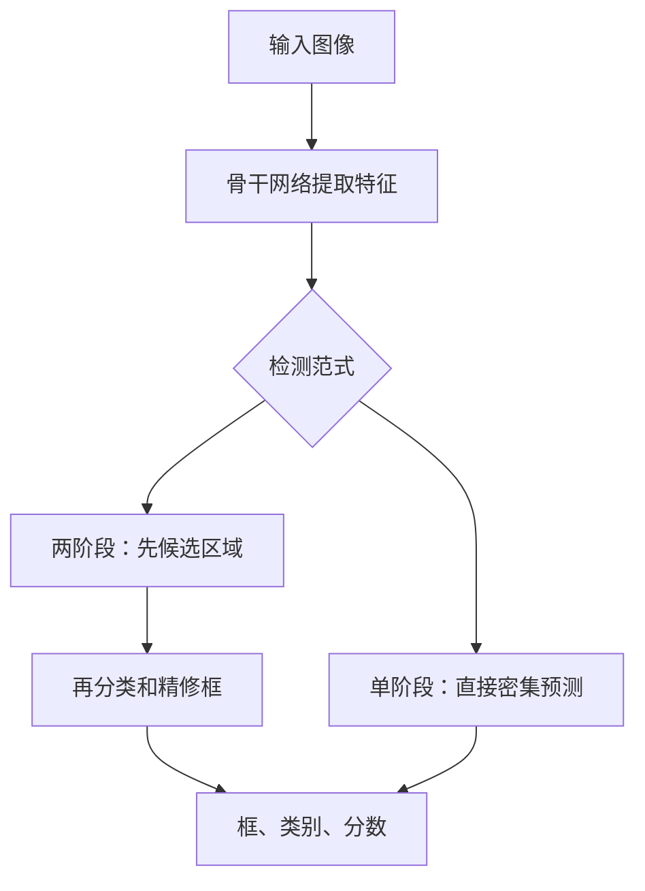
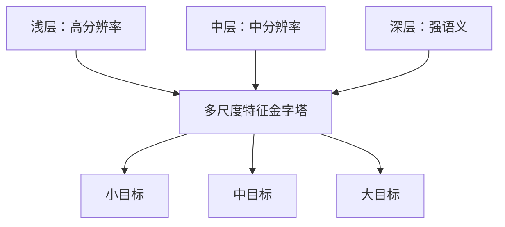

# 第五章 目标检测

## 5.1 目标检测输出什么？

目标检测回答两件事：

1. 图中有什么？
2. 每个目标在哪里？

每个预测通常包含：

```json
{
  "class_id": 2,
  "class_name": "drone",
  "confidence": 0.91,
  "bbox_xyxy": [120.4, 80.2, 310.8, 260.1]
}
```

### 5.1.1 边界框格式

| 格式 | 含义 |
|---|---|
| `xyxy` | 左上角 $(x_1,y_1)$，右下角 $(x_2,y_2)$ |
| `xywh` | 左上角 + 宽高 |
| `cxcywh` | 中心点 + 宽高 |
| normalized | 坐标除以图像宽高，范围 0～1 |
| OBB | 中心、宽高、旋转角或四个角点 |

格式转换错误会让训练完全失效。必须同时确认是否归一化、是否包含右下边界、角度单位与方向。

## 5.2 IoU：两个框有多重合？

$$
\mathrm{IoU}(A,B)=\frac{|A\cap B|}{|A\cup B|}
$$

```python
def box_iou_xyxy(a, b):
    x1 = max(a[0], b[0])
    y1 = max(a[1], b[1])
    x2 = min(a[2], b[2])
    y2 = min(a[3], b[3])

    inter = max(0, x2 - x1) * max(0, y2 - y1)
    area_a = max(0, a[2] - a[0]) * max(0, a[3] - a[1])
    area_b = max(0, b[2] - b[0]) * max(0, b[3] - b[1])
    return inter / max(area_a + area_b - inter, 1e-9)
```

IoU 用于正负样本分配、框回归损失、NMS 和最终评估。

## 5.3 两阶段与单阶段检测器



| 路线 | 代表 | 特点 |
|---|---|---|
| 两阶段 | Faster R-CNN、Mask R-CNN | 精度强、流程清晰，通常较慢 |
| 单阶段 Anchor-based | SSD、RetinaNet、部分 YOLO | 速度快，需 Anchor/样本分配 |
| 单阶段 Anchor-free | FCOS、现代 YOLO 等 | 简化 Anchor 设计 |
| Query-based | DETR 系列 | 集合预测、端到端匹配 |

## 5.4 R-CNN 家族

- R-CNN：对候选区域逐个跑 CNN，慢；
- Fast R-CNN：全图只提一次特征，再对候选区域做 RoI Pooling；
- Faster R-CNN：用 RPN 学习候选区域；
- Mask R-CNN：在检测基础上增加实例掩码分支。

关键思想：共享骨干特征，将“找候选”和“判断候选”联合学习。

## 5.5 FPN：为什么检测要融合多尺度？

骨干浅层分辨率高、语义弱；深层分辨率低、语义强。Feature Pyramid Network（FPN）通过自顶向下和横向连接融合它们：



小目标通常依赖较高分辨率特征。盲目把输入从 640 增到 1280 会显著增加计算，应与切片推理、相机位置和标注质量一起评估。

## 5.6 YOLO 思想

YOLO（You Only Look Once）代表实时单阶段检测路线。不同版本结构差异很大，但共同工程思想是：一次前向传播直接预测类别和位置。

现代 YOLO 系统常包含：

- Backbone：提取特征；
- Neck：融合多尺度特征；
- Head：分类与框回归；
- 标签分配策略；
- IoU 类回归损失；
- 后处理（部分新架构可做端到端 NMS-free）。

不要把“YOLO”理解成一篇固定论文或一个永远相同的网络。

## 5.7 Anchor 与 Anchor-free

Anchor 是预设的不同大小和长宽比参考框。模型预测相对偏移。

优点：把位置预测转为相对修正。  
问题：超参数多、正负样本严重不均衡、不同数据集需适配。

Anchor-free 方法直接预测中心点、到边界距离或对象查询，简化设计，但仍需要解决样本匹配与多尺度问题。

## 5.8 DETR 与集合预测

DETR 把检测看作一个集合预测问题：

1. CNN/视觉骨干提取特征；
2. Transformer 处理全局关系；
3. 固定数量 object queries 查询目标；
4. 用匈牙利匹配将预测与真实框一一对应；
5. 未匹配 query 学习“无目标”。

它减少了传统 Anchor 和复杂后处理依赖。早期 DETR 收敛慢、小目标较弱，后续 Deformable DETR 等改进了多尺度与效率。

## 5.9 框回归损失

只用 L1/L2 坐标损失不能直接表达重合关系。常见 IoU 系列：

| 损失 | 改进点 |
|---|---|
| IoU Loss | 直接优化重合 |
| GIoU | 无重叠时仍有梯度 |
| DIoU | 加入中心点距离 |
| CIoU | 加入距离与长宽比 |

检测总损失通常是：

$$
\mathcal{L}=
\lambda_{cls}\mathcal{L}_{cls}+
\lambda_{box}\mathcal{L}_{box}+
\lambda_{obj}\mathcal{L}_{obj}
$$

不同框架定义不同，不能只比较 loss 数值大小。

## 5.10 类别不均衡与 Focal Loss

密集检测中背景候选远多于目标。Focal Loss 降低简单样本权重：

$$
\mathrm{FL}(p_t)=-\alpha_t(1-p_t)^\gamma\log(p_t)
$$

当 $p_t$ 已很高，$(1-p_t)^\gamma$ 很小，模型把注意力放在难样本上。

## 5.11 NMS：去掉重复框

典型 NMS：

1. 选最高分框；
2. 删除与它 IoU 大于阈值的同类框；
3. 重复直到没有框。

```python
import torch
from torchvision.ops import nms

boxes = torch.tensor([
    [10, 10, 100, 100],
    [12, 12, 98, 98],
    [150, 40, 230, 130]
], dtype=torch.float32)
scores = torch.tensor([0.95, 0.88, 0.80])

keep = nms(boxes, scores, iou_threshold=0.5)
print(keep)
```

人群密集时，真实相邻目标可能被 NMS 错删。可考虑 Soft-NMS、类别/场景调阈值或端到端检测器。

## 5.12 检测指标：AP 与 mAP

先按置信度从高到低排序，在某个 IoU 阈值下判断 TP/FP，得到 Precision-Recall 曲线，其面积为 AP。

- `AP50`：IoU≥0.50 视为匹配；
- `AP75`：定位要求更严格；
- COCO `AP`：对 IoU 0.50～0.95（步长 0.05）取平均；
- `mAP`：再对类别取平均；
- `AP_small/medium/large`：按目标面积切片。

> AP50 高但 AP75 低，常表示“能找到目标，但框不够准”。总体 mAP 高但小目标 AP 低，可能不满足无人机/监控业务。

## 5.13 检测数据格式

### Pascal VOC XML

一张图一个 XML，包含类别和 `xmin/ymin/xmax/ymax`。

### COCO JSON

统一文件包含 `images`、`annotations`、`categories`，框常为绝对像素 `xywh`，也支持分割与关键点。

### YOLO TXT

每张图对应一个 TXT：

```text
class_id center_x center_y width height
```

坐标通常归一化到 0～1。`class_id` 通常从 0 开始。

## 5.14 Ultralytics 快速实践

```bash
pip install -U ultralytics
```

数据配置：

```yaml
# dataset.yaml
path: /absolute/path/to/my_dataset
train: images/train
val: images/val
test: images/test

names:
  0: airplane
  1: bird
  2: drone
  3: helicopter
```

```python
from ultralytics import YOLO

# 使用当前安装版本支持的预训练检查点；
# 示例用 yolo11n，正式项目固定 ultralytics 与权重版本。
model = YOLO("yolo11n.pt")
model.train(
    data="dataset.yaml",
    epochs=50,
    imgsz=640,
    batch=16,
    workers=4,
    project="runs/cv_tutorial",
    name="uav_detector",
    seed=42
)

metrics = model.val(data="dataset.yaml")
results = model.predict(
    source="demo.mp4",
    conf=0.25,
    iou=0.7,
    save=True
)
```

官方生态到 2026 年已继续演进到更新版本；教程使用成熟检查点只是为了降低版本不兼容。生产前需同时核对许可证、硬件支持、导出能力和准确率。

## 5.15 小目标、密集目标与超大图

小目标失败可能不是模型不够大：

- 原图中目标仅几像素，没有足够信息；
- 视频压缩抹去细节；
- 标注框漂移占目标尺寸比例过大；
- Resize 后目标消失；
- 训练集缺少远距离样本。

常见方案：

- 提升有效成像分辨率或调整镜头；
- 切片训练/推理（overlap tile）；
- 多尺度训练和高分辨率特征层；
- 复制粘贴增强小目标；
- 精细化标注与难例采样；
- 用召回优先阈值，再在跟踪/规则层去误报。

## 5.16 检测项目高频失败原因

- 不同标注工具的框格式混用；
- 框太松、太紧或同类标注标准不一致；
- 漏标被模型当作背景；
- 空图片未纳入训练，导致误报高；
- 只看 mAP，不看每类、每尺度、每场景；
- 训练和测试帧来自同一视频造成虚高；
- 线上摄像头分辨率、压缩、视角与训练不一致；
- 阈值在测试集上反复调整；
- 将“同时讲话”式的重叠问题类比到视觉：严重遮挡时，单帧证据本来就不足，需要时间信息或多相机。

---
