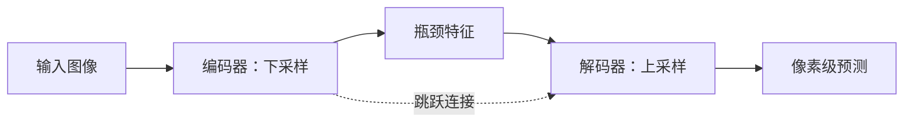

# 第六章 图像分割

## 6.1 三种分割任务

```text
语义分割：同类像素都标成同一个类别，不区分个体
实例分割：区分同一类别的不同个体
全景分割：所有像素有语义，同时“可数物体”有实例 ID
```

| 任务 | “两个人”输出 | 背景区域 | 典型模型 |
|---|---|---|---|
| 语义分割 | 都是 person | 道路/天空也分类 | FCN、U-Net、DeepLab |
| 实例分割 | person#1、person#2 | 通常不逐实例 | Mask R-CNN |
| 全景分割 | 两个 person 实例 | stuff 类也完整分类 | Mask2Former 等 |

## 6.2 分割标注

常见形式：

- 单通道类别 ID 图：每个像素值是类别；
- 二值 mask：0 背景、1/255 前景；
- 多边形：运行时栅格化；
- RLE：游程编码，节省存储；
- 每实例独立 mask；
- COCO panoptic：类别和实例编码。

切勿对类别 mask 使用双线性插值，否则类别 ID 会被插出不存在的小数。应使用最近邻插值。

## 6.3 FCN：从分类网络到像素预测

Fully Convolutional Network 用卷积替代固定全连接层，输出空间特征图，再上采样到原图大小。它揭示了：

> 分类网络回答“图中有没有”，分割网络要保留“特征在哪里”。

下采样提供语义与感受野，上采样恢复空间分辨率；跳跃连接融合浅层细节和深层语义。

## 6.4 U-Net

U-Net 是对称 Encoder–Decoder：



它最初用于生物医学图像，但结构思想广泛适用于小数据分割。跳跃连接帮助恢复边界与细节。

## 6.5 DeepLab

DeepLab 的关键思想：

- 空洞卷积（Dilated/Atrous Convolution）扩大感受野而不继续降分辨率；
- ASPP 用不同空洞率提取多尺度上下文；
- 部分版本增加解码器改善边界。

空洞卷积有效核大小：

$$
K_{eff}=K+(K-1)(r-1)
$$

其中 $r$ 为 dilation rate。

## 6.6 Mask R-CNN 与 Mask2Former

Mask R-CNN 在 Faster R-CNN 的 RoI 上增加掩码预测分支，适合实例分割。RoIAlign 避免量化造成的位置偏差。

Mask2Former 等统一式模型通过 masked attention 和 queries 处理语义、实例、全景分割，代表分割从“每种任务一套结构”向统一建模发展。

## 6.7 SAM、SAM 2 与提示式分割

Segment Anything 将分割变成可提示任务：

- 图像编码器计算图像特征；
- 点、框、粗 mask 等提示被编码；
- mask decoder 输出候选掩码。

SAM 2 将提示式分割扩展到图像和视频，加入流式记忆处理跨帧目标。到 2026 年，官方生态已出现后续迭代（如 SAM 3）；但应理解核心范式，而不是只记版本号：

> 从“每个类别单独训练”转向“用点、框、文本或示例告诉模型要分什么”。

局限：

- “能分出边界”不等于“知道业务类别”；
- 医疗、遥感、透明物体、极小目标仍可能失败；
- 自动生成的 mask 必须抽检，不能当绝对真值；
- 模型较大，交互延迟和显存需评估。

## 6.8 分割损失

### 像素交叉熵

把每个像素看成分类：

$$
\mathcal{L}_{CE}=-\frac{1}{HW}\sum_i\log p_{i,y_i}
$$

### Dice Loss

$$
\mathrm{Dice}=\frac{2|P\cap G|+\epsilon}{|P|+|G|+\epsilon}
$$

$$
\mathcal{L}_{Dice}=1-\mathrm{Dice}
$$

对前景很小、类别不均衡的任务更友好。

### 其他

- Focal Loss：关注难像素；
- Tversky：分别控制 FP 与 FN；
- Boundary Loss：重视边界；
- Lovász：近似直接优化 IoU。

常用组合：`CrossEntropy + Dice`，但权重需要在验证集调整。

## 6.9 分割指标

| 指标 | 含义 | 注意 |
|---|---|---|
| Pixel Accuracy | 像素正确比例 | 背景占比大时虚高 |
| IoU/Jaccard | 交并比 | 常用核心指标 |
| mIoU | 各类 IoU 平均 | 看每类而非只看均值 |
| Dice | 重合程度 | 医学分割常用 |
| Boundary F-score | 边界是否准确 | 适合精细轮廓 |
| Hausdorff Distance | 最坏边界距离 | 对离群点敏感 |
| PQ | 全景分割质量 | 同时考虑识别与分割 |

## 6.10 分割最小推理示例

```python
import torch
from PIL import Image
from torchvision.models.segmentation import (
    fcn_resnet50,
    FCN_ResNet50_Weights
)

weights = FCN_ResNet50_Weights.DEFAULT
model = fcn_resnet50(weights=weights).eval()
image = Image.open("image.jpg").convert("RGB")
batch = weights.transforms()(image).unsqueeze(0)

with torch.inference_mode():
    logits = model(batch)["out"]
mask = logits.argmax(dim=1)[0].cpu()
print(mask.shape, torch.unique(mask))
```

预训练类别由 `weights.meta["categories"]` 给出。业务数据通常需要微调。

## 6.11 超大图的滑窗推理

遥感、病理切片和工业线扫图可能远大于模型输入：

1. 按固定 tile 切片；
2. 相邻 tile 保留重叠；
3. 分别推理；
4. 在重叠区做平均/加权融合；
5. 还原到原图坐标；
6. 对跨片实例做合并。

无重叠切片会在边界把目标截断；重叠太大则计算冗余。

## 6.12 分割项目高频失败原因

- mask 类别值与配置类别顺序不一致；
- PNG 调色板被错误读取成 RGB；
- Resize mask 时用了双线性插值；
- 标注边界主观且标注员不一致；
- 只看像素准确率，背景掩盖前景失败；
- 随机裁剪导致多数 patch 没有前景；
- 小物体在下采样后消失；
- 训练时输入固定比例，线上图像被拉伸；
- 只评估重合，不评估面积误差、长度误差等业务指标。

---
