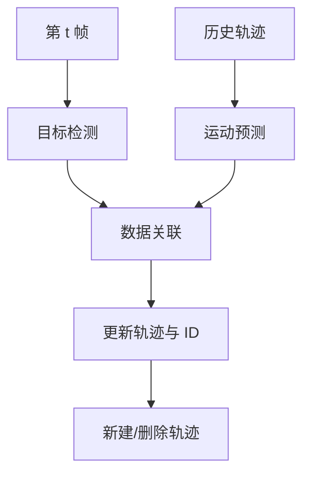

# 第八章 视频理解与多目标跟踪

<figure class="article-figure">
  
  <figcaption>视频提供时间信息，多视图几何提供空间约束，两者共同支撑跟踪、深度、点云和 SLAM。</figcaption>
</figure>

## 8.1 视频是什么？

视频是按时间排列的图像序列，并带有帧率、编码、时间戳等信息。

$$
\text{duration}\approx\frac{\text{frame count}}{\text{FPS}}
$$

但可变帧率视频不能只靠帧号推时间，应使用时间戳。

```python
import cv2

cap = cv2.VideoCapture("demo.mp4")
fps = cap.get(cv2.CAP_PROP_FPS)
width = int(cap.get(cv2.CAP_PROP_FRAME_WIDTH))
height = int(cap.get(cv2.CAP_PROP_FRAME_HEIGHT))

while True:
    ok, frame = cap.read()
    if not ok:
        break
    # frame 是 BGR，形状 [H, W, 3]
    # 在此处理

cap.release()
print(f"{width}x{height}, {fps:.2f} FPS")
```

## 8.2 运动信息与帧差

最简单运动检测：

1. 相邻帧转灰度；
2. 做差；
3. 阈值化；
4. 形态学清理；
5. 连通域得到运动区域。

固定摄像头、背景稳定时很有效；相机抖动、光照变化、树叶摆动会造成大量误报。

## 8.3 背景建模

MOG2/KNN 等背景减除会动态学习背景：

```python
subtractor = cv2.createBackgroundSubtractorMOG2(
    history=500,
    varThreshold=16,
    detectShadows=True
)
foreground_mask = subtractor.apply(frame)
```

需要设置“目标停留多久后会被吸收进背景”“阴影如何处理”等规则。

## 8.4 光流

光流估计像素在相邻帧的运动。亮度恒常近似：

$$
I_xu+I_yv+I_t=0
$$

一个方程有两个未知量，需要局部平滑等额外假设。

| 方法 | 类型 | 特点 |
|---|---|---|
| Lucas-Kanade | 稀疏 | 跟踪特征点，速度快 |
| Farnebäck | 稠密 | 每像素运动，经典方法 |
| RAFT 类 | 深度稠密光流 | 复杂运动更强，成本高 |

光流会受遮挡、快速运动、运动模糊和无纹理区域影响。

## 8.5 视频分类与动作识别

| 方法 | 思路 |
|---|---|
| 2D CNN + 时序池化 | 每帧提特征，再聚合 |
| Two-stream | RGB 外观 + 光流运动 |
| 3D CNN | 卷积同时跨时间和空间 |
| CNN/ViT + RNN | 空间编码后用序列模型 |
| Video Transformer | 对时空 patch 做注意力 |

采样策略比模型名字同样重要：每段取多少帧、间隔多大、短事件是否会被跳过。

## 8.6 多目标跟踪（MOT）

Tracking-by-Detection 的标准链路：



### 8.6.1 卡尔曼滤波

状态预测：

$$
\hat{x}_{t|t-1}=F\hat{x}_{t-1|t-1}
$$

观测到新检测后校正。它适合近似线性、平滑运动，用于预测目标下一帧位置。

### 8.6.2 匈牙利匹配

构造轨迹与检测之间的代价矩阵（如 `1-IoU`、中心距离、外观距离），求一一匹配的最小总代价。

### 8.6.3 外观 Re-ID

遮挡后仅靠位置可能无法恢复 ID。Re-ID 网络提取外观 embedding，帮助判断“这是不是刚才那个人/车”。

## 8.7 SORT、DeepSORT、ByteTrack

| 方法 | 关键思想 |
|---|---|
| SORT | 检测 + 卡尔曼 + IoU + 匈牙利 |
| DeepSORT | 加入外观 Re-ID |
| ByteTrack | 同时利用高分和低分检测，恢复被遮挡目标 |

实际性能高度依赖检测器、阈值、帧率和场景，不应只比较跟踪器名称。

## 8.8 跟踪指标

| 指标 | 关注 |
|---|---|
| MOTA | FP、FN、ID Switch 综合，可能偏重检测 |
| IDF1 | 身份连续性 |
| HOTA | 检测与关联平衡 |
| ID Switch | ID 被错误切换次数 |
| Track Fragmentation | 轨迹被切碎 |

计数业务还应评估“跨线计数误差”“重复计数”“漏计数”，而不只看 MOT 指标。

## 8.9 实时系统的延迟

摄像头 25 FPS 不代表模型必须 25 FPS。需区分：

- 吞吐量：每秒处理多少帧；
- 单帧延迟：一帧从输入到结果多久；
- 端到端延迟：采集、编码、网络、排队、推理、后处理、显示总和；
- 跳帧策略：只推理每第 k 帧；
- 跟踪补间：非检测帧用运动模型更新。

## 8.10 视频项目高频失败原因

- 把视频随机拆帧后切训练/测试，造成严重泄漏；
- 忽略实际帧率和时间戳；
- 每帧独立检测，告警抖动；
- 检测阈值太高，遮挡时轨迹立即丢失；
- 轨迹删除太快或太慢；
- 摄像机移动却使用固定背景方法；
- 只测模型 FPS，不测解码和绘制；
- 未处理断流、花屏、重连和时钟漂移。

---
