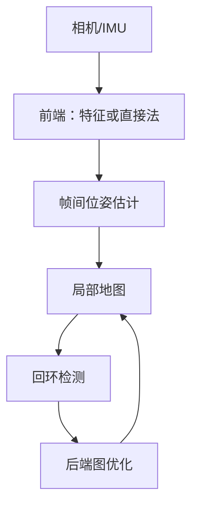

# 第九章 多视图几何、深度、三维视觉与 SLAM

## 9.1 坐标系

三维视觉常同时使用：

- 世界坐标系；
- 相机坐标系；
- 图像像素坐标系；
- 机器人/车体坐标系；
- 传感器坐标系。

刚体变换：

$$
\begin{bmatrix}p'\\1\end{bmatrix}
=
\underbrace{
\begin{bmatrix}R&t\\0&1\end{bmatrix}}_{T}
\begin{bmatrix}p\\1\end{bmatrix}
$$

必须明确变换方向。`T_world_camera` 和 `T_camera_world` 是逆关系，命名含糊会产生灾难性错误。

## 9.2 相机标定实践

典型步骤：

1. 从不同角度拍摄棋盘格；
2. 检测角点；
3. 建立棋盘格三维点与图像二维点对应；
4. 求解内参、畸变和每张图外参；
5. 查看重投影误差；
6. 用新图验证去畸变。

```python
# 核心 API 示意
ret, camera_matrix, dist_coeffs, rvecs, tvecs = cv2.calibrateCamera(
    object_points, image_points, image_size, None, None
)

undistorted = cv2.undistort(
    image, camera_matrix, dist_coeffs
)
```

低重投影误差不等于一定正确；角点分布若只集中在图像中央，边缘畸变估计仍可能很差。

## 9.3 单应矩阵

同一平面在两幅图之间满足：

$$
s\mathbf{x}'=H\mathbf{x}
$$

应用：

- 文档透视矫正；
- 平面广告替换；
- 图像拼接；
- 俯视图变换；
- 相机纯旋转情况下的全景。

它不能完整描述有明显三维视差的场景。

## 9.4 对极几何

两相机观察同一三维点时：

$$
\mathbf{x}'^TF\mathbf{x}=0
$$

$F$ 是基础矩阵。给定第一幅图中的点，对应点必在第二幅图的一条极线上，从二维搜索降为一维搜索。

已知内参时：

$$
E=K'^TFK
$$

本质矩阵 $E$ 可分解得到相对旋转和平移方向，但单目两视图无法直接恢复绝对尺度。

## 9.5 双目深度

校正后的平行双目：

$$
Z=\frac{fB}{d}
$$

- $Z$：深度；
- $f$：焦距；
- $B$：基线长度；
- $d$：左右图对应点视差。

远处目标视差很小，因此深度误差迅速增大。纹理重复、反光、透明、遮挡区域也很难匹配。

## 9.6 PnP、三角化与位姿

- PnP：已知三维点和二维投影，求相机位姿；
- 三角化：已知两个或多个视角及匹配点，恢复三维点；
- RANSAC PnP：在含错误匹配时稳健估计。

```python
ok, rvec, tvec, inliers = cv2.solvePnPRansac(
    object_points_3d,
    image_points_2d,
    camera_matrix,
    dist_coeffs
)
```

## 9.7 单目深度估计

深度学习可从单张图利用透视、遮挡、纹理和语义先验预测深度。但需要区分：

- 相对深度：谁近谁远；
- 度量深度：真实米制距离；
- 仿射不变深度：尺度和偏移不确定。

在安全决策中不能把相对深度图直接当米制真值。

## 9.8 点云基础

点云通常包含 $(x,y,z)$，还可带 RGB、反射强度、时间戳和类别。

常见处理：

- 体素下采样；
- 统计/半径离群点去除；
- 法线估计；
- RANSAC 平面拟合；
- ICP 配准；
- 聚类与 3D 检测；
- 点云到网格重建。

点云是无序集合。PointNet 用对称聚合处理无序性；Voxel、Sparse Convolution、Point Transformer 等分别从栅格、稀疏结构和注意力建模。

## 9.9 SfM 与 MVS

Structure from Motion：

1. 多图特征检测与匹配；
2. 估计相机相对位姿；
3. 三角化得到稀疏点云；
4. Bundle Adjustment 联合优化相机与三维点。

Multi-View Stereo 在已知相机位姿基础上恢复稠密几何。

## 9.10 Visual Odometry 与 SLAM

- Visual Odometry：估计连续相机运动；
- SLAM：同时定位并构建地图；
- 回环检测：识别“回到了以前的位置”；
- 图优化：全局修正累计漂移；
- VIO：融合相机与 IMU；
- 多传感器 SLAM：融合 LiDAR、GNSS 等。



动态人车、无纹理墙面、强光、运动模糊和时间不同步都可能导致失败。

## 9.11 NeRF 与 3D Gaussian Splatting

### NeRF

神经辐射场学习：

$$
F_\theta(\mathbf{x},\mathbf{d})\rightarrow(\sigma,\mathbf{c})
$$

输入三维位置和观察方向，输出体密度与颜色，通过体渲染合成新视角。优点是视图质量高；经典方案训练和渲染较慢，几何提取也不总稳定。

### 3D Gaussian Splatting

用大量带位置、尺度、旋转、不透明度和颜色参数的三维高斯表示场景，通过可微 splatting 渲染。它通常训练/渲染更快，适合新视角合成，但模型大小、动态场景和几何一致性仍是工程议题。

## 9.12 三维任务评估

| 任务 | 指标 |
|---|---|
| 深度 | Abs Rel、RMSE、$\delta$ accuracy |
| 位姿 | ATE、RPE |
| 点云配准 | 旋转/平移误差、inlier ratio |
| 三维检测 | 3D IoU、BEV AP |
| 重建几何 | Chamfer Distance、F-score |
| 新视角合成 | PSNR、SSIM、LPIPS |

视觉质量高不等于几何准确。NeRF/3DGS 看起来逼真，也可能不适合工程测量。

---
