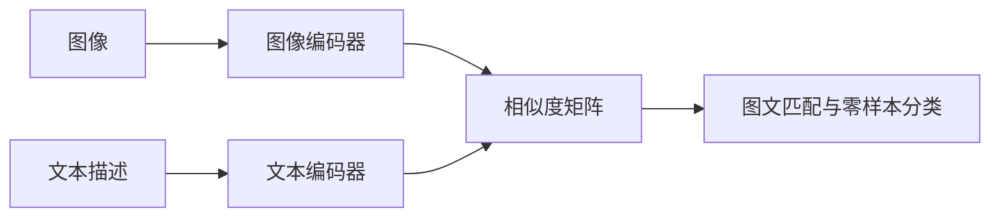
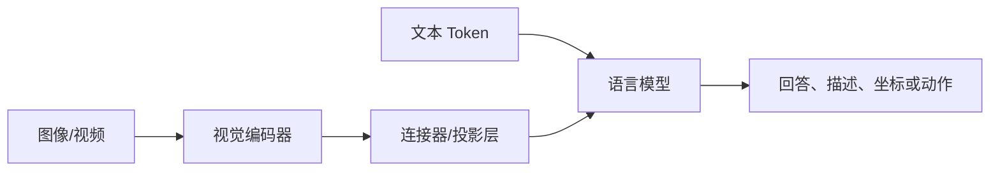

# 第十章 Vision Transformer、自监督学习与视觉基础模型

<figure class="article-figure">
  
  <figcaption>现代视觉模型通过大规模预训练获得统一表征，再按分类、对齐、分割或生成任务进行适配。</figcaption>
</figure>

## 10.1 为什么把 Transformer 用到图像？

Vision Transformer（ViT）把图像切成固定 patch：

```text
224×224 图像，patch=16
→ 14×14=196 个 patch token
```

每个 patch 展平并线性映射，加位置编码和可选 `[CLS]` token，再送入 Transformer Encoder。

$$
\mathbf{z}_0=[
\mathbf{x}_{cls};
\mathbf{x}_p^1E;
\cdots;
\mathbf{x}_p^NE
]+\mathbf{E}_{pos}
$$

ViT 直接建模远距离 patch 关系，但原始 ViT 的局部归纳偏置弱，通常更依赖大规模预训练和增强。

## 10.2 CNN 与 ViT

| 维度 | CNN | ViT |
|---|---|---|
| 局部性 | 卷积天然局部 | 注意力可全局 |
| 平移先验 | 较强 | 需从数据学习 |
| 数据需求 | 中小数据较友好 | 原始 ViT 更依赖预训练 |
| 长距离关系 | 通过深层逐步建立 | 可直接注意远处 patch |
| 复杂度 | 与卷积核局部相关 | 标准注意力随 token 数平方增长 |
| 部署 | 生态成熟 | 需关注注意力与动态形状优化 |

两者并非非此即彼。现代架构大量互相借鉴。

## 10.3 Swin Transformer

Swin 的关键设计：

- 局部窗口注意力降低计算；
- shifted windows 让相邻窗口跨层交流；
- 分层特征适配检测与分割；
- 类似 CNN 的多尺度输出。

## 10.4 自监督视觉学习

自监督从无人工标签数据中构造训练目标。

### 10.4.1 对比学习

同一图的两种增强是正样本，不同图是负样本：

$$
\mathcal{L}_{InfoNCE}
=-\log
\frac{\exp(\mathrm{sim}(z_i,z_j)/\tau)}
{\sum_k\exp(\mathrm{sim}(z_i,z_k)/\tau)}
$$

代表：SimCLR、MoCo。增强策略定义了模型应对哪些变化保持不变。

### 10.4.2 无显式负样本

BYOL 等使用在线网络、目标网络和防坍塌设计，不依赖大批负样本。

### 10.4.3 掩码图像建模

MAE 遮住大量 patch，让模型重建缺失内容。它把 BERT 式掩码思想迁移到图像。

### 10.4.4 自蒸馏

DINO 系列通过教师—学生、自蒸馏和多视角训练学习语义特征。DINOv2/DINOv3 一类基础骨干的价值是：冻结或少量微调即可为分类、分割、深度等任务提供强特征。

## 10.5 CLIP 与视觉语言对齐

CLIP 使用图像编码器和文本编码器，将匹配图文拉近、非匹配图文拉远：



零样本分类：

1. 为每个类别构造文本提示，如“一张无人机的照片”；
2. 编码图像和所有文本；
3. 计算相似度；
4. 最高相似度对应预测类。

提示模板和类别描述会显著影响结果；开放词汇不等于对所有专业类别都可靠。

## 10.6 开放词汇检测与分割

传统检测器类别固定。开放词汇系统通过文本查询定位新概念：

```text
输入图像 + 文本“红色安全帽”
→ 匹配框/掩码
```

可组合：

- 视觉语言检测器先按文本找框；
- SAM 类模型按框生成精细 mask；
- 视觉特征模型提 embedding 做聚类或少样本分类；
- 人工确认后回流为标注。

这能降低冷启动标注成本，但伪标签必须验证。

## 10.7 视觉基础模型

“基础模型”通常指在大规模数据上预训练、可适配多任务的通用视觉模型。常见能力维度：

| 范式 | 代表性方向 | 擅长 |
|---|---|---|
| 通用视觉表征 | DINO 系列、MAE 等 | 特征、迁移、密集预测 |
| 图文对齐 | CLIP 类 | 检索、零样本分类 |
| 提示式分割 | SAM 系列 | 点/框/文本提示分割 |
| 开放词汇定位 | Grounding 类 | 文本到区域 |
| 视觉语言模型 | VLM/MLLM | 问答、描述、推理、工具调用 |

截至 2026 年，官方生态已出现 DINOv3、SAM 3 和持续演进的开放视觉模型。项目选型不应追逐版本号，而应核对：

- 是否真正支持你的任务和语言；
- 是否可商用、许可证是否允许；
- 需要多大显存与延迟；
- 是否可离线、私有化或端侧部署；
- 是否能给稳定结构化输出；
- 在你的独立测试集上是否优于小模型。

## 10.8 视觉语言模型如何“看图回答”？

常见结构：



语言模型生成得流畅，不代表视觉事实一定正确。它可能：

- 数错物体；
- 看错小字或细节；
- 把常识补成图中事实；
- 对空间关系、精确坐标和多帧一致性不稳定；
- 在图像提示注入下执行恶意文字指令。

高风险系统应让专用检测/OCR/数据库提供可验证事实，VLM 负责解释和交互。

## 10.9 参数高效适配

| 方法 | 做法 | 适合 |
|---|---|---|
| Linear Probe | 冻结骨干，只训线性头 | 评估特征质量、数据少 |
| Full Fine-tuning | 更新全部参数 | 数据/算力充足 |
| LoRA/Adapter | 插入少量可训练参数 | 大模型低成本适配 |
| Prompt Tuning | 学习提示 token | 基础模型适配 |
| Distillation | 大模型教小模型 | 边缘部署 |

先做 linear probe，可快速判断预训练特征是否适合你的领域。

## 10.10 基础模型的使用边界

- 通用预训练数据可能含偏差与版权风险；
- 零样本结果要与监督基线比较；
- 视觉问答不能替代精确测量；
- 不要把自动 mask 当人工金标准；
- 模型更新会导致输出漂移，应锁定版本；
- 向第三方 API 发送图片前要评估隐私、跨境和保密要求；
- 开放世界系统必须设计“未知/拒识”，而非强制归类。

---
