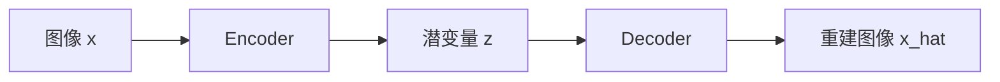

# 第十一章 生成式视觉：VAE、GAN 与扩散模型

## 11.1 判别式与生成式

- 判别式：学习 $P(y|x)$，如图像→类别；
- 生成式：学习数据分布，产生新样本或补全缺失内容。

生成式视觉任务包括文生图、图生图、修复、扩图、风格迁移、超分辨率、去噪、视频生成和三维生成。

## 11.2 Autoencoder 与 VAE

Autoencoder：

仅最小化重建误差的普通 AE 潜空间未必连续、可采样。

VAE 让编码器输出 $\mu,\sigma$，从分布采样：

$$
z=\mu+\sigma\odot\epsilon,\quad
\epsilon\sim\mathcal{N}(0,I)
$$

损失：

$$
\mathcal{L}_{VAE}=
\mathcal{L}_{recon}
+\beta D_{KL}(q(z|x)\|p(z))
$$

KL 项让潜空间更规则，便于采样，但可能牺牲锐利细节。

## 11.3 GAN

生成器 $G$ 试图骗过判别器 $D$：

$$
\min_G\max_D
\mathbb{E}_{x\sim p_{data}}\log D(x)
+\mathbb{E}_{z\sim p(z)}\log(1-D(G(z)))
$$

| 组件 | 目标 |
|---|---|
| Generator | 生成逼真假图 |
| Discriminator | 区分真图和假图 |

常见问题：

- 训练不稳定；
- 模式崩塌，只生成少数类型；
- 评估困难；
- 生成细节真实但全局结构错误。

GAN 仍常见于超分、图像翻译、特定实时生成，但通用图像生成主流已大量转向扩散模型。

## 11.4 扩散模型

前向过程逐步给真实图加噪：

$$
q(x_t|x_{t-1})=
\mathcal{N}(\sqrt{1-\beta_t}x_{t-1},\beta_tI)
$$

模型学习逆过程，从噪声逐步恢复图像。常见训练目标是预测加入的噪声：

$$
\mathcal{L}=
\mathbb{E}_{x_0,\epsilon,t}
\|\epsilon-\epsilon_\theta(x_t,t,c)\|^2
$$

$c$ 可以是文本、边缘、深度、姿态、参考图等条件。

## 11.5 Latent Diffusion

直接在像素空间扩散成本高。Latent Diffusion：

1. VAE 将图像压到潜空间；
2. U-Net/Transformer 在潜空间去噪；
3. 文本编码器提供条件；
4. VAE Decoder 还原图像。

这显著降低计算，使高分辨率文生图更实用。

## 11.6 Guidance 与可控生成

- Classifier Guidance：用分类器梯度引导；
- Classifier-Free Guidance（CFG）：组合有条件/无条件预测；
- ControlNet/Adapter：用边缘、姿态、深度等结构控制；
- Inpainting：只重绘 mask 区域；
- Image-to-Image：在输入图的噪声版本上生成；
- LoRA：低成本学习风格、角色或领域；
- Reference/IP Adapter 类：用参考图控制外观。

CFG 太高可能产生过饱和、细节僵硬或多样性降低。

## 11.7 生成质量评估

| 指标 | 用途 | 局限 |
|---|---|---|
| FID | 比较生成与真实特征分布 | 受样本数和特征网络影响 |
| IS | 可辨别性与多样性 | 不直接比较真实分布 |
| CLIPScore | 图文语义一致 | 可能忽略几何/文字细节 |
| PSNR/SSIM | 超分、复原 | 与人感知不完全一致 |
| LPIPS | 感知距离 | 仍不能代替人工 |
| 人工偏好 | 真实可用性 | 成本高、主观 |

复原任务还要评估“是否忠实”。生成出更漂亮但不存在的纹理，可能在医疗、司法、遥感中造成严重风险。

## 11.8 合成数据

生成模型可补充：

- 稀有场景；
- 不同天气、背景、角度；
- 隐私友好替代数据；
- 自动生成检测框/深度/分割等标签。

但合成数据不能自动代表真实分布。必须：

1. 保留独立真实测试集；
2. 检查伪影与生成器偏差；
3. 控制合成/真实比例；
4. 验证是否真的改善长尾，而非只改善合成风格。

## 11.9 深度伪造与内容安全

风险包括身份冒用、虚假证据、隐私泄露、版权侵权和不当内容。工程上可组合：

- 内容凭证/来源元数据；
- 水印；
- 生成内容标识；
- 人脸与敏感内容审核；
- 使用日志与权限；
- 检测模型（但检测器可能被新生成器绕过）；
- 人工核验与原始来源比对。

不要承诺“一个检测器可以永久识别所有 AI 图像”。

---
