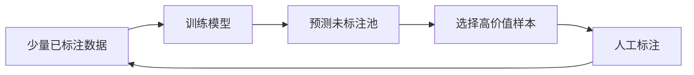

# 第十二章 数据集、标注、增强与数据治理

## 12.1 数据决定模型能学到什么

一个视觉数据集至少包含：

```text
样本 = 输入数据 + 标签 + 元数据 + 数据来源 + 使用权限
```

元数据可能包括相机、地点、时间、天气、设备、患者/产品批次、标注员、数据版本。没有元数据，就很难发现域偏移和泄漏。

## 12.2 先写标签体系，再开始标注

标注规范至少要回答：

1. 每个类别定义是什么？
2. 包含与不包含什么？
3. 遮挡到什么程度还标？
4. 截断目标如何标？
5. 模糊目标如何标？
6. 多个目标相互覆盖如何处理？
7. 边界框松紧或 mask 精度要求？
8. “无法判断”如何处理？

示例：

```markdown
类别：drone
定义：可确认的多旋翼或固定翼无人航空器。
包含：机体部分被遮挡但仍能确认类别的目标。
不包含：无法区分鸟与无人机的远距离点状目标，标为 uncertain。
边界：框住所有可见机体，不包含明显旋翼运动模糊尾迹。
```

`uncertain/ignore` 往往比强行标错更好。

## 12.3 标注质量控制

### 12.3.1 双人标注与仲裁

关键样本由两人独立标注，冲突由专家仲裁。可计算：

- 分类：Cohen's Kappa；
- 框：标注员之间 IoU；
- 分割：Dice/IoU；
- 关键点：归一化距离。

### 12.3.2 自动规则检查

- 类别 ID 是否越界；
- 框宽高是否正数；
- 坐标是否超图；
- mask 是否只有合法类别；
- 图片是否损坏；
- 是否有无标签的图片或无图片的标签；
- 极小/极大框是否异常；
- 同一图重复框；
- train/val/test 哈希重复。

```python
from pathlib import Path
from PIL import Image

def validate_yolo_label(image_path: Path, label_path: Path, num_classes: int):
    with Image.open(image_path) as im:
        width, height = im.size

    errors = []
    for line_no, line in enumerate(label_path.read_text().splitlines(), start=1):
        parts = line.split()
        if len(parts) != 5:
            errors.append(f"line {line_no}: expected 5 fields")
            continue
        cls, cx, cy, w, h = map(float, parts)
        if int(cls) != cls or not (0 <= int(cls) < num_classes):
            errors.append(f"line {line_no}: invalid class {cls}")
        if not all(0 <= v <= 1 for v in [cx, cy, w, h]):
            errors.append(f"line {line_no}: coordinates out of [0,1]")
        if w <= 0 or h <= 0:
            errors.append(f"line {line_no}: non-positive box")
    return errors
```

## 12.4 数据探索（EDA）

训练前至少统计：

- 每类样本数/实例数；
- 图像宽高与宽高比；
- 框尺寸、长宽比和每图目标数；
- 空图片比例；
- 模糊、曝光、遮挡、截断分布；
- 设备、场景、时间、天气分布；
- 重复图与近重复图；
- 标签共现；
- 各切分的分布差异。

检测中“图片数均衡”不等于“实例数均衡”。一张人群图可能有几百个 person。

## 12.5 数据切分策略

| 数据类型 | 建议分组单位 |
|---|---|
| 视频 | 原始视频/事件 |
| 医疗 | 患者 |
| 工业 | 产品批次/产线/日期 |
| 遥感 | 地理区域/采集航次 |
| 多相机 | 场景或摄像头 |
| 用户上传 | 用户/会话 |

如果目标是评估新摄像头泛化，应专门留出“未见摄像头”测试集，而非随机混合。

## 12.6 类别不均衡

解决手段：

- 收集更多少数类真实样本；
- 过采样/欠采样；
- class weight；
- Focal Loss；
- hard negative mining；
- balanced sampler；
- 按类设阈值；
- 合并无法可靠区分的过细类别。

不要只复制同几张少数类图片，它会加剧过拟合。

## 12.7 数据增强的分类

| 类型 | 例子 | 对标签的影响 |
|---|---|---|
| 几何 | 翻转、旋转、裁剪、透视 | 框/mask/keypoint 同步变化 |
| 光度 | 亮度、对比度、色温、噪声 | 通常位置不变 |
| 遮挡 | Cutout、Random Erasing | 模拟遮挡 |
| 混合 | MixUp、CutMix、Mosaic | 标签需合并 |
| 退化 | 模糊、压缩、降采样 | 模拟真实链路 |
| 合成 | 复制粘贴、渲染、生成模型 | 注意域差异和伪影 |

增强应来自真实失败模式。例如线上是 H.264 压缩视频，就优先模拟压缩，而不是随意加艺术滤镜。

## 12.8 主动学习

在大量未标注数据中，优先标注最有价值样本：

- 低置信度；
- 高熵/模型分歧；
- 与已有样本差异大；
- 业务高风险；
- 新设备/新场景；
- 聚类后每簇代表样本。



只选“不确定样本”可能集中在脏数据，需结合多样性和业务价值。

## 12.9 数据版本管理

每次训练应能回答：

- 用了哪些原始数据；
- 经过什么清洗；
- 哪个标注规范版本；
- train/val/test 的样本清单；
- 哪些样本新增、删除或改标；
- 是否可复现。

可使用 Git 管代码，小文件清单进入 Git，大数据用 DVC/对象存储/数据平台管理。不要直接覆盖 `dataset_final_final_v2`。

## 12.10 隐私、授权与合规

- 人脸、车牌、医疗影像可能是敏感数据；
- 训练用途不能自动扩大为营销或身份识别用途；
- 数据抓取需考虑版权、平台条款和个人信息；
- 最小化采集与保留；
- 传输/存储加密；
- 开发环境脱敏；
- 控制导出、下载与访问审计；
- 明确数据删除如何传导到训练集、缓存和衍生标注。

---
