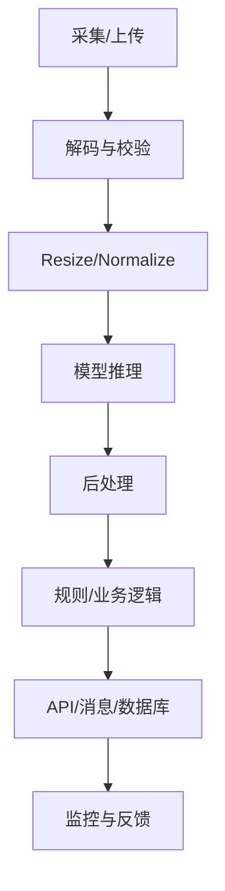

# 第十四章 部署、加速、监控与生产工程

<figure class="article-figure">
  
  <figcaption>可靠的视觉系统不是一次训练完成，而是任务、数据、评估、部署和错误样本持续回流的闭环。</figcaption>
</figure>

## 14.1 从 Notebook 到服务

生产链路：



部署包必须包含：

- 模型权重；
- 预处理；
- 后处理；
- 类别映射；
- 阈值；
- 输入输出 Schema；
- 框架/运行时版本；
- 评估报告和已知限制。

## 14.2 指标：延迟、吞吐与资源

| 指标 | 定义 |
|---|---|
| P50/P95/P99 延迟 | 50%/95%/99% 请求在此时间内完成 |
| 吞吐 | 每秒图片/帧/请求数 |
| 峰值显存 | 最坏输入下显存占用 |
| 冷启动 | 首次加载到可服务时间 |
| 模型大小 | 磁盘与下载成本 |
| 功耗 | 端侧/边缘重要 |

测量要包含预处理和后处理；GPU 异步执行时需同步后再计时。

```python
import time
import torch

@torch.inference_mode()
def benchmark(model, sample, warmup=20, repeat=100):
    model.eval()
    for _ in range(warmup):
        _ = model(sample)
    if sample.is_cuda:
        torch.cuda.synchronize()

    times = []
    for _ in range(repeat):
        start = time.perf_counter()
        _ = model(sample)
        if sample.is_cuda:
            torch.cuda.synchronize()
        times.append((time.perf_counter() - start) * 1000)

    times.sort()
    return {
        "p50_ms": times[int(0.50 * repeat)],
        "p95_ms": times[int(0.95 * repeat)],
        "mean_ms": sum(times) / len(times)
    }
```

## 14.3 PyTorch 模型导出 ONNX

```python
import torch

model.eval()
dummy = torch.randn(1, 3, 224, 224)

torch.onnx.export(
    model,
    dummy,
    "model.onnx",
    input_names=["images"],
    output_names=["logits"],
    dynamic_axes={
        "images": {0: "batch"},
        "logits": {0: "batch"}
    },
    opset_version=17
)
```

导出成功不等于正确：

1. 用同一输入分别跑原模型与 ONNX；
2. 比较输出误差；
3. 验证动态形状；
4. 验证真实预处理；
5. 跑完整测试集看指标是否下降。

## 14.4 ONNX Runtime 推理

```python
import numpy as np
import onnxruntime as ort

session = ort.InferenceSession(
    "model.onnx",
    providers=["CPUExecutionProvider"]
)

input_name = session.get_inputs()[0].name
dummy = np.random.randn(1, 3, 224, 224).astype(np.float32)
logits = session.run(None, {input_name: dummy})[0]
print(logits.shape)
```

ONNX Runtime 可使用不同 Execution Provider 对接 CPU、CUDA、TensorRT、移动端等。不同后端支持的算子和动态形状不同。

## 14.5 量化

| 类型 | 做法 | 特点 |
|---|---|---|
| FP16/BF16 | 半精度 | GPU 常用，精度损失通常小 |
| 动态 INT8 | 运行时量化部分激活 | 简单，CNN 收益视算子而定 |
| 静态 PTQ | 用校准集确定量化范围 | 无需重训，可能掉点 |
| QAT | 训练时模拟量化 | 精度通常更好，成本高 |

INT8 权重理论上约为 FP32 的 1/4 大小，但实际速度取决于硬件、算子、内存和图优化。

校准集应覆盖真实输入分布，不能只用几十张“好看样例”。

## 14.6 剪枝、蒸馏与轻量化

- 非结构化剪枝：大量权重置零，普通硬件未必加速；
- 结构化剪枝：删通道/层，更容易实际加速；
- 知识蒸馏：学生模型学习教师 logits/特征/关系；
- 轻量骨干：MobileNet、EfficientNet-Lite 等；
- 降分辨率：直接但可能损伤小目标；
- 级联系统：小模型先筛，大模型处理难例。

真实优化目标是“端到端延迟、资源和业务指标”，不是只看 FLOPs。

## 14.7 服务 API

```python
# app.py
from io import BytesIO
from PIL import Image
import torch
from fastapi import FastAPI, File, HTTPException, UploadFile

app = FastAPI(title="视觉分类服务")

# 启动时加载一次：model、transform、class_names

@app.post("/predict")
async def predict(file: UploadFile = File(...)):
    raw = await file.read()
    if len(raw) > 10 * 1024 * 1024:
        raise HTTPException(413, "文件过大")

    try:
        image = Image.open(BytesIO(raw)).convert("RGB")
    except Exception:
        raise HTTPException(400, "无效图像")

    x = transform(image).unsqueeze(0).to(device)
    with torch.inference_mode():
        prob = model(x).softmax(dim=1)[0]
    score, index = prob.max(dim=0)
    return {
        "label": class_names[index.item()],
        "confidence": score.item(),
        "model_version": "cv-classifier-1.0.0"
    }
```

启动：

```bash
pip install fastapi uvicorn python-multipart
uvicorn app:app --host 0.0.0.0 --port 8000
```

生产还需身份认证、限流、超时、文件安全、日志脱敏、健康检查、负载均衡和容器资源限制。

## 14.8 批处理、队列与流式

- 在线单图：低延迟优先；
- 离线批量：吞吐优先，可动态 batching；
- 视频流：按流维护状态，处理背压与断流；
- 大图：异步任务 + 对象存储；
- 多模型链路：避免重复解码/拷贝，复用特征需权衡耦合。

队列过长时，不是继续堆内存，而应降采样、丢过期帧、扩容或做背压。

## 14.9 边缘端

边缘部署关注：

- ARM/x86 架构；
- GPU/NPU 支持；
- 内存和模型大小；
- 摄像头接口；
- 功耗与温度降频；
- 离线能力；
- 模型更新与回滚；
- 设备碎片化；
- 网络断开后的缓存。

Mac 可用 MPS 做本地实验；NVIDIA 常用 CUDA/TensorRT；移动端可用 Core ML、NNAPI、TFLite、ONNX Runtime Mobile；NPU 平台需使用厂商工具链并验证算子支持。

## 14.10 线上监控

### 系统监控

- QPS、延迟、错误率；
- CPU/GPU/NPU、显存、内存；
- 队列长度；
- 输入尺寸与解码失败；
- 摄像头在线率和帧率。

### 模型监控

- 类别/置信度分布；
- 低置信度比例；
- OOD/未知样本；
- 人工纠正率；
- 抽样精度；
- 场景和设备漂移；
- 告警量突变。

没有真值时，置信度变化只能提示风险，不能证明精度下降。需要抽样复标。

## 14.11 灰度发布与回滚

1. 新模型离线通过固定回归集；
2. Shadow 模式只记录、不影响业务；
3. 小流量灰度；
4. 与旧模型按相同样本比较；
5. 设置自动/人工回滚条件；
6. 全量后持续监控。

模型版本必须可追溯到数据与代码，不能只写“latest”。

---
