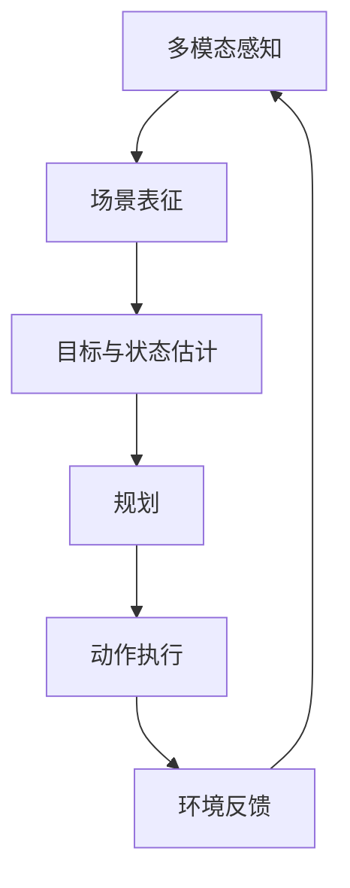

# 第十六章 行业落地、选型方法与学习路线

## 16.1 行业任务地图

| 行业 | 典型视觉任务 | 关键难点 |
|---|---|---|
| 工业质检 | 分类、检测、分割、异常检测 | 缺陷稀少、精细、产线变化 |
| 自动驾驶 | 2D/3D 检测、分割、跟踪、深度 | 安全、长尾、多传感器 |
| 医疗 | 分类、分割、配准、报告辅助 | 数据少、合规、跨设备 |
| 遥感 | 检测、变化检测、分割、地理配准 | 超大图、小目标、多光谱 |
| 安防 | 人车检测、跟踪、事件分析 | 隐私、遮挡、误报 |
| 零售 | 商品识别、客流、货架分析 | 长尾 SKU、陈列变化 |
| 文档 | OCR、版面、表格、字段抽取 | 模板多、低清、语言混合 |
| 机器人/具身 | 深度、姿态、SLAM、抓取 | 实时、闭环控制、物理交互 |
| 农业 | 病虫害、作物分割、计数 | 自然变化、季节与地域 |
| 内容平台 | 审核、检索、推荐、生成检测 | 语义复杂、规模、对抗 |

## 16.2 工业异常检测

当缺陷样本极少且类型不断变化时，固定类别监督检测不一定合适。

| 路线 | 思路 |
|---|---|
| One-class | 只学习正常分布，偏离即异常 |
| Reconstruction | 正常可重建，异常重建差 |
| Feature Memory | 正常 patch 特征库，算距离 |
| Teacher-Student | 正常样本上对齐，异常产生差异 |
| Open-vocabulary | 用文本/基础模型描述异常 |

异常分数不等于缺陷类别，需要阈值、定位、人工复核和持续回流。

## 16.3 遥感和无人机视觉

特殊问题：

- 单图巨大，需切片与地理坐标回填；
- 小目标多；
- 旋转目标多，常用 OBB；
- 不同航高、GSD、季节和传感器域差异；
- RGB、红外、多光谱、SAR 融合；
- 正射影像与原始倾斜影像不同；
- 结果需映射到经纬度/GIS。

评估除 mAP/mIoU，还可能需要每平方公里误报数、地理定位误差、巡检覆盖率和人工节省时间。

## 16.4 医疗视觉

必须明确模型角色是筛查、辅助、分诊还是诊断。需关注：

- 患者级切分；
- 多中心/多设备外部验证；
- 敏感度与特异度；
- 置信区间；
- 亚组公平性；
- DICOM 元数据；
- 标注专家一致性；
- 数据匿名化；
- 临床工作流和监管要求。

不能用普通随机图片切分得到的高准确率声称临床有效。

## 16.5 具身智能与世界模型

具身系统的视觉链路：



它不仅要“看懂图片”，还要：

- 跨时间保持物体恒常性；
- 理解可供性（能抓、能开、能通过）；
- 估计三维位置与不确定性；
- 预测动作后果；
- 在实时闭环中纠错；
- 满足物理和安全约束。

世界模型可学习环境状态与变化规律，但仿真中成功不等于现实可靠，需要 Sim-to-Real、真实测试和安全控制器。

## 16.6 任务选型决策表

| 业务问题 | 推荐任务 |
|---|---|
| 整张图是否合格？ | 分类/异常检测 |
| 有几个目标，分别在哪？ | 检测 |
| 要精确面积或轮廓？ | 分割 |
| 要测姿态、角度或装配点？ | 关键点 |
| 要跨帧计数和轨迹？ | 检测 + 跟踪 |
| 要读文字？ | OCR + 版面/字段抽取 |
| 要真实距离或三维位置？ | 标定 + 深度/多视图/传感器融合 |
| 类别经常新增、标注少？ | 基础模型/开放词汇 + 少样本适配 |
| 正常多、未知缺陷多？ | 异常检测 |

## 16.7 模型选型的六步法

1. **任务**：输出是类、框、mask、点、深度还是文本？
2. **数据**：有多少、质量如何、与线上是否一致？
3. **指标**：误报/漏报哪个更贵？
4. **约束**：延迟、吞吐、显存、功耗、离线、许可证？
5. **基线**：规则、小模型、预训练模型各能到什么程度？
6. **闭环**：失败如何发现、人工如何介入、数据如何回流？

## 16.8 给产品经理的视觉需求模板

```markdown
业务目标：
在固定摄像头视频中识别进入警戒区的无人机并留存证据。

输入：
1080p/H.264/25FPS；日间与夜间；固定机位。

输出：
目标类别、框、置信度、轨迹 ID、首次/最后出现时间、告警截图。

事件规则：
目标连续出现≥2秒且轨迹进入警戒区；同一轨迹5分钟内不重复告警。

指标：
目标级 Recall≥X%；每路每小时误报≤Y；P95端到端延迟≤Z秒。

数据范围：
覆盖不同天气、光照、航高、背景、鸟类和空背景。

不处理：
目标小于约N像素且无法人工确认；极端雾天；镜头完全遮挡。

人工兜底：
低置信度进入待复核队列；告警支持纠正类别。
```

## 16.9 12 周学习路线

| 周 | 重点 | 产出 |
|---:|---|---|
| 1 | Python/NumPy/图像张量 | 图像检查脚本 |
| 2 | OpenCV 滤波、阈值、形态学 | 文档扫描/颜色分割 |
| 3 | 神经网络与 PyTorch | CIFAR-10 小 CNN |
| 4 | CNN、ResNet、迁移学习 | 自定义分类器 |
| 5 | 数据标注与评估 | 标注规范+混淆矩阵 |
| 6 | 目标检测与 YOLO | 自定义检测 Demo |
| 7 | 分割与 U-Net/SAM | 分割 Demo |
| 8 | 视频与跟踪 | 跨线计数 |
| 9 | 相机几何与深度 | 标定/透视/双目实验 |
| 10 | ViT、CLIP、自监督 | 零样本分类/图文检索 |
| 11 | ONNX、量化、FastAPI | 推理服务 |
| 12 | 综合项目与作品集 | 报告、Demo、错误分析 |

## 16.10 经典论文阅读路线

### 入门主线

1. AlexNet：深度学习视觉转折；
2. VGG：深层小卷积；
3. ResNet：残差学习；
4. Faster R-CNN：两阶段检测；
5. YOLO：实时单阶段检测；
6. FCN / U-Net：语义分割；
7. Mask R-CNN：实例分割；
8. Transformer / ViT：视觉 Transformer；
9. DETR：集合预测检测；
10. CLIP：图文对齐；
11. MAE / DINO：自监督表示；
12. SAM：提示式分割；
13. DDPM / Latent Diffusion：生成式视觉；
14. NeRF / 3D Gaussian Splatting：神经三维表示。

### 阅读每篇论文时回答

1. 它解决上一代什么具体问题？
2. 输入、输出、监督信号是什么？
3. 结构创新在哪里？
4. 用什么数据和指标？
5. 消融实验支持了什么结论？
6. 代价和失败场景是什么？
7. 今天哪些系统仍使用这条思想？

## 16.11 最后：用十个问题思考任何视觉项目

1. 现实业务动作是什么，视觉输出如何触发它？  
2. 任务是分类、检测、分割、跟踪、三维还是组合？  
3. 标签与边界如何定义，谁能提供真值？  
4. 数据是否覆盖真实设备、场景、时间和长尾？  
5. 数据是否按正确主体切分，是否泄漏？  
6. 最简单规则/小模型基线是多少？  
7. 指标是否反映误报、漏报、延迟和业务成本？  
8. 模型最常错在哪，系统能否拒识或转人工？  
9. 部署后的输入、预处理和版本是否与训练一致？  
10. 如何监控漂移、回流纠正并安全回滚？  

成熟的计算机视觉产品，不是把一个模型接到摄像头上，而是让成像、数据、标注、模型、评估、工程、业务规则和人工反馈形成闭环。

---
