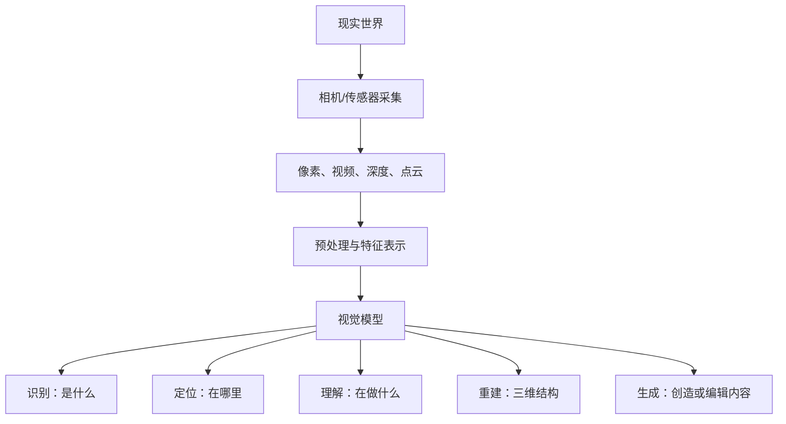

# 计算机视觉从零入门：从图像处理到视觉基础模型与工程实践

> **适合读者**：零基础或会一点 Python、机器学习，但尚未建立计算机视觉完整知识体系的学习者。  
> **完成后你将能够**：理解图像如何变成张量；使用 OpenCV 完成图像处理；解释 CNN、ResNet、YOLO、U-Net、ViT、CLIP、SAM 等模型之间的关系；完成分类、检测、分割和视频分析原型；知道如何准备数据、选择指标、训练模型、排查错误并部署服务。  
> **学习原则**：先明确“现实问题—视觉任务—标注形式—评价指标”，再选择模型；先建立可靠基线，再追求更大的模型。  
> **版本说明**：文档按 2026 年 7 月的工具生态核验。视觉模型与框架更新很快，正式项目必须固定依赖、权重、数据与评估集版本。

---

<figure class="article-figure">
  
  <figcaption>计算机视觉先把图像、视频、深度和点云转成数字表示，再用模型完成识别、定位、理解、重建与生成。</figcaption>
</figure>

## 目录

- [第一章 计算机视觉全景与图像基础](/concepts/ai-tech/cv/01-image-foundations)
- [第二章 OpenCV 与经典图像处理](/concepts/ai-tech/cv/02-opencv-classic-processing)
- [第三章 机器学习、神经网络与 PyTorch 基础](/concepts/ai-tech/cv/03-ml-neural-pytorch)
- [第四章 CNN 与图像分类](/concepts/ai-tech/cv/04-cnn-classification)
- [第五章 目标检测](/concepts/ai-tech/cv/05-object-detection)
- [第六章 图像分割](/concepts/ai-tech/cv/06-image-segmentation)
- [第七章 关键点、姿态、OCR 与人脸分析](/concepts/ai-tech/cv/07-keypoints-ocr-face)
- [第八章 视频理解与多目标跟踪](/concepts/ai-tech/cv/08-video-tracking)
- [第九章 多视图几何、深度、三维视觉与 SLAM](/concepts/ai-tech/cv/09-3d-vision-slam)
- [第十章 Vision Transformer、自监督学习与视觉基础模型](/concepts/ai-tech/cv/10-vision-transformer-foundation-models)
- [第十一章 生成式视觉：VAE、GAN 与扩散模型](/concepts/ai-tech/cv/11-generative-vision)
- [第十二章 数据集、标注、增强与数据治理](/concepts/ai-tech/cv/12-data-governance)
- [第十三章 训练、评估、错误分析与模型优化](/concepts/ai-tech/cv/13-training-evaluation-optimization)
- [第十四章 部署、加速、监控与生产工程](/concepts/ai-tech/cv/14-deployment-production)
- [第十五章 三个端到端实践项目](/concepts/ai-tech/cv/15-end-to-end-projects)
- [第十六章 行业落地、选型方法与学习路线](/concepts/ai-tech/cv/16-industry-roadmap)
- [附录 A 常用公式与指标速查](/concepts/ai-tech/cv/appendix-a-formulas-metrics)
- [附录 B 常见数据集与工具速查](/concepts/ai-tech/cv/appendix-b-datasets-tools)
- [参考资料与经典论文](/concepts/ai-tech/cv/references)

---

## 先建立一张全景图：计算机视觉到底在做什么？

计算机视觉（Computer Vision，CV）的目标，是让机器从图像、视频、深度图、点云等视觉数据中提取可计算的信息，并完成“看见、定位、理解、测量、追踪、重建和生成”。

### 视觉任务不是按模型命名，而是按输出定义

| 任务 | 输入 | 输出 | 例子 |
|---|---|---|---|
| 图像分类 | 一张图 | 一个或多个类别 | 猫/狗；缺陷/正常 |
| 目标检测 | 图像/视频 | 类别 + 边界框 | 找出所有车辆 |
| 语义分割 | 图像 | 每个像素的语义类别 | 道路、天空、行人 |
| 实例分割 | 图像 | 每个目标实例的掩码 | 分开每一辆车 |
| 关键点/姿态 | 图像 | 一组坐标与可见性 | 人体关节、面部点 |
| 跟踪 | 视频 | 跨帧一致的目标 ID | 统计进出人数 |
| OCR | 图像/文档 | 文字位置与内容 | 识别发票、车牌 |
| 深度估计 | 图像 | 每个像素的距离 | 机器人避障 |
| 三维重建 | 多张图/视频 | 点云、网格或辐射场 | 建筑建模 |
| 图像生成 | 文本/图像/条件 | 新图像或编辑结果 | 文生图、修复、超分 |
| 视觉语言理解 | 图像/视频 + 文本 | 回答、描述或动作 | 图像问答、视觉 Agent |

> **第一条核心认知**：先问“系统最后要输出什么”，再决定它是分类、检测、分割、跟踪还是组合任务。  
> **第二条核心认知**：现实系统通常不是一个模型。例如“无人机巡检”往往是检测 + 跟踪 + 地理定位 + 规则判断 + 人工复核。

### 为什么视觉比“识别像素”更难？

| 变化 | 例子 | 影响 |
|---|---|---|
| 光照 | 晴天、夜间、背光 | 同一物体像素值完全不同 |
| 视角 | 正面、侧面、俯视 | 形状与可见区域改变 |
| 尺度 | 远处小目标、近处大目标 | 特征分辨率差异巨大 |
| 遮挡 | 人群、车辆相互遮挡 | 目标不完整 |
| 类内差异 | 不同品种的狗 | 同类外观差异大 |
| 类间相似 | 狼与哈士奇 | 不同类外观相近 |
| 域偏移 | 训练用高清图，线上是压缩视频 | 离线高分、线上失效 |
| 开放世界 | 线上出现训练集没有的物体 | 模型仍可能自信误判 |

---
