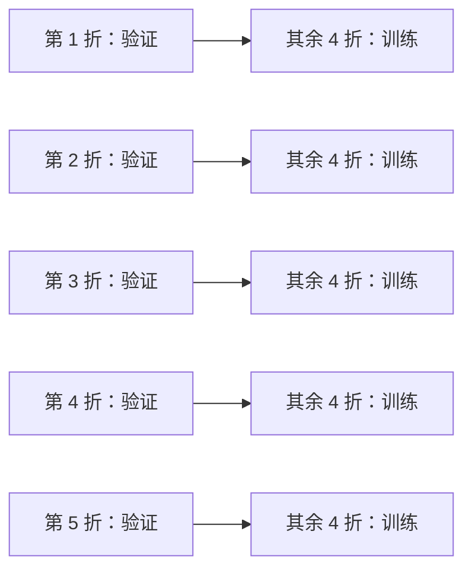

# 机器学习基础概念

## 训练集、测试集和验证集

| 数据集 | 用途 | 能否参与调参 | 最佳实践 |
|---|---|---|---|
| 训练集 Train | 让模型学习参数 | 可以 | 占比通常最大 |
| 验证集 Validation | 比较模型、选择超参数 | 可以 | 数据不足时可用交叉验证替代 |
| 测试集 Test | 最终验收泛化能力 | 不应反复使用 | 最后只评估一次或极少数次数 |

一个常见拆分方式：

```text
原始数据 100%
├── 训练集 70%
├── 验证集 15%
└── 测试集 15%
```

但比例不是绝对的：

- 数据量很大时，验证和测试集可以比例更小。
- 数据量很小时，常用 **K 折交叉验证**。
- 时间序列不能随机打乱，应按时间顺序切分。
- 同一用户、同一设备、同一图片来源的样本要避免同时落在训练与测试中，否则会高估效果。

### K 折交叉验证



把数据分为 $K$ 份，每次用其中 1 份验证、其余 $K-1$ 份训练，最终取平均分数。它能让小数据集的评估更稳定，但训练成本会更高。

## 特征（Features）和标签（Labels）

- **特征**：模型用于判断的输入信息。
- **标签**：模型想预测的目标答案。

示例：预测用户是否会流失。

| 字段 | 是特征还是标签 | 解释 |
|---|---|---|
| 距上次登录天数 | 特征 | 帮助预测流失 |
| 月消费金额 | 特征 | 帮助预测流失 |
| 是否会员 | 特征 | 帮助预测流失 |
| 是否在未来 30 天流失 | 标签 | 模型要预测的答案 |

### 好特征的三个标准

1. **可获得**：预测时真实可拿到，不能依赖未来信息。
2. **相关性**：对目标有解释或预测价值。
3. **稳定性**：字段定义不会频繁改变，线上质量可控。

## 模型（Model）与算法（Algorithm）

可以用“菜谱”和“做好的菜”来理解：

- **算法**：训练规则或方法，例如“决策树算法”“逻辑回归算法”。
- **模型**：算法在某一份数据上训练得到的具体结果，例如某棵具体树的切分条件、某组具体的回归系数。

例如：

```text
算法：逻辑回归
训练数据：过去 10 万条用户行为记录
训练完成的模型：w0=-1.2, w1=0.8, w2=-0.4, ...
```

## 监督学习、无监督学习和强化学习

| 类型 | 是否有标签 | 核心目标 | 例子 |
|---|---|---|---|
| 监督学习 | 有 | 从输入预测答案 | 流失预测、房价预测 |
| 无监督学习 | 无 | 发现数据结构 | 客群分群、降维 |
| 强化学习 | 没有固定标签，只有奖励 | 学习长期决策策略 | 游戏、调度、机器人 |

## 过拟合与欠拟合

### 欠拟合（Underfitting）

模型太简单，连训练数据中的主要规律都没有学到。

表现：训练集分数低，测试集分数也低。

可能原因：

- 特征信息不足。
- 模型容量太小。
- 训练次数不够。
- 正则化太强。

### 过拟合（Overfitting）

模型把训练数据中的偶然噪声、异常点甚至数据编号都当成规律记住了。

表现：训练集分数非常高，但测试集显著变差。

可能原因：

- 模型过于复杂。
- 数据量太少。
- 特征太多且噪声大。
- 调参时反复“偷看”测试集。
- 训练数据与测试数据分布不同。

### 如何缓解过拟合？

- 增加高质量训练数据。
- 降低模型复杂度，例如限制树深度。
- 使用正则化，例如 L1、L2。
- 使用交叉验证。
- 进行特征选择。
- 对树模型使用采样、剪枝、限制深度。
- 早停（Early Stopping）。

## 训练与测试误差

| 指标 | 含义 | 如何解读 |
|---|---|---|
| 训练误差 | 模型在训练集上的错误 | 很低不一定是好事 |
| 验证误差 | 调参时在验证集上的错误 | 主要用于选模型 |
| 测试误差 | 最终在未参与调参的数据上的错误 | 更接近上线预期 |

理想状态不是训练误差越低越好，而是训练、验证、测试之间差距合理，且测试结果满足业务要求。

## 评估指标

### 1. 分类问题：混淆矩阵

以“是否欺诈”为例，正类是“欺诈”。

| 真实 \ 预测 | 预测欺诈 | 预测正常 |
|---|---:|---:|
| 实际欺诈 | TP：真正例 | FN：假负例 |
| 实际正常 | FP：假正例 | TN：真负例 |

- **准确率 Accuracy**：整体预测正确比例。

$$
Accuracy=\frac{TP+TN}{TP+TN+FP+FN}
$$

- **精确率 Precision**：被模型判为“欺诈”的样本中，真正欺诈的比例。

$$
Precision=\frac{TP}{TP+FP}
$$

- **召回率 Recall**：所有真实欺诈样本中，被模型找出来的比例。

$$
Recall=\frac{TP}{TP+FN}
$$

- **F1 分数**：精确率和召回率的平衡。

$$
F1=2\times\frac{Precision\times Recall}{Precision+Recall}
$$

业务理解：

| 场景 | 更应关注 | 原因 |
|---|---|---|
| 疾病初筛、欺诈拦截 | 召回率 | 漏掉一个高风险对象可能代价很大 |
| 自动封禁、人工审核成本高 | 精确率 | 误伤正常用户成本高 |
| 类别极不平衡 | F1、PR-AUC、召回率 | 单看准确率会误导 |
| 需要给出排序/概率 | ROC-AUC、PR-AUC、校准度 | 关注不同阈值下表现 |

### 2. 回归问题

- **MAE（平均绝对误差）**：平均每次预测差多少。

$$
MAE=\frac{1}{n}\sum_{i=1}^{n}|y_i-\hat{y}_i|
$$

- **MSE（均方误差）**：会更严厉惩罚大误差。

$$
MSE=\frac{1}{n}\sum_{i=1}^{n}(y_i-\hat{y}_i)^2
$$

- **RMSE（均方根误差）**：与原始单位一致，更直观。

$$
RMSE=\sqrt{MSE}
$$

- **$R^2$（决定系数）**：模型解释了目标变量波动的比例；越接近 1 通常越好，但要结合数据和场景理解。

### 3. 聚类问题

聚类没有固定标准答案，常看：

- **Inertia**：簇内样本离中心的平方距离之和，越小越紧凑，但 $K$ 越大通常也会越小。
- **轮廓系数（Silhouette Score）**：衡量簇内相似、簇间分离，接近 1 往往更好。
- **业务可解释性**：每个簇是否能被清晰命名，并对应不同运营或产品动作。

---
