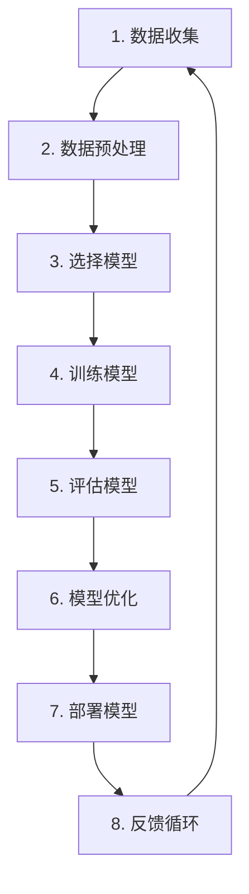
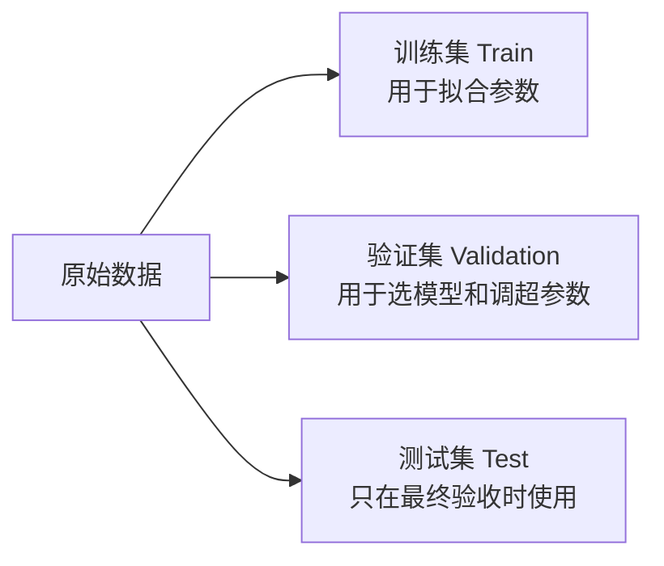
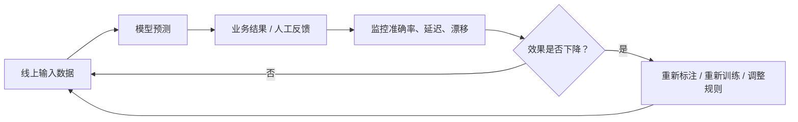

# 机器学习如何工作

下面先用**项目全流程视角**理解机器学习。后面“机器学习如何工作”一节会从训练、损失函数、参数更新等技术视角再讲一次。



## 1. 数据收集

数据是模型学习的“教材”。没有可靠数据，再先进的算法也无法产生可靠结果。

常见数据来源：

- **业务系统**：订单、客户、商品、工单、CRM、ERP。
- **埋点日志**：浏览、点击、搜索、停留、加购、支付。
- **文本与文档**：客服对话、评论、合同、邮件、知识库。
- **图像与音频**：质检照片、监控视频、语音录音。
- **设备与传感器**：温湿度、定位、振动、功耗、飞行数据。
- **人工标注**：给图片标类别、给文本标情感、给交易标风险。

以“预测用户是否流失”为例：

| 用户 ID | 距上次登录天数 | 30 天使用次数 | 是否购买会员 | 客服投诉次数 | 是否流失 |
|---|---:|---:|---:|---:|---:|
| U001 | 2 | 18 | 1 | 0 | 0 |
| U002 | 45 | 0 | 0 | 2 | 1 |
| U003 | 7 | 4 | 0 | 0 | 0 |

前五列是模型可用的**特征**，最后一列“是否流失”是**标签**。

### 数据收集阶段的检查清单

- 训练数据是否覆盖真实业务中的主要人群和场景？
- 标签是否可信？例如“已投诉”不等于“真的不满意”。
- 是否混入了未来信息？例如预测用户是否流失时，不能使用“流失后 30 天的登录次数”。
- 是否有敏感字段、隐私字段或不应使用的代理变量？
- 数据粒度是否统一？一行究竟代表“一个用户”“一笔订单”还是“某用户某天”？

## 2. 数据预处理

真实数据通常像“未经整理的原始食材”，不能直接拿来训练。预处理的目标是把数据变成模型能理解、质量相对可靠的输入。

| 常见问题 | 示例 | 常见处理方式 |
|---|---|---|
| 缺失值 | 年龄为空、收入未知 | 均值/中位数填补、填“未知”、增加缺失标记 |
| 重复数据 | 同一订单被导入两次 | 去重，保留可信版本 |
| 异常值 | 年龄为 999、金额为 -1 | 业务校验、截断、删除或单独标记 |
| 类别数据 | 城市、性别、品类 | One-Hot 编码、目标编码、Embedding |
| 数值量纲不同 | 收入 100000，点击次数 3 | 标准化、归一化 |
| 文本数据 | 评论、工单内容 | 分词、TF-IDF、词向量、文本 Embedding |
| 时间穿越 | 用了未来才可得字段 | 按时间重新构造特征和切分数据 |

### 为什么标准化很重要？

对 KNN、逻辑回归、SVM、K-means、PCA 等依赖距离或梯度优化的算法，数值尺度会直接影响结果。

例如，有两个特征：

- 年收入：0～500,000
- 最近 30 天登录次数：0～50

若不做标准化，年收入的数值范围远大于登录次数，模型可能几乎只“看见”年收入。

常用标准化公式：

$$
z=\frac{x-\mu}{\sigma}
$$

其中 $\mu$ 是均值，$\sigma$ 是标准差。标准化后，特征通常变为均值约为 0、标准差约为 1。

> **防泄漏原则**：必须先切分训练集和测试集，再只用训练集计算均值、标准差、缺失值填补规则；然后把同一套规则应用到验证集和测试集。最安全的方式是使用 `Pipeline`。

## 3. 选择模型

模型选择不应从“哪个算法最热门”开始，而应从问题与约束开始。

| 你的目标 | 优先尝试的模型 | 原因 |
|---|---|---|
| 预测连续数值 | 线性回归、随机森林回归、XGBoost 回归 | 输出是金额、销量、时长等数值 |
| 预测类别 | 逻辑回归、KNN、SVM、决策树、随机森林、XGBoost | 输出是类别或概率 |
| 发现人群结构 | K-means、层次聚类、DBSCAN | 没有人工标签，想找群体规律 |
| 降维、可视化、压缩 | PCA | 用较少维度保留主要变化 |
| 多轮决策、试错优化 | 强化学习 | 行为会影响后续状态和奖励 |

初学者最实用的策略是：

1. 先做一个**简单且可解释的基线模型**，例如线性回归或逻辑回归。
2. 再尝试树模型、随机森林、XGBoost 等复杂模型。
3. 用一致的数据切分和指标比较，而不是凭感觉选模型。
4. 复杂模型若没有带来业务价值，不值得增加维护成本。

## 4. 训练模型

训练的本质是：让模型在训练数据上不断调整参数，使预测结果尽量接近真实答案。

以线性回归为例：

$$
\hat{y}=w_0+w_1x_1+w_2x_2+\cdots+w_px_p
$$

模型训练的过程，就是寻找合适的 $w_0,w_1,\ldots,w_p$。

可以把它理解为：模型先给出预测 → 计算预测错了多少 → 根据误差调整参数 → 再预测。这个循环会重复很多次。

## 5. 评估模型

训练集表现好，不代表模型真的好。真正重要的是：它面对**没见过的新数据**时是否仍然有效，这叫**泛化能力**。

因此需要把数据拆开：



常见评估指标：

- 分类：准确率、精确率、召回率、F1、ROC-AUC、PR-AUC。
- 回归：MAE、MSE、RMSE、$R^2$。
- 聚类：轮廓系数、簇内平方和（Inertia）、业务可解释性。

## 6. 模型优化

优化不等于“反复换算法”。通常按下列优先级推进：

1. 修复错误数据、重复数据、时间穿越。
2. 改善标签质量。
3. 补充更有业务意义的特征。
4. 处理类别不平衡。
5. 使用交叉验证稳定评估。
6. 调整超参数。
7. 选择更适合的模型或组合模型。

> 很多真实项目里，数据质量和特征设计带来的提升，常常大于从 A 算法换到 B 算法。

## 7. 部署模型

部署是让模型从 Notebook 进入业务流程。常见方式：

- **批处理**：每天离线跑一次，为全部客户计算流失风险分。
- **实时 API**：用户提交申请或下单时，接口立即返回风险概率或推荐结果。
- **嵌入产品工作流**：模型给出建议，人工审核后决定是否采纳。
- **边缘部署**：模型运行在摄像头、手机、工业设备等本地终端。

## 8. 反馈循环

上线后的环境会变化：用户行为变了、业务规则改了、产品版本更新了、季节变化了、采集字段变了。模型效果可能因此下降。



需要关注两类变化：

- **数据漂移（Data Drift）**：输入特征的分布变化。例如原来用户平均消费 100 元，现在因为大促变成 300 元。
- **概念漂移（Concept Drift）**：同样的输入与结果之间的关系变化。例如过去“频繁异地登录”常意味着风险，但某业务上线后大量用户出差使用，规则关系失效。

---

---

## 技术视角：机器学习如何工作

这一节从更技术的角度，把“数据输入 → 预测 → 计算误差 → 更新参数”的内部逻辑讲清楚。

### 1. 数据输入：数据是学习的基础

机器学习模型最终接收到的是一个数值矩阵：

$$
X=\begin{bmatrix}
x_{11} & x_{12} & \cdots & x_{1p}\\
x_{21} & x_{22} & \cdots & x_{2p}\\
\vdots & \vdots & \ddots & \vdots\\
x_{n1} & x_{n2} & \cdots & x_{np}
\end{bmatrix}
$$

- $n$：样本数，例如 10,000 个用户。
- $p$：特征数，例如年龄、消费金额、登录次数等 30 个字段。

监督学习还会有标签向量：

$$
y=[y_1,y_2,\ldots,y_n]^T
$$

模型看不懂“深圳”“高风险”“满意”这样的文字，需要把它们转为数字：

| 原始字段 | 处理后的形式 |
|---|---|
| 城市 = 深圳 / 广州 / 上海 | One-Hot：`[1,0,0]` / `[0,1,0]` / `[0,0,1]` |
| 是否会员 = 是 / 否 | `1` / `0` |
| 评论文本 | TF-IDF 向量或文本 Embedding |
| 日期时间 | 星期几、小时、距上次事件时长等衍生特征 |

### 2. 模型选择：选择合适的学习算法

不同算法对数据的假设不同：

| 算法 | 隐含假设 / 特点 | 更适合 |
|---|---|---|
| 线性回归 | 输入与输出关系可近似线性 | 可解释的数值预测 |
| 逻辑回归 | 用线性组合预测类别概率 | 二分类、基线模型 |
| KNN | 相似样本的结果相似 | 小规模、局部结构明显的数据 |
| 决策树 | 可通过连续条件切分样本 | 非线性、可解释规则 |
| SVM | 希望类别之间有清晰间隔 | 中小规模、边界复杂的分类 |
| 随机森林 / XGBoost | 多棵树组合提升效果 | 表格型结构化数据 |
| K-means | 数据可分为近似球形的若干簇 | 初步客户分群、探索性分析 |
| PCA | 高维变化可由少数方向概括 | 降维、可视化、去冗余 |

### 3. 训练过程：让模型从数据中学习

训练过程可以概括为四步：


#### 什么是损失函数？

损失函数用于衡量“预测错得有多严重”。训练的目标是让总损失尽可能小。

- 回归常用均方误差：

$$
MSE=\frac{1}{n}\sum_{i=1}^n(y_i-\hat{y}_i)^2
$$

- 二分类常用对数损失（交叉熵）：

$$
Loss=-\frac{1}{n}\sum_{i=1}^{n}[y_i\log(p_i)+(1-y_i)\log(1-p_i)]
$$

其中 $p_i$ 是模型预测样本为正类的概率。

#### 什么是梯度下降？

很多模型不能直接算出最优参数，只能从一个初始值出发，一点点向“损失更低”的方向移动。这种方法叫**梯度下降**。

$$
\theta \leftarrow \theta-\eta\nabla J(\theta)
$$

- $\theta$：模型参数。
- $J(\theta)$：损失函数。
- $\nabla J(\theta)$：损失上升最快的方向。
- $\eta$：学习率，控制每次迈多大步。

直觉理解：你在雾中下山，坡度告诉你哪里最陡；每次沿下坡方向走一小步。步子太大可能跨过谷底，步子太小会走得很慢。

### 4. 验证与评估：测试模型的性能

训练集分数高，不足以证明模型可靠。必须观察验证集、测试集上的表现。

| 现象 | 训练集表现 | 验证/测试集表现 | 说明 |
|---|---|---|---|
| 欠拟合 | 差 | 差 | 模型太简单、特征不足或训练不够 |
| 合适 | 好 | 接近训练集且稳定 | 具备较好泛化能力 |
| 过拟合 | 非常好 | 明显变差 | 把训练数据中的噪声也记住了 |

### 5. 优化与调整：提高模型的精度

优化时建议按下列顺序排查：

1. 标签是否准确？
2. 是否存在数据泄漏？
3. 训练/测试切分是否符合真实场景？
4. 特征是否有业务意义？
5. 指标是否选对？
6. 类别是否不平衡？
7. 是否需要正则化、剪枝、采样或调参？

### 6. 模型部署与预测：实际应用

训练完成后，模型的输入格式必须与线上保持一致。例如训练时使用了：

```text
[最近登录天数, 30天使用次数, 是否会员, 投诉次数]
```

线上预测时也必须严格按相同字段、顺序、单位、编码和预处理规则输入。否则，模型即使成功加载，结果也可能完全不可信。

### 7. 持续学习与模型更新

模型通常不是“训练一次，永久有效”。建议至少监控：

- 输入字段是否缺失、取值范围是否异常。
- 预测概率分布是否突然变化。
- 有真实标签回流时，准确率、召回率、MAE 是否下降。
- 业务策略改变后，历史标签定义是否仍然适用。

---
