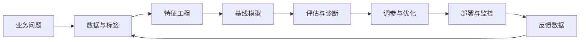

# 机器学习从零入门：一份可讲、可学、可运行的实战指南

## 使用说明：先搭一张“全局地图”

机器学习入门最容易陷入两个误区：

1. **只会调用库，不知道结果是否可信。**
2. **先背算法公式，却不知道算法在业务里解决什么问题。**

本章采用下面的学习顺序：

> **阅读建议**：先完整看完“机器学习简介—基础概念—第一个 Python 项目”，再按任务需要深入单个算法。所有代码默认使用 Python 3.10+，可在 Jupyter Notebook、VS Code 或 PyCharm 中运行。

## 文章目录

1. [机器学习简介](/concepts/ai-tech/ml/overview)
2. [机器学习如何工作](/concepts/ai-tech/ml/how-machine-learning-works)
3. [机器学习基础概念与评估指标](/concepts/ai-tech/ml/basic-concepts)
4. [Python 入门机器学习：第一个分类项目](/concepts/ai-tech/ml/python-machine-learning)
5. [机器学习进阶：监督学习与无监督学习](/concepts/ai-tech/ml/ml-advanced)
6. [机器学习十大算法](/concepts/ai-tech/ml/classic-algorithms)
7. [从训练到调优：可复用工作流](/concepts/ai-tech/ml/workflow)
8. [模型部署、预测与反馈循环](/concepts/ai-tech/ml/deployment-feedback)
9. [常见误区与排错清单](/concepts/ai-tech/ml/pitfalls)
10. [初学者实践路线](/concepts/ai-tech/ml/beginner-roadmap)
11. [结语与延伸学习](/concepts/ai-tech/ml/conclusion-resources)

---

## 网站学习顺序

1. [机器学习简介](/concepts/ai-tech/ml/overview)
2. [机器学习如何工作](/concepts/ai-tech/ml/how-machine-learning-works)
3. [机器学习基础概念](/concepts/ai-tech/ml/basic-concepts)
4. [Python 入门机器学习](/concepts/ai-tech/ml/python-machine-learning)
5. [机器学习进阶](/concepts/ai-tech/ml/ml-advanced)
6. [机器学习十大算法](/concepts/ai-tech/ml/classic-algorithms)
7. [从训练到调优：可复用工作流](/concepts/ai-tech/ml/workflow)
8. [模型部署、预测与反馈循环](/concepts/ai-tech/ml/deployment-feedback)
9. [常见误区与排错清单](/concepts/ai-tech/ml/pitfalls)
10. [初学者实践路线](/concepts/ai-tech/ml/beginner-roadmap)
11. [结语与延伸学习](/concepts/ai-tech/ml/conclusion-resources)
