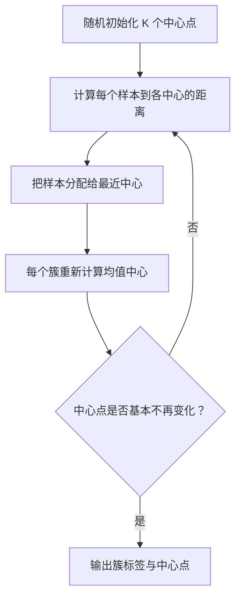

# K-means【机器学习】

## 1.1 K-means 是什么？

K-means 是最常见的聚类算法之一。它需要你预先指定要分成几组，也就是 $K$ 值。

目标：让同一组内样本尽量靠近自己的中心点，让不同组的中心点彼此分离。

## 1.2 算法步骤



更具体地说：

1. 初始化 $K$ 个质心。
2. 把每个样本分配到离它最近的质心。
3. 对每个簇重新计算均值，得到新质心。
4. 重复步骤 2、3，直到质心不再明显移动，或达到最大迭代次数。

K-means 优化的目标是簇内平方和：

$$
\sum_{k=1}^{K}\sum_{x_i\in C_k}\|x_i-\mu_k\|^2
$$

## 1.3 复杂度

一次 K-means 的时间复杂度通常可近似理解为：

$$
O(n\times K\times I\times d)
$$

其中：

- $n$：样本数。
- $K$：簇数。
- $I$：迭代次数。
- $d$：特征维度。

因此，当样本很多、维度很高、K 很大时，聚类成本会增长。

## 2. 优缺点

### 2.1 优点

- 原理简单、速度较快。
- 适合发现初步人群结构。
- 对大规模数值型数据有较好的可扩展性。
- 结果容易结合业务做标签命名。

### 2.2 缺点

- 必须提前指定 K。
- 对异常值敏感，异常点会拉偏中心。
- 更适合大小相近、近似圆形/凸形的簇。
- 对尺度敏感，通常需要标准化。
- 不同随机初始化可能得到不同结果。

## 3. 关键实践与改进

### 3.1 数据预处理

```python
import matplotlib.pyplot as plt
from sklearn.datasets import make_blobs
from sklearn.preprocessing import StandardScaler
from sklearn.cluster import KMeans
from sklearn.metrics import silhouette_score

X, _ = make_blobs(
    n_samples=500,
    centers=4,
    cluster_std=[1.0, 1.2, 0.8, 1.1],
    random_state=42
)

# 对距离敏感的聚类算法，通常先标准化
X_scaled = StandardScaler().fit_transform(X)
```

### 3.2 合理选择 K 值

### 方法一：肘部法（Elbow Method）

计算不同 K 下的 Inertia，寻找“继续增加 K 后收益明显变小”的拐点。

```python
inertias = []
k_values = range(2, 11)

for k in k_values:
    km = KMeans(n_clusters=k, n_init=10, random_state=42)
    km.fit(X_scaled)
    inertias.append(km.inertia_)

plt.plot(list(k_values), inertias, marker="o")
plt.xlabel("K")
plt.ylabel("Inertia（簇内平方和）")
plt.title("K-means 肘部法")
plt.show()
```

### 方法二：轮廓系数

```python
for k in range(2, 8):
    km = KMeans(n_clusters=k, n_init=10, random_state=42)
    labels = km.fit_predict(X_scaled)
    score = silhouette_score(X_scaled, labels)
    print(f"K={k}, silhouette={score:.3f}")
```

最后训练并画图：

```python
final_k = 4
kmeans = KMeans(n_clusters=final_k, n_init=10, random_state=42)
labels = kmeans.fit_predict(X_scaled)

plt.scatter(X_scaled[:, 0], X_scaled[:, 1], c=labels, cmap="tab10", alpha=0.7)
plt.scatter(
    kmeans.cluster_centers_[:, 0],
    kmeans.cluster_centers_[:, 1],
    c="red",
    marker="X",
    s=200,
    label="中心点"
)
plt.title("K-means 聚类结果")
plt.legend()
plt.show()
```

### 3.3 采用核函数

普通 K-means 本质上使用欧氏距离，更擅长处理近似球形簇。对于环形、月牙形等复杂结构，普通 K-means 可能失败。

“核 K-means”通过核函数隐式映射到更高维空间后再聚类，可以处理更复杂边界，但计算更复杂。在实际入门项目中，也可以考虑：

- 谱聚类（Spectral Clustering）。
- DBSCAN（能发现非规则形状簇，并识别噪声点）。
- 高斯混合模型（GMM）。

### 3.4 K-means++

随机初始化中心点可能导致差的局部结果。K-means++ 会更分散地选择初始中心，通常让结果更稳定。

在 `scikit-learn` 中，`KMeans` 默认使用的初始化方式通常就是 `k-means++`，你也可以显式指定：

```python
KMeans(n_clusters=4, init="k-means++", n_init=10, random_state=42)
```

### 3.5 ISODATA

ISODATA（Iterative Self-Organizing Data Analysis Technique）是 K-means 的扩展思想。它不仅反复更新中心，还可能根据规则：

- 对过大的簇进行拆分。
- 合并距离很近的簇。
- 删除样本过少的簇。

它适合“事先不完全确定应该分几组”的场景，但实现与参数更复杂。在入门阶段，先掌握“肘部法 + 轮廓系数 + 业务解释”选择 K 的方法更实用。

---
