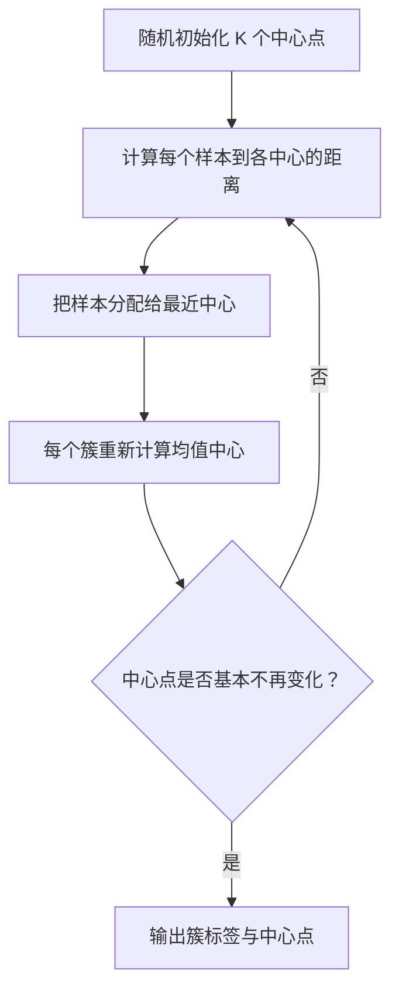

# K-means【机器学习】

## 1.1 K-means 是什么？

K-means 是最常见的聚类算法之一。它需要你预先指定要分成几组，也就是 $K$ 值。

目标：让同一组内样本尽量靠近自己的中心点，让不同组的中心点彼此分离。

## 1.2 算法步骤



更具体地说：

1. 初始化 $K$ 个质心。
2. 把每个样本分配到离它最近的质心。
3. 对每个簇重新计算均值，得到新质心。
4. 重复步骤 2、3，直到质心不再明显移动，或达到最大迭代次数。

K-means 优化的目标是簇内平方和：

$$
\sum_{k=1}^{K}\sum_{x_i\in C_k}\|x_i-\mu_k\|^2
$$

## 1.3 复杂度

一次 K-means 的时间复杂度通常可近似理解为：

$$
O(n\times K\times I\times d)
$$

其中：

- $n$：样本数。
- $K$：簇数。
- $I$：迭代次数。
- $d$：特征维度。

因此，当样本很多、维度很高、K 很大时，聚类成本会增长。

## 2. 优缺点

### 2.1 优点

- 原理简单、速度较快。
- 适合发现初步人群结构。
- 对大规模数值型数据有较好的可扩展性。
- 结果容易结合业务做标签命名。

### 2.2 缺点

- 必须提前指定 K。
- 对异常值敏感，异常点会拉偏中心。
- 更适合大小相近、近似圆形/凸形的簇。
- 对尺度敏感，通常需要标准化。
- 不同随机初始化可能得到不同结果。

## 3. 关键实践与改进

### 3.1 数据预处理

```python
import matplotlib.pyplot as plt
from sklearn.datasets import make_blobs
from sklearn.preprocessing import StandardScaler
from sklearn.cluster import KMeans
from sklearn.metrics import silhouette_score

X, _ = make_blobs(
    n_samples=500,
    centers=4,
    cluster_std=[1.0, 1.2, 0.8, 1.1],
    random_state=42
)
