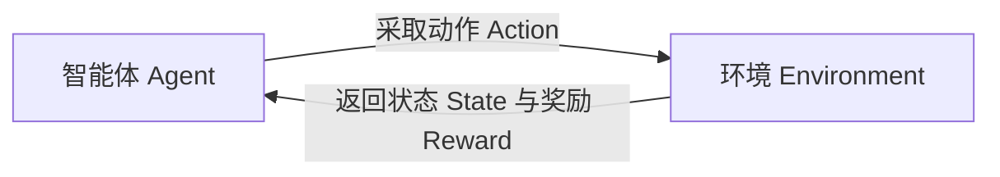

# 机器学习简介


## 入门认知

### 1. 机器学习到底是什么？

**机器学习（Machine Learning，ML）**是一类让计算机从数据中归纳规律，并把规律应用到新数据上的方法。

它不是让机器“记住所有答案”，而是让机器学习一个从输入到输出的映射关系：

$$
\hat{y}=f_{\theta}(x)
$$

其中：

| 符号 | 含义 | 例子：预测房价 |
|---|---|---|
| $x$ | 输入，也叫特征 | 面积、地段、房龄、楼层 |
| $y$ | 真实答案，也叫标签 | 实际成交价 |
| $\hat{y}$ | 模型预测的答案 | 预测成交价 |
| $f$ | 模型结构 | 线性回归、决策树、神经网络 |
| $\theta$ | 模型训练出来的参数 | 每个特征的权重、树的切分规则 |

例如，判断一封邮件是否为垃圾邮件：

- **传统规则程序**：人工写规则，例如“标题含有 `中奖` 且发件人不在通讯录，就判为垃圾邮件”。
- **机器学习程序**：准备大量“邮件内容 + 是否垃圾邮件”的历史样本，让模型学习哪些词语、发件域名、发送频率和格式更可能对应垃圾邮件。

### 2. 机器学习、人工智能、深度学习和大模型是什么关系？

```text
人工智能（AI）
└── 机器学习（ML）
    └── 深度学习（DL）
        └── 生成式 AI / 大语言模型（LLM）
```

- **人工智能**：让机器完成通常需要人类智能的任务，是一个大概念。
- **机器学习**：通过数据学习能力，而不是完全依靠手写规则。
- **深度学习**：使用多层神经网络的一类机器学习方法，擅长图像、语音、自然语言等复杂非结构化数据。
- **大语言模型**：深度学习在语言、代码、多模态生成任务上的代表性应用。

因此，销量预测、客户流失预警、垃圾邮件识别、推荐排序、风控评分都属于机器学习；它们并不一定需要大语言模型。

### 3. 什么问题适合用机器学习？

先问自己四个问题：

1. **是否有历史数据？** 例如用户行为、订单、图片、文本、设备传感器数据。
2. **是否存在可学习的规律？** 过去发生的模式，对未来仍有一定参考价值。
3. **是否难以穷举规则？** 规则太多、变化太快、相互关系复杂时，机器学习更有价值。
4. **是否能定义成功标准？** 例如准确率、召回率、误差、转化率、人工审核量下降等。

| 场景 | 输入 | 期望输出 | 常见任务 |
|---|---|---|---|
| 房价预测 | 面积、地段、户型 | 房价 | 回归 |
| 判断交易是否欺诈 | 金额、时间、设备、用户行为 | 欺诈 / 正常 | 二分类 |
| 将客户划分为人群 | 消费金额、频次、偏好 | 若干客户群 | 聚类 |
| 推荐商品 | 浏览、点击、购买历史 | 商品排序 | 排序 / 推荐 |
| 判断图片中是否有缺陷 | 图片像素、视觉特征 | 缺陷类别 | 图像分类 |
| 满 100 减 20 | 订单金额 | 固定优惠结果 | 规则即可，不必用 ML |

> **非常重要的产品判断**：能够被少量稳定、明确规则解决的问题，通常优先用规则。机器学习不是“更高级的 if-else”，而是在规则难以完整表达、但数据可学习时发挥价值。

---

## 技术细节

### 机器学习的类型

机器学习常按“有没有标签”和“学习信号来自哪里”分为三类。

### 1. 监督学习（Supervised Learning）

监督学习的数据有明确答案：每条样本都包含输入 $x$ 和标签 $y$。

$$
(x_1,y_1),(x_2,y_2),\ldots,(x_n,y_n)
$$

模型的目标是学会从 $x$ 预测 $y$。

#### 常见任务

| 任务 | 输出类型 | 示例 |
|---|---|---|
| 回归 | 连续数值 | 预测房价、销量、配送时长 |
| 二分类 | 两个类别 | 欺诈/正常、流失/未流失 |
| 多分类 | 多个互斥类别 | 鸢尾花品种、图片类别 |
| 多标签分类 | 多个标签可同时存在 | 一篇文章同时属于“AI”“产品”“编程” |
| 排序 | 结果排序 | 搜索结果排序、推荐排序 |

#### 监督学习的关键前提

- 标签必须可靠。
- 训练数据要与未来预测场景相近。
- 必须避免数据泄漏。
- 评估指标要和业务目标一致。

### 2. 无监督学习（Unsupervised Learning）

无监督学习只有输入 $x$，没有人工给定的标准答案 $y$。模型尝试发现数据内部的结构、群体或低维表示。

#### 常见任务

| 任务 | 目标 | 示例 |
|---|---|---|
| 聚类 | 把相似样本分组 | 客户分群、商品分群 |
| 降维 | 用更少维度保留主要信息 | 高维数据可视化、压缩特征 |
| 异常检测 | 找到少见或异常样本 | 设备异常、异常交易 |
| 关联规则 | 找到共同出现关系 | 购物篮分析：“买 A 的人也常买 B” |

无监督学习的难点在于：**没有唯一标准答案**。例如 K-means 分出 4 个群，不代表“4 一定正确”；你需要结合轮廓系数、业务解释和后续行动价值判断结果是否有意义。

### 3. 强化学习（Reinforcement Learning）

强化学习关注“智能体如何连续做决策”。它不是从固定标签学习，而是通过环境给出的奖励或惩罚，逐步学习长期收益更高的策略。



#### 强化学习的四个核心元素

| 概念 | 含义 | 棋牌游戏例子 |
|---|---|---|
| 状态 State | 当前所处情境 | 当前棋盘局面 |
| 动作 Action | 可以采取的选择 | 落子位置 |
| 奖励 Reward | 行动后的得分信号 | 赢 +1，输 -1 |
| 策略 Policy | 在状态下如何选动作 | 看到局面后下一步怎么走 |

强化学习常用于：游戏对弈、机器人控制、广告出价、动态资源调度、推荐策略优化等。它通常需要大量交互数据或模拟环境，入门阶段先理解概念即可。

---

## 机器学习的应用领域

| 行业 / 场景 | 典型问题 | 可用机器学习任务 |
|---|---|---|
| 电商零售 | 推荐、销量预测、价格优化 | 排序、回归、分类 |
| 金融风控 | 欺诈识别、信用评分 | 分类、异常检测 |
| 制造业 | 设备预测性维护、缺陷识别 | 时间序列、分类、视觉检测 |
| 医疗健康 | 辅助筛查、风险预测 | 分类、图像识别、回归 |
| 交通物流 | 到达时间预测、路径优化 | 回归、强化学习、图优化 |
| 政务与办公 | 文档分类、工单分派、风险预警 | 文本分类、聚类、排序 |
| 内容平台 | 推荐、审核、反作弊 | 排序、分类、异常检测 |
| 低空与物联网 | 目标识别、飞行风险预警、气象预测 | 视觉分类、检测、时序预测 |

机器学习能力通常不是孤立功能，而是嵌入业务闭环的一部分。例如“流失预测”本身不产生价值，真正有价值的是：模型识别高风险用户后，运营是否有合理触达策略、是否能验证挽回效果、是否会形成新一轮训练数据。

---

## 机器学习的未来

从学习者角度，更值得关注的不是“哪一个算法会取代哪一个算法”，而是以下趋势：

1. **机器学习将与生成式 AI 结合。** 传统模型擅长结构化预测、排序、风控和表格数据；大模型擅长语言、多模态理解和生成。实际系统往往会组合使用。
2. **数据治理比单纯调参更重要。** 数据口径、标签质量、权限、隐私、版本和漂移监控，会越来越决定模型是否可持续。
3. **小而专的模型仍然重要。** 在成本、延迟、可解释性、内网部署要求较高的场景，经典机器学习模型通常仍是可靠选择。
4. **从“训练模型”走向“运营模型”。** 企业更关注模型上线后的效果、漂移、审计、反馈和迭代，而不只关注离线分数。
5. **人机协同会成为常态。** 在高风险场景，模型输出更适合作为建议、排序或预警，关键决策仍保留人工复核与可追溯依据。

---
