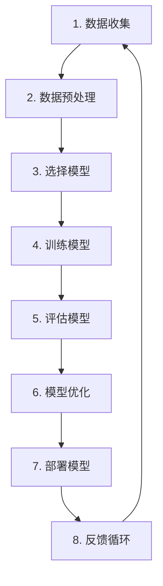
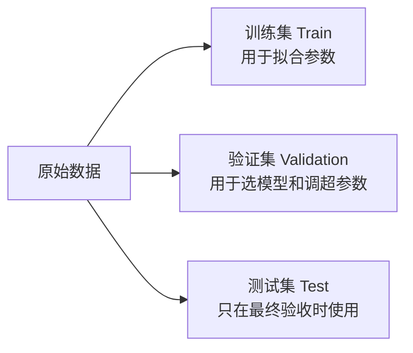
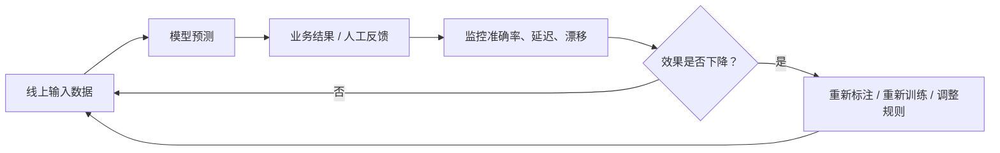
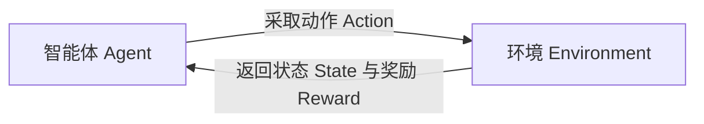

# 机器学习简介

## 入门认知

### 1. 机器学习到底是什么？

**机器学习（Machine Learning，ML）**是一类让计算机从数据中归纳规律，并把规律应用到新数据上的方法。

它不是让机器“记住所有答案”，而是让机器学习一个从输入到输出的映射关系：

$$
\hat{y}=f_{\theta}(x)
$$

其中：

| 符号 | 含义 | 例子：预测房价 |
|---|---|---|
| $x$ | 输入，也叫特征 | 面积、地段、房龄、楼层 |
| $y$ | 真实答案，也叫标签 | 实际成交价 |
| $\hat{y}$ | 模型预测的答案 | 预测成交价 |
| $f$ | 模型结构 | 线性回归、决策树、神经网络 |
| $\theta$ | 模型训练出来的参数 | 每个特征的权重、树的切分规则 |

例如，判断一封邮件是否为垃圾邮件：

- **传统规则程序**：人工写规则，例如“标题含有 `中奖` 且发件人不在通讯录，就判为垃圾邮件”。
- **机器学习程序**：准备大量“邮件内容 + 是否垃圾邮件”的历史样本，让模型学习哪些词语、发件域名、发送频率和格式更可能对应垃圾邮件。

### 2. 机器学习、人工智能、深度学习和大模型是什么关系？

```text
人工智能（AI）
└── 机器学习（ML）
    └── 深度学习（DL）
        └── 生成式 AI / 大语言模型（LLM）
```

- **人工智能**：让机器完成通常需要人类智能的任务，是一个大概念。
- **机器学习**：通过数据学习能力，而不是完全依靠手写规则。
- **深度学习**：使用多层神经网络的一类机器学习方法，擅长图像、语音、自然语言等复杂非结构化数据。
- **大语言模型**：深度学习在语言、代码、多模态生成任务上的代表性应用。

因此，销量预测、客户流失预警、垃圾邮件识别、推荐排序、风控评分都属于机器学习；它们并不一定需要大语言模型。

### 3. 什么问题适合用机器学习？

先问自己四个问题：

1. **是否有历史数据？** 例如用户行为、订单、图片、文本、设备传感器数据。
2. **是否存在可学习的规律？** 过去发生的模式，对未来仍有一定参考价值。
3. **是否难以穷举规则？** 规则太多、变化太快、相互关系复杂时，机器学习更有价值。
4. **是否能定义成功标准？** 例如准确率、召回率、误差、转化率、人工审核量下降等。

| 场景 | 输入 | 期望输出 | 常见任务 |
|---|---|---|---|
| 房价预测 | 面积、地段、户型 | 房价 | 回归 |
| 判断交易是否欺诈 | 金额、时间、设备、用户行为 | 欺诈 / 正常 | 二分类 |
| 将客户划分为人群 | 消费金额、频次、偏好 | 若干客户群 | 聚类 |
| 推荐商品 | 浏览、点击、购买历史 | 商品排序 | 排序 / 推荐 |
| 判断图片中是否有缺陷 | 图片像素、视觉特征 | 缺陷类别 | 图像分类 |
| 满 100 减 20 | 订单金额 | 固定优惠结果 | 规则即可，不必用 ML |

> **非常重要的产品判断**：能够被少量稳定、明确规则解决的问题，通常优先用规则。机器学习不是“更高级的 if-else”，而是在规则难以完整表达、但数据可学习时发挥价值。

---

## 机器学习是如何工作的？

下面先用**项目全流程视角**理解机器学习。后面“机器学习如何工作”一节会从训练、损失函数、参数更新等技术视角再讲一次。



### 1. 数据收集

数据是模型学习的“教材”。没有可靠数据，再先进的算法也无法产生可靠结果。

常见数据来源：

- **业务系统**：订单、客户、商品、工单、CRM、ERP。
- **埋点日志**：浏览、点击、搜索、停留、加购、支付。
- **文本与文档**：客服对话、评论、合同、邮件、知识库。
- **图像与音频**：质检照片、监控视频、语音录音。
- **设备与传感器**：温湿度、定位、振动、功耗、飞行数据。
- **人工标注**：给图片标类别、给文本标情感、给交易标风险。

以“预测用户是否流失”为例：

| 用户 ID | 距上次登录天数 | 30 天使用次数 | 是否购买会员 | 客服投诉次数 | 是否流失 |
|---|---:|---:|---:|---:|---:|
| U001 | 2 | 18 | 1 | 0 | 0 |
| U002 | 45 | 0 | 0 | 2 | 1 |
| U003 | 7 | 4 | 0 | 0 | 0 |

前五列是模型可用的**特征**，最后一列“是否流失”是**标签**。

#### 数据收集阶段的检查清单

- 训练数据是否覆盖真实业务中的主要人群和场景？
- 标签是否可信？例如“已投诉”不等于“真的不满意”。
- 是否混入了未来信息？例如预测用户是否流失时，不能使用“流失后 30 天的登录次数”。
- 是否有敏感字段、隐私字段或不应使用的代理变量？
- 数据粒度是否统一？一行究竟代表“一个用户”“一笔订单”还是“某用户某天”？

### 2. 数据预处理

真实数据通常像“未经整理的原始食材”，不能直接拿来训练。预处理的目标是把数据变成模型能理解、质量相对可靠的输入。

| 常见问题 | 示例 | 常见处理方式 |
|---|---|---|
| 缺失值 | 年龄为空、收入未知 | 均值/中位数填补、填“未知”、增加缺失标记 |
| 重复数据 | 同一订单被导入两次 | 去重，保留可信版本 |
| 异常值 | 年龄为 999、金额为 -1 | 业务校验、截断、删除或单独标记 |
| 类别数据 | 城市、性别、品类 | One-Hot 编码、目标编码、Embedding |
| 数值量纲不同 | 收入 100000，点击次数 3 | 标准化、归一化 |
| 文本数据 | 评论、工单内容 | 分词、TF-IDF、词向量、文本 Embedding |
| 时间穿越 | 用了未来才可得字段 | 按时间重新构造特征和切分数据 |

#### 为什么标准化很重要？

对 KNN、逻辑回归、SVM、K-means、PCA 等依赖距离或梯度优化的算法，数值尺度会直接影响结果。

例如，有两个特征：

- 年收入：0～500,000
- 最近 30 天登录次数：0～50

若不做标准化，年收入的数值范围远大于登录次数，模型可能几乎只“看见”年收入。

常用标准化公式：

$$
z=\frac{x-\mu}{\sigma}
$$

其中 $\mu$ 是均值，$\sigma$ 是标准差。标准化后，特征通常变为均值约为 0、标准差约为 1。

> **防泄漏原则**：必须先切分训练集和测试集，再只用训练集计算均值、标准差、缺失值填补规则；然后把同一套规则应用到验证集和测试集。最安全的方式是使用 `Pipeline`。

### 3. 选择模型

模型选择不应从“哪个算法最热门”开始，而应从问题与约束开始。

| 你的目标 | 优先尝试的模型 | 原因 |
|---|---|---|
| 预测连续数值 | 线性回归、随机森林回归、XGBoost 回归 | 输出是金额、销量、时长等数值 |
| 预测类别 | 逻辑回归、KNN、SVM、决策树、随机森林、XGBoost | 输出是类别或概率 |
| 发现人群结构 | K-means、层次聚类、DBSCAN | 没有人工标签，想找群体规律 |
| 降维、可视化、压缩 | PCA | 用较少维度保留主要变化 |
| 多轮决策、试错优化 | 强化学习 | 行为会影响后续状态和奖励 |

初学者最实用的策略是：

1. 先做一个**简单且可解释的基线模型**，例如线性回归或逻辑回归。
2. 再尝试树模型、随机森林、XGBoost 等复杂模型。
3. 用一致的数据切分和指标比较，而不是凭感觉选模型。
4. 复杂模型若没有带来业务价值，不值得增加维护成本。

### 4. 训练模型

训练的本质是：让模型在训练数据上不断调整参数，使预测结果尽量接近真实答案。

以线性回归为例：

$$
\hat{y}=w_0+w_1x_1+w_2x_2+\cdots+w_px_p
$$

模型训练的过程，就是寻找合适的 $w_0,w_1,\ldots,w_p$。

可以把它理解为：模型先给出预测 → 计算预测错了多少 → 根据误差调整参数 → 再预测。这个循环会重复很多次。

### 5. 评估模型

训练集表现好，不代表模型真的好。真正重要的是：它面对**没见过的新数据**时是否仍然有效，这叫**泛化能力**。

因此需要把数据拆开：



常见评估指标：

- 分类：准确率、精确率、召回率、F1、ROC-AUC、PR-AUC。
- 回归：MAE、MSE、RMSE、$R^2$。
- 聚类：轮廓系数、簇内平方和（Inertia）、业务可解释性。

### 6. 模型优化

优化不等于“反复换算法”。通常按下列优先级推进：

1. 修复错误数据、重复数据、时间穿越。
2. 改善标签质量。
3. 补充更有业务意义的特征。
4. 处理类别不平衡。
5. 使用交叉验证稳定评估。
6. 调整超参数。
7. 选择更适合的模型或组合模型。

> 很多真实项目里，数据质量和特征设计带来的提升，常常大于从 A 算法换到 B 算法。

### 7. 部署模型

部署是让模型从 Notebook 进入业务流程。常见方式：

- **批处理**：每天离线跑一次，为全部客户计算流失风险分。
- **实时 API**：用户提交申请或下单时，接口立即返回风险概率或推荐结果。
- **嵌入产品工作流**：模型给出建议，人工审核后决定是否采纳。
- **边缘部署**：模型运行在摄像头、手机、工业设备等本地终端。

### 8. 反馈循环

上线后的环境会变化：用户行为变了、业务规则改了、产品版本更新了、季节变化了、采集字段变了。模型效果可能因此下降。



需要关注两类变化：

- **数据漂移（Data Drift）**：输入特征的分布变化。例如原来用户平均消费 100 元，现在因为大促变成 300 元。
- **概念漂移（Concept Drift）**：同样的输入与结果之间的关系变化。例如过去“频繁异地登录”常意味着风险，但某业务上线后大量用户出差使用，规则关系失效。

---

## 技术细节

### 机器学习的类型

机器学习常按“有没有标签”和“学习信号来自哪里”分为三类。

### 1. 监督学习（Supervised Learning）

监督学习的数据有明确答案：每条样本都包含输入 $x$ 和标签 $y$。

$$
(x_1,y_1),(x_2,y_2),\ldots,(x_n,y_n)
$$

模型的目标是学会从 $x$ 预测 $y$。

#### 常见任务

| 任务 | 输出类型 | 示例 |
|---|---|---|
| 回归 | 连续数值 | 预测房价、销量、配送时长 |
| 二分类 | 两个类别 | 欺诈/正常、流失/未流失 |
| 多分类 | 多个互斥类别 | 鸢尾花品种、图片类别 |
| 多标签分类 | 多个标签可同时存在 | 一篇文章同时属于“AI”“产品”“编程” |
| 排序 | 结果排序 | 搜索结果排序、推荐排序 |

#### 监督学习的关键前提

- 标签必须可靠。
- 训练数据要与未来预测场景相近。
- 必须避免数据泄漏。
- 评估指标要和业务目标一致。

### 2. 无监督学习（Unsupervised Learning）

无监督学习只有输入 $x$，没有人工给定的标准答案 $y$。模型尝试发现数据内部的结构、群体或低维表示。

#### 常见任务

| 任务 | 目标 | 示例 |
|---|---|---|
| 聚类 | 把相似样本分组 | 客户分群、商品分群 |
| 降维 | 用更少维度保留主要信息 | 高维数据可视化、压缩特征 |
| 异常检测 | 找到少见或异常样本 | 设备异常、异常交易 |
| 关联规则 | 找到共同出现关系 | 购物篮分析：“买 A 的人也常买 B” |

无监督学习的难点在于：**没有唯一标准答案**。例如 K-means 分出 4 个群，不代表“4 一定正确”；你需要结合轮廓系数、业务解释和后续行动价值判断结果是否有意义。

### 3. 强化学习（Reinforcement Learning）

强化学习关注“智能体如何连续做决策”。它不是从固定标签学习，而是通过环境给出的奖励或惩罚，逐步学习长期收益更高的策略。



#### 强化学习的四个核心元素

| 概念 | 含义 | 棋牌游戏例子 |
|---|---|---|
| 状态 State | 当前所处情境 | 当前棋盘局面 |
| 动作 Action | 可以采取的选择 | 落子位置 |
| 奖励 Reward | 行动后的得分信号 | 赢 +1，输 -1 |
| 策略 Policy | 在状态下如何选动作 | 看到局面后下一步怎么走 |

强化学习常用于：游戏对弈、机器人控制、广告出价、动态资源调度、推荐策略优化等。它通常需要大量交互数据或模拟环境，入门阶段先理解概念即可。

---

## 机器学习的应用领域

| 行业 / 场景 | 典型问题 | 可用机器学习任务 |
|---|---|---|
| 电商零售 | 推荐、销量预测、价格优化 | 排序、回归、分类 |
| 金融风控 | 欺诈识别、信用评分 | 分类、异常检测 |
| 制造业 | 设备预测性维护、缺陷识别 | 时间序列、分类、视觉检测 |
| 医疗健康 | 辅助筛查、风险预测 | 分类、图像识别、回归 |
| 交通物流 | 到达时间预测、路径优化 | 回归、强化学习、图优化 |
| 政务与办公 | 文档分类、工单分派、风险预警 | 文本分类、聚类、排序 |
| 内容平台 | 推荐、审核、反作弊 | 排序、分类、异常检测 |
| 低空与物联网 | 目标识别、飞行风险预警、气象预测 | 视觉分类、检测、时序预测 |

机器学习能力通常不是孤立功能，而是嵌入业务闭环的一部分。例如“流失预测”本身不产生价值，真正有价值的是：模型识别高风险用户后，运营是否有合理触达策略、是否能验证挽回效果、是否会形成新一轮训练数据。

---

## 机器学习的未来

从学习者角度，更值得关注的不是“哪一个算法会取代哪一个算法”，而是以下趋势：

1. **机器学习将与生成式 AI 结合。** 传统模型擅长结构化预测、排序、风控和表格数据；大模型擅长语言、多模态理解和生成。实际系统往往会组合使用。
2. **数据治理比单纯调参更重要。** 数据口径、标签质量、权限、隐私、版本和漂移监控，会越来越决定模型是否可持续。
3. **小而专的模型仍然重要。** 在成本、延迟、可解释性、内网部署要求较高的场景，经典机器学习模型通常仍是可靠选择。
4. **从“训练模型”走向“运营模型”。** 企业更关注模型上线后的效果、漂移、审计、反馈和迭代，而不只关注离线分数。
5. **人机协同会成为常态。** 在高风险场景，模型输出更适合作为建议、排序或预警，关键决策仍保留人工复核与可追溯依据。

---
