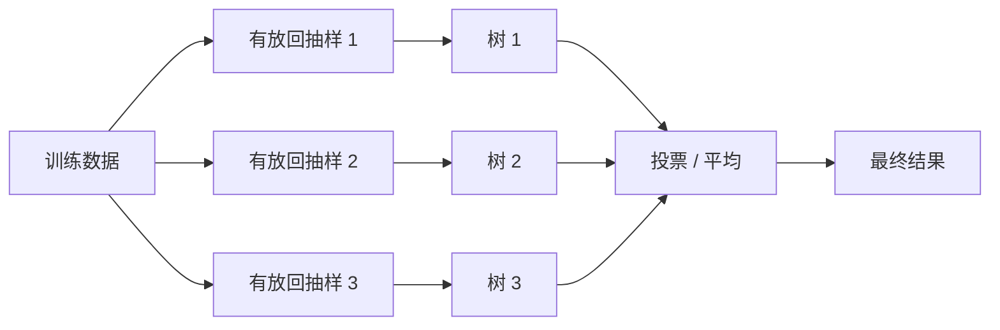
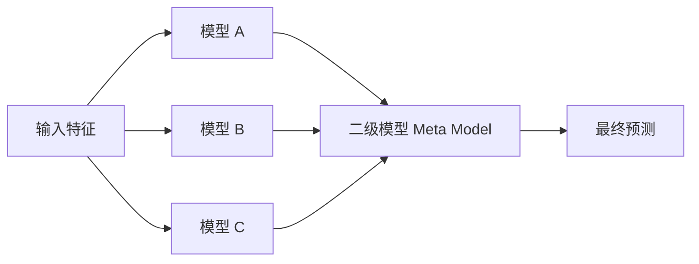

# 随机森林分类模型详解

随机森林属于**集成学习**：不是依赖一棵树，而是让多棵树共同投票或平均，从而提升稳定性和泛化能力。

## 1. Bagging（Bootstrap Aggregating）

Bagging 的核心是“并行训练多个模型，再做平均或投票”。



随机森林在 Bagging 的基础上，还会在每次分裂时随机抽取一部分特征候选，降低树与树之间的相似性。

## 2. Boosting

Boosting 的核心是“串行纠错”：后一个模型更关注前一个模型犯错的样本。


常见 Boosting 模型：AdaBoost、Gradient Boosting、XGBoost、LightGBM、CatBoost。

## 3. Stacking（Stacked Generalization）

Stacking 的思路是：先训练多个不同类型的基础模型，再训练一个“二级模型”学习如何组合它们的输出。



## 随机森林的优缺点

| 优点 | 缺点 |
|---|---|
| 通常比单棵树稳定，不易过拟合 | 模型体积和预测成本高于单棵树 |
| 能处理非线性与特征交互 | 可解释性弱于单棵树 |
| 对异常值和特征缩放不太敏感 | 高维稀疏文本数据通常不是首选 |
| 可输出特征重要性 | 重要性不等于因果关系 |

## 实例演示：随机森林、Bagging、AdaBoost、Stacking

```python
from sklearn.datasets import load_breast_cancer
from sklearn.model_selection import train_test_split
from sklearn.tree import DecisionTreeClassifier
from sklearn.ensemble import (
    RandomForestClassifier,
    BaggingClassifier,
    AdaBoostClassifier,
    StackingClassifier
)
from sklearn.linear_model import LogisticRegression
from sklearn.metrics import accuracy_score, f1_score

# 1. 数据
cancer = load_breast_cancer()
X_train, X_test, y_train, y_test = train_test_split(
    cancer.data,
    cancer.target,
    test_size=0.25,
    random_state=42,
    stratify=cancer.target
)

# 2. 定义模型
models = {
    "RandomForest": RandomForestClassifier(
        n_estimators=300,
        max_depth=None,
        min_samples_leaf=2,
        random_state=42,
        n_jobs=-1
    ),
    "Bagging": BaggingClassifier(
        estimator=DecisionTreeClassifier(max_depth=5, random_state=42),
        n_estimators=100,
        random_state=42,
        n_jobs=-1
    ),
    "AdaBoost": AdaBoostClassifier(
        estimator=DecisionTreeClassifier(max_depth=1, random_state=42),
        n_estimators=200,
        learning_rate=0.5,
        random_state=42
    ),
    "Stacking": StackingClassifier(
        estimators=[
            ("tree", DecisionTreeClassifier(max_depth=4, random_state=42)),
            ("rf", RandomForestClassifier(n_estimators=150, random_state=42, n_jobs=-1))
        ],
        final_estimator=LogisticRegression(max_iter=2000),
        cv=5,
        n_jobs=-1
    )
}

# 3. 训练与评估
for name, model in models.items():
    model.fit(X_train, y_train)
    pred = model.predict(X_test)
    print(
        f"{name:12s} "
        f"accuracy={accuracy_score(y_test, pred):.4f}, "
        f"f1={f1_score(y_test, pred):.4f}"
    )
```

> **注意**：`Stacking` 如果处理不当容易发生泄漏。`scikit-learn` 的 `StackingClassifier` 会借助交叉验证生成训练阶段的元特征；不要直接用同一批训练样本的预测结果去训练二级模型。

---
