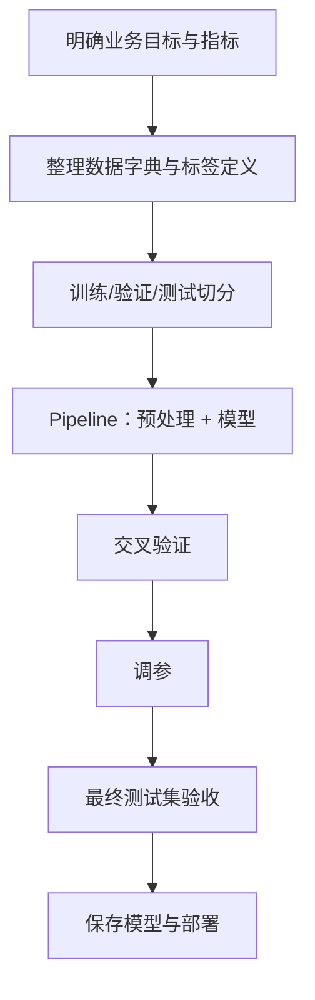

# 从训练到调优：一套可复用的机器学习工作流

虽然目录重点放在算法，但真正做项目时，推荐统一使用以下工作流：



## 1. 使用 Pipeline 防止数据泄漏

```python
from sklearn.pipeline import Pipeline
from sklearn.impute import SimpleImputer
from sklearn.preprocessing import StandardScaler
from sklearn.linear_model import LogisticRegression

pipeline = Pipeline([
    ("imputer", SimpleImputer(strategy="median")),
    ("scaler", StandardScaler()),
    ("model", LogisticRegression(max_iter=1000))
])
```

`Pipeline` 的好处：

- 训练时，填补规则和标准化参数只从训练折学习。
- 验证/测试/线上预测自动应用同一规则。
- 预处理和模型可以一起保存，降低线上线下不一致风险。

## 2. 用交叉验证评估模型

```python
from sklearn.model_selection import StratifiedKFold, cross_val_score

cv = StratifiedKFold(n_splits=5, shuffle=True, random_state=42)
scores = cross_val_score(
    pipeline,
    X_train,
    y_train,
    scoring="f1",
    cv=cv
)

print("每折 F1：", scores)
print("平均 F1：", scores.mean())
print("标准差：", scores.std())
```

## 3. 用网格搜索调参

```python
from sklearn.model_selection import GridSearchCV

param_grid = {
    "model__C": [0.01, 0.1, 1, 10],
    "model__class_weight": [None, "balanced"]
}

search = GridSearchCV(
    estimator=pipeline,
    param_grid=param_grid,
    scoring="f1",
    cv=cv,
    n_jobs=-1
)

search.fit(X_train, y_train)

print("最佳参数：", search.best_params_)
print("交叉验证最佳 F1：", search.best_score_)
```

`model__C` 中的双下划线表示“Pipeline 中名为 `model` 的步骤的参数 `C`”。

## 4. 最终测试集验收

```python
from sklearn.metrics import classification_report

best_model = search.best_estimator_
test_pred = best_model.predict(X_test)

print(classification_report(y_test, test_pred))
```

> 测试集应当像“期末考试题”。如果你每调一次参数都看一次测试集，你就在逐渐把答案泄漏给模型选择过程，最后的分数会偏乐观。

---
