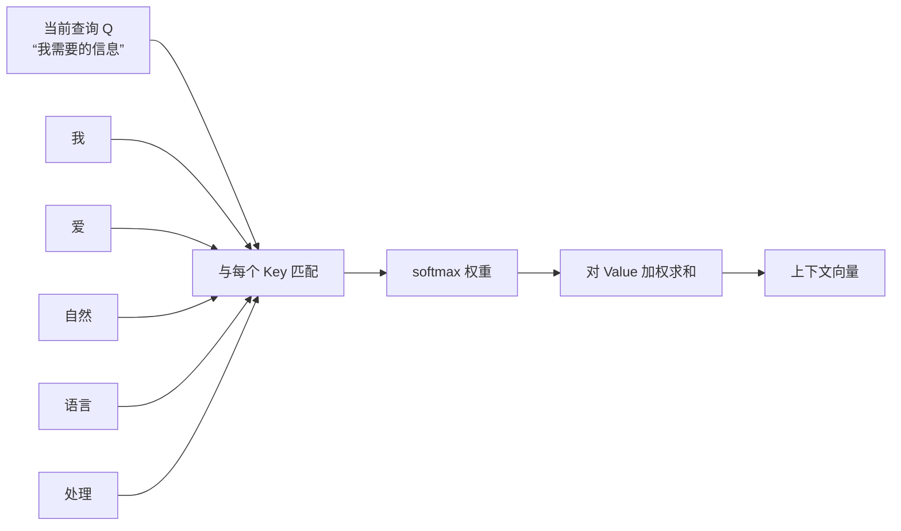

# 3.2 注意力机制

### 3.2.1 注意力机制解决什么问题？

翻译“我爱自然语言处理”时，模型生成 `language` 时应该重点看“语言”，而不是平均处理整句。注意力机制让模型为不同输入位置分配不同权重。



### 3.2.2 Q、K、V 如何理解？

一个贴近检索的类比：

- **Query（查询）**：当前我想找什么；
- **Key（键）**：每条候选信息的索引；
- **Value（值）**：候选信息本身的内容。

Query 与所有 Key 计算相关度，得到权重后对 Value 加权汇总。

### 3.2.3 缩放点积注意力公式

$$
\mathrm{Attention}(Q,K,V)=\mathrm{softmax}\left(\frac{QK^T}{\sqrt{d_k}}\right)V
$$

拆开看：

1. $QK^T$：计算匹配分数；
2. $\sqrt{d_k}$：避免维度较大时分数过大；
3. `softmax`：将分数变为和为 1 的权重；
4. 权重乘 $V$：汇总最相关的信息。

### 3.2.4 小型注意力计算示例

```python
import math
import torch
import torch.nn.functional as F

Q = torch.tensor([[1.0, 0.0, 1.0, 0.0]])
K = torch.tensor([
    [1.0, 0.0, 1.0, 0.0],
    [0.0, 1.0, 0.0, 1.0],
    [1.0, 1.0, 0.0, 0.0]
])
V = torch.tensor([
    [10.0, 0.0],
    [0.0, 20.0],
    [5.0, 5.0]
])

scores = Q @ K.T / math.sqrt(K.size(-1))
weights = F.softmax(scores, dim=-1)
output = weights @ V

print("分数：", scores)
print("权重：", weights)
print("输出：", output)
```

### 3.2.5 Self-Attention（自注意力）

当 Q、K、V 都来自同一段输入时，称为自注意力。例如：

```text
“这家公司发布了它的新产品。”
```

“它”可能需要重点关注“这家公司”来解决指代问题。自注意力允许每个 token 直接查看序列中所有位置的信息。

### 3.2.6 注意力的限制

标准自注意力对长度为 $n$ 的序列通常具有 $O(n^2)$ 的计算/内存开销。序列越长，成本越高，所以长文本、长视频、超长上下文需要专门优化。
