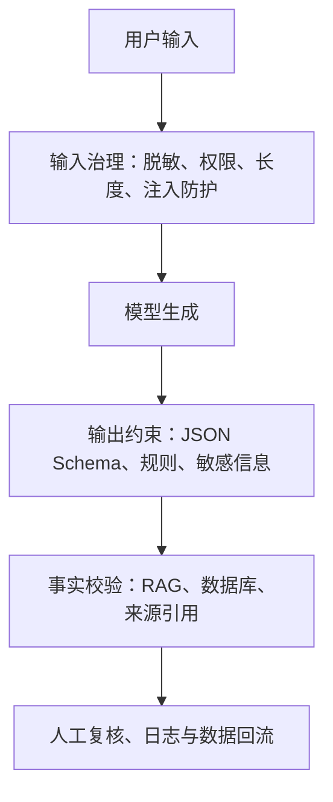

# 4.3 生成式预训练模型

### 4.3.1 什么是生成式模型？

生成式预训练模型通常按照“已知前文，预测下一个 token”的方式学习：

$$
P(x_1,x_2,\ldots,x_n)=\prod_{t=1}^{n}P(x_t\mid x_1,\ldots,x_{t-1})
$$

例如：

```text
输入：“今天天气很”
模型：预测下一个 token，可能是“好”“热”“冷”……
```

### 4.3.2 三种主流范式

| 范式 | 输入可见范围 | 代表 | 强项 |
|---|---|---|---|
| Encoder-only | 双向上下文 | BERT | 理解、分类、抽取 |
| Decoder-only | 左侧历史 | GPT 类 | 对话、续写、代码、生成 |
| Encoder-Decoder | 编码输入后再自回归输出 | T5、BART | 翻译、摘要、改写 |

### 4.3.3 GPT、T5、BART 如何区分？

| 模型 | 一句话理解 | 典型任务 |
|---|---|---|
| GPT 类 | 根据前文不断继续写 | 对话、创作、代码、指令执行 |
| T5 | 把 NLP 统一转成“文本输入→文本输出” | 翻译、摘要、问答、分类 |
| BART | 破坏文本后再学会复原 | 摘要、改写、生成与理解 |
| 指令微调模型 | 学会按照自然语言指令执行任务 | 助手、结构化抽取、工作流 |

### 4.3.4 生成模型能做什么，又可能错在哪里？

| 能力 | 示例 | 主要风险 |
|---|---|---|
| 摘要 | 长文→要点 | 漏条件、编造事实 |
| 问答 | 文档+问题→答案 | 语气很肯定但内容不真 |
| 信息抽取 | 文本→JSON | 字段漏抽、格式错误 |
| 改写 | 口语→正式 | 改写时改变原意 |
| 分类 | 输入→标签 | 输出不可控、难复现 |

### 4.3.5 用 Schema 约束结构化输出

提示词应当写清楚任务、字段、格式和禁止事项：

```text
你是信息抽取助手。请从文本中抽取订单号、金额、投诉原因。
仅输出符合以下 JSON Schema 的 JSON，不要输出解释：

{
  "order_id": "string | null",
  "amount": "string | null",
  "complaint_reason": ["string"]
}

文本：
“订单202607060001金额2399元，用户投诉手机发热严重。”
```

程序侧还要做校验：

```python
import json
from pydantic import BaseModel, Field, ValidationError

class ExtractionResult(BaseModel):
    order_id: str | None = None
    amount: str | None = None
    complaint_reason: list[str] = Field(default_factory=list)

raw_model_output = '''
{
  "order_id": "202607060001",
  "amount": "2399元",
  "complaint_reason": ["手机发热严重"]
}
'''

try:
    result = ExtractionResult.model_validate(json.loads(raw_model_output))
    print(result.model_dump())
except (json.JSONDecodeError, ValidationError) as e:
    print("输出不合法，需要重试或转人工：", e)
```

### 4.3.6 生成式系统的四层防线


