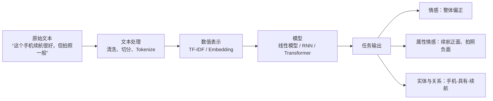

# NLP 从零入门：从文本处理到 Transformer 与预训练模型

> **适合读者**：会一点 Python，了解基础机器学习，但还没有建立 NLP 完整知识体系的学习者。  
> **完成后你将能够**：解释文本如何变成向量；区分文本分类、NER、关系抽取和语义相似度；理解 RNN、注意力、Transformer、BERT 与 GPT 的关系；搭建若干可运行的 NLP 原型。  
> **学习原则**：先理解“任务要解决什么、数据是什么、输出怎么评估”，再学习模型和代码。

---

## 第一章 基础概念

## 先建立一张全景图：NLP 到底在做什么？

自然语言处理（Natural Language Processing，NLP）的目标，是让计算机把人类语言转成可计算的表示，并完成理解、分类、抽取、检索、生成和对话等任务。

语言难在“相同字符不一定相同意思、不同表达可能意思相近”。例如：

| 语言现象 | 例子 | 造成的挑战 |
|---|---|---|
| 多义 | “苹果发布新品”与“苹果很好吃” | 一个词在不同上下文含义不同 |
| 否定 | “并不是不好用” | 出现负面词不等于整体负面 |
| 指代 | “小王买了电脑，他很满意” | “他”需要回指前文实体 |
| 反讽 | “服务真周到，让我等了两小时” | 字面与真实情绪相反 |
| 领域差异 | 医疗中的“阳性” | 词义随领域改变 |

> **核心认知**：NLP 不是让模型“认识字”，而是让模型在上下文中学会哪些信息重要、信息之间有什么关系，以及一句话在完成什么语义功能。

<figure class="article-figure">
  
  <figcaption>NLP 入门先建立全景图：文本处理、数值表示、模型任务和语言现象彼此相连。</figcaption>
</figure>

## 本章菜单

- [1.1 文本预处理](/concepts/ai-tech/nlp/text-preprocessing)
- [1.2 文本表示方法](/concepts/ai-tech/nlp/text-representation)
- [1.3 文本分类](/concepts/ai-tech/nlp/text-classification)
- [1.4 语言学基础](/concepts/ai-tech/nlp/linguistics-basics)
