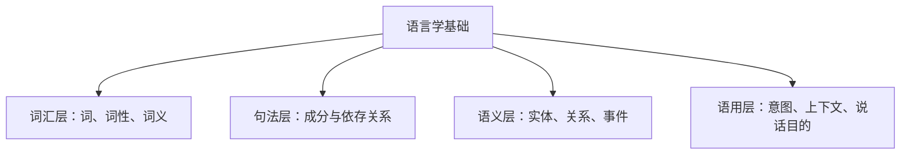

# 1.4 语言学基础

懂一点语言学，会帮助你定位“问题是文本本身、标注规则，还是模型能力”。



| 层次 | 关键问题 | 示例 | 对应任务 |
|---|---|---|---|
| 词汇 | 词是什么、什么词性？ | “研究”可作名词也可作动词 | 分词、词性标注 |
| 句法 | 词如何组合？ | “我喜欢你”中“我”是主语 | 依存句法 |
| 语义 | 文本表达什么事实？ | “张三入职腾讯” | NER、关系抽取 |
| 语用 | 说话者真正要做什么？ | “能开下空调吗？”是请求 | 意图识别、对话 |

### 1.4.1 词性、依存句法与语义角色

```text
“李华昨天在深圳提交了申请。”

词性：李华/名词  昨天/时间  在/介词  深圳/地点  提交/动词  申请/名词
依存：李华 → 提交（主语）；提交 → 申请（宾语）
语义角色：施事=李华；时间=昨天；地点=深圳；动作=提交；对象=申请
```

### 1.4.2 中文 NLP 特有挑战

| 挑战 | 示例 | 常见应对 |
|---|---|---|
| 无空格 | “研究生命起源” | 分词或子词建模 |
| 同形多义 | “行长”“行走” | 上下文模型 |
| 口语、省略 | “这个咋整？” | 采集真实语料 |
| 同音错别字 | “在吗”→“再吗” | 字符级模型、纠错 |
| 网络语言 | “绝绝子”“yyds” | 增量语料、领域词典 |
| 专业术语 | 法律、医疗、金融 | 术语库、领域模型、人工校验 |

### 1.4.3 LTP 基础分析（可选）

```bash
pip install ltp
```

```python
from ltp import LTP

ltp = LTP()
output = ltp.pipeline(
    ["张三昨天在深圳提交了退款申请。"],
    tasks=["cws", "pos", "ner", "dep", "srl"]
)
print("分词：", output.cws)
print("词性：", output.pos)
print("实体：", output.ner)
print("依存：", output.dep)
print("语义角色：", output.srl)
```

不同版本 API 与模型下载方式可能不同。正式项目应固定依赖版本，并把模型文件纳入部署与版本管理。
