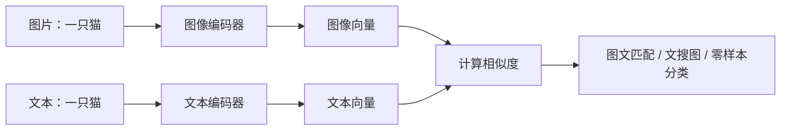

# 4.4 多模态预训练模型

### 4.4.1 什么是多模态？

多模态模型同时处理文本、图像、音频、视频等数据。文本在多模态系统中常承担描述、查询、指令和解释的角色。

| 模态 | 例子 |
|---|---|
| 文本 | 问题、描述、指令、文档 |
| 图像 | 商品图、票据、截图、医学影像 |
| 音频 | 客服录音、会议、语音指令 |
| 视频 | 教学视频、监控、短视频 |

### 4.4.2 CLIP：图文如何进入同一语义空间？

CLIP 类方法会将匹配图文对的向量拉近、非匹配对拉远，因此可用于图文检索、零样本分类和图文一致性判断。

### 4.4.3 多模态任务

| 任务 | 输入 | 输出 |
|---|---|---|
| 文搜图 | “红色运动鞋” | 匹配商品图 |
| 图像问答 | 图片 + 问题 | 文本答案 |
| 文档理解 | 扫描件 + 问题 | 字段、摘要、表格 |
| 视频检索 | “找出有人摔倒片段” | 视频时间段 |
| 图文审核 | 图片 + 文案 | 是否一致、是否违规 |

### 4.4.4 三类融合方式

| 方式 | 思路 | 典型用途 |
|---|---|---|
| 双编码器 | 图像、文本分别编码后比相似度 | 高速检索、CLIP 类 |
| 交叉注意力 | 文本 token 与图像特征深度交互 | 图像问答、细粒度理解 |
| 统一生成式模型 | 多模态特征送入语言模型生成 | 视觉对话、文档理解 |

### 4.4.5 多模态项目注意事项

- OCR 错误会传递给后续 NLP；
- 拍摄角度、光照、分辨率、遮挡都会显著影响结果；
- 模型可能产生视觉幻觉，即描述不存在的内容；
- 图片与文本都可能含敏感信息，需脱敏、权限和审计；
- 测试集必须覆盖真实设备、真实模板和真实复杂场景。
