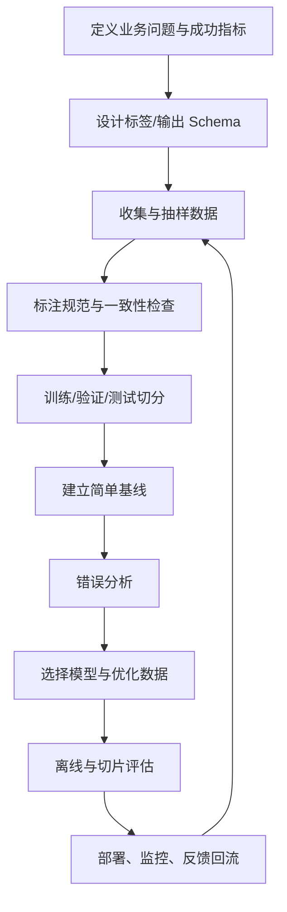

# 4.5 Python NLP 生态

### 4.5.1 工具全景图

| 工具 | 主要用途 | 适合阶段 |
|---|---|---|
| `re` | 正则清洗、规则抽取 | 全阶段 |
| `pandas` | CSV、数据清洗、标注分析 | 数据准备 |
| `jieba` | 中文分词 | 传统 NLP 入门 |
| `LTP` / HanLP | 中文分词、词性、NER、句法 | 中文语言分析 |
| `scikit-learn` | TF-IDF、分类、聚类、评估 | 快速基线 |
| `PyTorch` | 自定义神经网络训练 | 深度学习基础 |
| `transformers` | BERT/GPT/T5 等模型 | 现代 NLP |
| `datasets` | 数据集读取与处理 | 训练管线 |
| `evaluate` | 指标计算 | 离线评估 |
| `sentence-transformers` | 句向量、检索、重排序 | Embedding/RAG |
| `spaCy` | 英文及多语言 NLP 管线 | 国际化项目 |
| `FastAPI` | 将模型封装接口 | 部署原型 |

### 4.5.2 推荐开发环境

```bash
mkdir nlp-learning-project
cd nlp-learning-project

python -m venv .venv
# macOS / Linux
source .venv/bin/activate
# Windows PowerShell：.venv\Scripts\Activate.ps1

pip install -U pip
pip install pandas scikit-learn jieba matplotlib jupyter
pip install torch transformers datasets evaluate sentence-transformers

pip freeze > requirements.txt
```

### 4.5.3 推荐项目目录

```text
nlp-project/
├── data/
│   ├── raw/                 # 原始数据，只读保留
│   ├── processed/           # 清洗与切分后数据
│   └── label_guideline.md   # 标注规范
├── notebooks/               # 探索分析
├── src/
│   ├── preprocess.py
│   ├── train.py
│   ├── evaluate.py
│   ├── predict.py
│   └── utils.py
├── models/                  # 本地模型，通常不提交 Git
├── tests/
├── requirements.txt
└── README.md
```

### 4.5.4 一个 NLP 项目的标准闭环



### 4.5.5 第一个完整练习：工单意图分类器

目标：将用户文本分为 `退款`、`物流`、`商品质量`。

建议步骤：

1. 准备 300～1000 条真实或模拟文本；
2. 为每条文本打清晰标签；
3. 按 8:1:1 切训练、验证、测试；
4. 先训练 TF-IDF + 逻辑回归；
5. 查看每类 F1 与至少 20 条错例；
6. 基线稳定后再试中文 BERT；
7. 封装 `/predict` 接口；
8. 把低置信度和人工纠正样本回流。

最小 FastAPI 服务：

```bash
pip install fastapi uvicorn joblib
```

```python
# app.py
from fastapi import FastAPI
import joblib
import jieba

app = FastAPI(title="工单意图识别服务")
model = joblib.load("intent_model.joblib")  # 训练完成后保存

def cut_words(text: str) -> str:
    return " ".join(jieba.lcut(text))

@app.post("/predict")
def predict(text: str):
    processed = cut_words(text)
    probabilities = model.predict_proba([processed])[0]
    label_index = probabilities.argmax()
    return {
        "label": model.classes_[label_index],
        "confidence": float(probabilities[label_index])
    }
```

启动：

```bash
uvicorn app:app --reload
```

本地打开 `http://127.0.0.1:8000/docs` 即可测试接口。

### 4.5.6 学习路径：从能跑代码到能做项目

| 阶段 | 学习重点 | 建议作品 |
|---|---|---|
| 1 | 正则、清洗、分词、TF-IDF | 评论关键词分析 |
| 2 | 线性模型、朴素贝叶斯、指标 | 情感/意图分类器 |
| 3 | 词向量、RNN、注意力 | 小型文本分类实验 |
| 4 | Transformer、BERT 微调 | NER 或句对匹配项目 |
| 5 | Embedding、召回、重排序 | FAQ 语义检索 |
| 6 | LLM、RAG、结构化输出 | 领域问答助手 |
| 7 | 部署、监控、反馈回流 | 可演示 Web/API 应用 |

### 4.5.7 最后：用五个问题思考任何 NLP 项目

1. **业务输入是什么，最终要输出什么？**  
2. **标签、Schema 或正确答案如何定义？**  
3. **数据是否代表真实线上场景？**  
4. **最简单基线能做到什么程度？**  
5. **模型错在哪里，这种错误业务能否接受？**  

成熟 NLP 系统不是“把模型跑起来”，而是让数据、标签、模型、评估、部署和反馈闭环一起工作。

---

## 参考资料与延伸阅读

以下资料用于核对核心概念、工具 API 与经典模型背景。建议优先阅读官方文档和原始论文。

1. [scikit-learn：文本特征提取](https://scikit-learn.org/stable/modules/feature_extraction.html)  
2. [scikit-learn：TfidfVectorizer API](https://scikit-learn.org/stable/modules/generated/sklearn.feature_extraction.text.TfidfVectorizer.html)  
3. [Hugging Face Transformers：文本分类](https://huggingface.co/docs/transformers/en/tasks/sequence_classification)  
4. [Hugging Face Transformers：Token Classification / NER](https://huggingface.co/docs/transformers/en/tasks/token_classification)  
5. [spaCy 101：NLP 管线基础](https://spacy.io/usage/spacy-101)  
6. [LTP：Language Technology Platform](https://github.com/HIT-SCIR/ltp)  
7. [PyTorch：RNN](https://docs.pytorch.org/docs/stable/generated/torch.nn.RNN.html)、[LSTM](https://docs.pytorch.org/docs/stable/generated/torch.nn.LSTM.html)、[GRU](https://docs.pytorch.org/docs/stable/generated/torch.nn.GRU.html)  
8. [Attention Is All You Need（Transformer 原始论文）](https://arxiv.org/abs/1706.03762)  
9. [BERT：Pre-training of Deep Bidirectional Transformers](https://arxiv.org/abs/1810.04805)  
10. [T5：Text-to-Text Transfer Transformer](https://arxiv.org/abs/1910.10683)  
11. [BART：Denoising Sequence-to-Sequence Pre-training](https://arxiv.org/abs/1910.13461)  
12. [Sentence Transformers：语义文本相似度](https://sbert.net/docs/sentence_transformer/usage/semantic_textual_similarity.html)  
13. [CLIP：Learning Transferable Visual Models from Natural Language Supervision](https://arxiv.org/abs/2103.00020)  

> **发布建议**：个人网站可拆成四篇系列文章：① 文本预处理与表示；② 四类常见 NLP 任务；③ 从 RNN 到 Transformer；④ BERT、GPT、多模态与工程落地。拆分后更利于阅读、SEO 和后续更新。

## 参考资料与延伸阅读

以下资料用于核对核心概念、工具 API 与经典模型背景。建议优先阅读官方文档和原始论文。

1. [scikit-learn：文本特征提取](https://scikit-learn.org/stable/modules/feature_extraction.html)  
2. [scikit-learn：TfidfVectorizer API](https://scikit-learn.org/stable/modules/generated/sklearn.feature_extraction.text.TfidfVectorizer.html)  
3. [Hugging Face Transformers：文本分类](https://huggingface.co/docs/transformers/en/tasks/sequence_classification)  
4. [Hugging Face Transformers：Token Classification / NER](https://huggingface.co/docs/transformers/en/tasks/token_classification)  
5. [spaCy 101：NLP 管线基础](https://spacy.io/usage/spacy-101)  
6. [LTP：Language Technology Platform](https://github.com/HIT-SCIR/ltp)  
7. [PyTorch：RNN](https://docs.pytorch.org/docs/stable/generated/torch.nn.RNN.html)、[LSTM](https://docs.pytorch.org/docs/stable/generated/torch.nn.LSTM.html)、[GRU](https://docs.pytorch.org/docs/stable/generated/torch.nn.GRU.html)  
8. [Attention Is All You Need（Transformer 原始论文）](https://arxiv.org/abs/1706.03762)  
9. [BERT：Pre-training of Deep Bidirectional Transformers](https://arxiv.org/abs/1810.04805)  
10. [T5：Text-to-Text Transfer Transformer](https://arxiv.org/abs/1910.10683)  
11. [BART：Denoising Sequence-to-Sequence Pre-training](https://arxiv.org/abs/1910.13461)  
12. [Sentence Transformers：语义文本相似度](https://sbert.net/docs/sentence_transformer/usage/semantic_textual_similarity.html)  
13. [CLIP：Learning Transferable Visual Models from Natural Language Supervision](https://arxiv.org/abs/2103.00020)  

> **发布建议**：个人网站可拆成四篇系列文章：① 文本预处理与表示；② 四类常见 NLP 任务；③ 从 RNN 到 Transformer；④ BERT、GPT、多模态与工程落地。拆分后更利于阅读、SEO 和后续更新。
