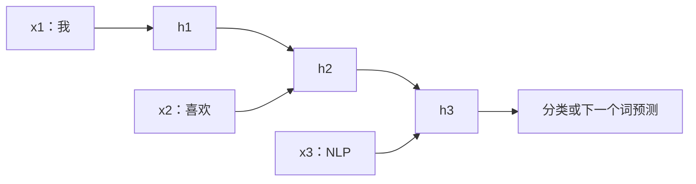

# 3.1 循环神经网络（RNN）

### 3.1.1 为什么需要序列模型？

下面两句包含相同的词，但语义不同：

```text
“我喜欢你”
“你喜欢我”
```

普通全连接网络擅长固定长度特征，但不会天然理解词序。RNN（Recurrent Neural Network）的核心思想是：**按顺序读取 token，并维护一个不断更新的隐状态（记忆）。**



### 3.1.2 RNN 基本公式

在第 $t$ 个时间步：

$$
h_t=\tanh(W_{xh}x_t+W_{hh}h_{t-1}+b_h)
$$

$$
y_t=W_{hy}h_t+b_y
$$

| 符号 | 含义 |
|---|---|
| $x_t$ | 当前 token 的向量 |
| $h_{t-1}$ | 已读前文的隐藏状态 |
| $h_t$ | 读完当前 token 后的新状态 |
| $y_t$ | 当前输出，可用于分类或预测 |

### 3.1.3 RNN 的难点：长距离依赖与梯度消失

```text
“我在很多年前去过……（中间几十个词）……北京。”
```

当模型读到“北京”时，早期的“去过”可能在多次状态传递中逐渐衰减。反向传播时梯度也可能越来越小，这就是梯度消失；也可能越来越大，形成梯度爆炸。

### 3.1.4 LSTM 与 GRU：用门控管理记忆

| 模型 | 思想 | 优点 | 代价 |
|---|---|---|---|
| Vanilla RNN | 单一递归状态 | 易理解 | 长序列记忆弱 |
| LSTM | 输入门、遗忘门、输出门 | 能更好保留长期信息 | 参数较多 |
| GRU | 更新门、重置门 | 比 LSTM 更简洁 | 表达与 LSTM 略有差异 |

可以把门理解成笔记本：

- 遗忘门：旧笔记中哪些该擦掉；
- 输入门：当前信息中哪些值得记下；
- 输出门：此刻该拿出哪些记忆来回答。

### 3.1.5 PyTorch：极简双向 GRU 分类器

```python
import torch
import torch.nn as nn

class GRUTextClassifier(nn.Module):
    def __init__(self, vocab_size: int, embed_dim: int, hidden_dim: int, num_classes: int):
        super().__init__()
        self.embedding = nn.Embedding(vocab_size, embed_dim, padding_idx=0)
        self.gru = nn.GRU(
            input_size=embed_dim,
            hidden_size=hidden_dim,
            batch_first=True,
            bidirectional=True
        )
        self.classifier = nn.Linear(hidden_dim * 2, num_classes)

    def forward(self, input_ids):
        # input_ids: [batch_size, seq_len]
        x = self.embedding(input_ids)
        _, hidden = self.gru(x)

        # 双向 GRU 的最后两个 hidden 分别来自正向与反向
        sentence_vector = torch.cat([hidden[-2], hidden[-1]], dim=1)
        return self.classifier(sentence_vector)

model = GRUTextClassifier(vocab_size=5000, embed_dim=128, hidden_dim=128, num_classes=2)
dummy_input = torch.randint(1, 5000, (4, 20))
print(model(dummy_input).shape)  # torch.Size([4, 2])
```

### 3.1.6 RNN 还值得学吗？

值得学，但不必把它当作现代 NLP 的默认首选。它帮助你理解序列、隐状态、长依赖和门控，也仍适用于部分轻量模型、语音与时间序列任务。多数通用 NLP 场景中，Transformer 已更常见。
