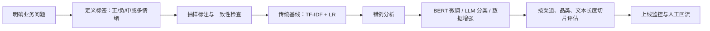

# 2.1 情感分析

### 2.1.1 情感分析不只是正面/负面

情感分析旨在识别文本表达的态度、情绪或立场。

| 类型 | 输入 | 输出 |
|---|---|---|
| 文档级 | 一篇评论 | 正面 / 负面 / 中性 |
| 句子级 | 一句话 | 正面 / 负面 / 中性 |
| 方面级（ABSA） | “续航好，拍照一般” | 续航=正面；拍照=负面 |
| 情绪识别 | “我非常失望” | 愤怒 / 失望 / 开心 / 焦虑 |
| 立场检测 | “我支持这个政策” | 支持 / 反对 / 未表态 |

### 2.1.2 方面级情感：比整体情感更接近业务

```text
“这款手机续航很强，但拍照效果一般。”
```

| 属性（Aspect） | 观点（Opinion） | 极性（Polarity） |
|---|---|---|
| 续航 | 很强 | 正面 |
| 拍照 | 一般 | 负面或中性 |

如果只输出“中性”，产品、运营和研发无法知道到底应该优先优化什么。方面级情感分析的关键是：**先找评价对象，再判断评价倾向。**

### 2.1.3 情感分析工作流



### 2.1.4 词典法：可解释但不够聪明

```python
positive_words = {"满意", "喜欢", "好用", "流畅", "推荐", "不错"}
negative_words = {"失望", "难用", "卡顿", "贵", "差", "退货"}

def lexicon_sentiment(text: str) -> str:
    pos = sum(word in text for word in positive_words)
    neg = sum(word in text for word in negative_words)
    if pos > neg:
        return "正面"
    if neg > pos:
        return "负面"
    return "中性"

print(lexicon_sentiment("产品不错，运行很流畅"))
```

词典法适合快速验证、强规则领域、关键词监控；但会在否定、转折、反讽和新词上失效：

```text
“不是不好用，只是价格略高。”
```

### 2.1.5 更可靠的策略

1. 先做 **TF-IDF + 逻辑回归**，验证标签和数据是否可学。  
2. 有一定标注数据后，用 **中文 BERT 微调** 做上下文分类。  
3. 数据少时可尝试 **提示词或少样本分类**，但必须在独立测试集评估。  
4. 投诉升级、合规审核等高风险业务应设计 **置信度阈值 + 人工复核**。

### 2.1.6 情感模型应如何评估？

除了整体 F1，还要按下列维度切片：

- 短评 / 长评；
- 口语 / 正式文本；
- 含表情、网络语、错别字文本；
- 否定句、转折句；
- 每个商品品类、渠道和用户群；
- 低置信度样本。
