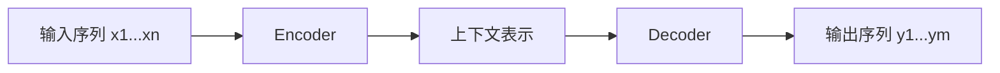

# 3.4 序列到序列模型

### 3.4.1 什么是 Seq2Seq？

序列到序列（Sequence-to-Sequence，Seq2Seq）是“输入一个序列，输出另一个序列”。

| 任务 | 输入 | 输出 |
|---|---|---|
| 翻译 | 中文句子 | 英文句子 |
| 摘要 | 长文章 | 短摘要 |
| 问答 | 问题+文档 | 答案 |
| 改写 | 原句 | 更正式/更简洁的句子 |
| 对话 | 用户消息 | 助手回复 |

### 3.4.2 经典 Encoder–Decoder



早期 RNN Seq2Seq 把整句压成固定向量，长句容易丢失信息。加入注意力后，Decoder 每生成一个词都能回看输入不同位置，从而减轻这个瓶颈。

### 3.4.3 Teacher Forcing：训练与推理的差别

真实目标：

```text
我 喜欢 NLP <EOS>
```

训练时，生成第 $t$ 个词会喂入真实的第 $t-1$ 个词；推理时没有真实答案，只能把自己上一步生成结果喂回去。这会产生“训练时总看到正确历史、推理时一个错误可能持续传播”的暴露偏差。

### 3.4.4 常见解码策略

| 策略 | 方法 | 优点 | 缺点 |
|---|---|---|---|
| Greedy Search | 每步取概率最高 token | 最快 | 容易局部最优、重复 |
| Beam Search | 保留多个候选序列 | 输出更稳 | 更慢，可能过度保守 |
| Top-k Sampling | 从 Top-k 中采样 | 多样性高 | 可控性较弱 |
| Top-p Sampling | 从累计概率达到 p 的集合采样 | 更自然 | 参数需调 |

### 3.4.5 生成过程伪代码

```python
# 伪代码：用于理解流程，不能直接训练
encoder_outputs, encoder_hidden = encoder(source_tokens)

decoder_input = BOS_TOKEN
decoder_hidden = encoder_hidden
generated = []

for step in range(max_length):
    logits, decoder_hidden = decoder(
        decoder_input,
        decoder_hidden,
        encoder_outputs  # 注意力会读取编码器输出
    )
    next_token = logits.argmax(dim=-1)
    generated.append(next_token)

    if next_token == EOS_TOKEN:
        break
    decoder_input = next_token

return generated
```

### 3.4.6 如何评估 Seq2Seq？

| 任务 | 自动指标 | 仍需人工检查 |
|---|---|---|
| 翻译 | BLEU、COMET 等 | 术语、遗漏、忠实性 |
| 摘要 | ROUGE | 是否幻觉、是否覆盖关键事实 |
| 对话 | 任务成功率、偏好评估 | 有用性、安全性、事实性 |
| 改写 | 语义相似度、人工评分 | 是否改变原意 |

> 生成任务中，自动指标只能作为参考。医疗、法律、金融和业务规则文本还需要来源引用、规则校验与人工抽检。
