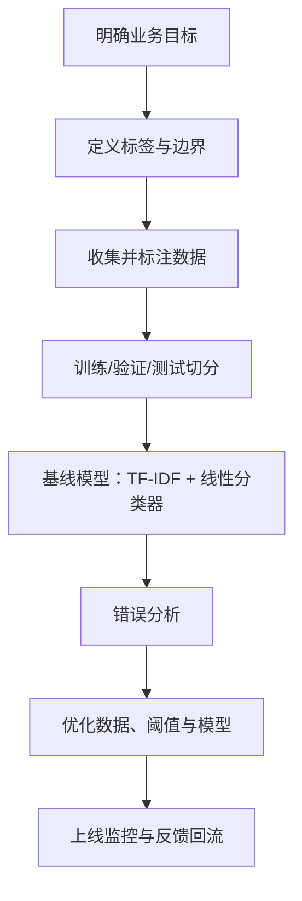

# 1.3 文本分类

### 1.3.1 文本分类解决什么问题？

文本分类是为文本分配一个或多个预定义标签。

| 输入 | 分类任务 | 输出 |
|---|---|---|
| “快递三天还没到” | 工单路由 | 物流问题 |
| “这部电影太精彩了” | 情感分类 | 正面 |
| “限时领免费提现额度” | 风险识别 | 营销/诈骗风险 |
| 一篇新闻 | 主题分类 | 体育/财经/科技 |

### 1.3.2 二分类、多分类与多标签

| 类型 | 每条文本的标签数 | 例子 | 典型输出 |
|---|---:|---|---|
| 二分类 | 1 个，二选一 | 垃圾/正常 | Sigmoid |
| 多分类 | 1 个，N 选 1 | 体育/财经/科技 | Softmax |
| 多标签 | 0 至多个 | 文章同时属于 AI、产品、创业 | 多个 Sigmoid |

### 1.3.3 全流程：先定义标签，再训练模型



标签定义要写清楚“包含什么、不包含什么、边界案例怎么判”。例如：

```markdown
标签：退款进度
定义：用户询问退款是否到账、退款需要多久、退款状态。
包含：退款什么时候到账？为什么退款还没到？
不包含：如何申请退款？（归为“退款申请”）
```

### 1.3.4 可运行示例：TF-IDF + 逻辑回归

```bash
pip install scikit-learn jieba
```

```python
import jieba
from sklearn.model_selection import train_test_split
from sklearn.pipeline import Pipeline
from sklearn.feature_extraction.text import TfidfVectorizer
from sklearn.linear_model import LogisticRegression
from sklearn.metrics import classification_report, confusion_matrix

texts = [
    "手机续航非常好，值得购买", "客服回复很慢，体验太差了",
    "屏幕清晰，系统运行流畅", "用了两天就死机，不推荐",
    "价格合理，物流也很快", "包装破损，产品还有划痕",
    "音质很好，降噪效果明显", "退货流程麻烦，客服态度不好",
    "做工精致，性价比高", "发热严重，电池掉电很快"
]
labels = [1, 0, 1, 0, 1, 0, 1, 0, 1, 0]  # 1=正面，0=负面

def cut_words(text: str) -> str:
    return " ".join(jieba.lcut(text))

X = [cut_words(t) for t in texts]
X_train, X_test, y_train, y_test = train_test_split(
    X, labels, test_size=0.3, random_state=42, stratify=labels
)

model = Pipeline([
    ("tfidf", TfidfVectorizer(ngram_range=(1, 2))),
    ("clf", LogisticRegression(max_iter=1000))
])
model.fit(X_train, y_train)
pred = model.predict(X_test)

print(classification_report(y_test, pred, target_names=["负面", "正面"]))
print(confusion_matrix(y_test, pred))
print(model.predict([cut_words("外观漂亮，使用起来很顺手")]))
```

### 1.3.5 为什么不能只看准确率？

若 95% 的短信都是正常短信，一个“永远预测正常”的模型准确率也有 95%，但毫无业务价值。

$$
\mathrm{Precision}=\frac{TP}{TP+FP},\quad
\mathrm{Recall}=\frac{TP}{TP+FN}
$$

$$
F1=2\times\frac{\mathrm{Precision}\times\mathrm{Recall}}{\mathrm{Precision}+\mathrm{Recall}}
$$

| 指标 | 回答的问题 | 适用 |
|---|---|---|
| Accuracy | 总体预测对了多少？ | 类别均衡 |
| Precision | 预测为正的，多少真的为正？ | 错杀成本高 |
| Recall | 真实正例中抓到了多少？ | 漏检成本高 |
| F1 | 精确率与召回率的平衡 | 不均衡分类常用 |
| Macro-F1 | 每个类别平等计分 | 长尾多分类 |

### 1.3.6 文本分类的高频失败原因

- 标签边界不清；
- 训练文本与线上文本风格差异过大；
- 类别严重不均衡；
- 同一模板或同一用户文本同时落入训练集和测试集；
- 只扩大模型，不看错例；
- 忽略置信度与阈值，0.51 和 0.99 被同等对待。
