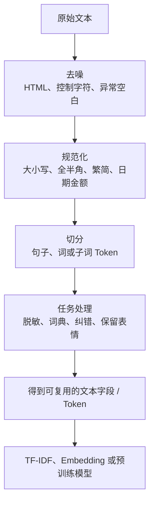

# 1.1 文本预处理

### 1.1.1 什么是文本预处理？

文本预处理是把原始文本转成模型可稳定使用的数据的过程。它像做饭前的洗、切、分装，但**不是清理得越干净越好**，而是要保留对任务有价值的信息。

例如：

```text
原文：iPhone 16 Pro!!! 续航是真的不错😊，不过价格有点贵……
规范化：iphone 16 pro 续航是真的不错 😊 不过价格有点贵
分词：['iphone', '16', 'pro', '续航', '是', '真的', '不错', '😊', '不过', '价格', '有点', '贵']
```

若做情感分析，`😊`、`!`、`不`、`但是` 都可能有价值；若做商品型号识别，`iPhone 16 Pro` 不应被随意拆碎。

### 1.1.2 预处理链路



### 1.1.3 常见步骤：什么时候做、什么时候不要做？

| 步骤 | 作用 | 适用场景 | 常见误区 |
|---|---|---|---|
| 去 HTML、清空白 | 删除网页格式噪声 | 爬虫、论坛、评论 | 删除本来有意义的段落、列表结构 |
| 大小写归一 | 合并 `Apple` 与 `APPLE` | 英文检索、传统模型 | NER 中首字母大写可能是特征 |
| URL/手机号占位 | 脱敏且保留“这是链接/号码”信息 | 客服、日志、工单 | 直接删除导致结构信息丢失 |
| 标点压缩 | `！！！`→`！` | 评论、社媒 | 完全删除标点会损失情绪 |
| 去停用词 | 去除低区分度词 | 关键词、传统检索 | 把“不”“没”“但是”删掉会破坏语义 |
| 分词/Tokenize | 定义模型最小输入单位 | 所有 NLP 任务 | 以为 BERT 前必须 jieba 分词 |
| 拼写纠错 | 降低错别字影响 | 搜索、问答 | 错把专有名词“纠正”成普通词 |

### 1.1.4 中文分词与 Tokenize 的区别

英文通常由空格天然分词：

```text
I love natural language processing
→ [I, love, natural, language, processing]
```

中文没有天然空格：

```text
“我喜欢自然语言处理”
→ [我, 喜欢, 自然语言处理]
```

也可能被切成：

```text
[我, 喜欢, 自然, 语言, 处理]
```

所以中文分词本身就是一个模型问题。传统机器学习常依赖人工分词；BERT 等 Transformer 通常使用子词 tokenizer，把罕见词拆成更小单元，因此不要求先用 jieba 分词。

### 1.1.5 可运行示例：中文预处理

安装：

```bash
pip install jieba opencc-python-reimplemented
```

```python
import re
import jieba
from opencc import OpenCC

cc = OpenCC("t2s")  # 繁体转简体；不需要可删除

def preprocess_zh(text: str) -> list[str]:
    """适合传统机器学习的基础中文预处理示例。"""
    text = cc.convert(text)
    text = re.sub(r"\s+", " ", text).strip()

    # 用占位符保留“链接/手机号”的结构意义
    text = re.sub(r"https?://\S+|www\.\S+", " <URL> ", text)
    text = re.sub(r"1[3-9]\d{9}", " <PHONE> ", text)

    # 连续标点压缩，但保留一个标点
    text = re.sub(r"([!！?？。])\1+", r"\1", text)
    return [t.strip() for t in jieba.lcut(text) if t.strip()]

sample = "iPhone 16 Pro!!! 续航是真的不错😊，不过价格有点贵……详见 https://example.com"
print(preprocess_zh(sample))
```

### 1.1.6 预处理的三条底线

1. **先看任务，再决定删什么。** 情感任务中，否定词和表情不一定是噪声。  
2. **训练与线上必须使用同一规则。** 训练时分词、线上不分词，会造成特征错位。  
3. **先切分数据，再学习统计规则。** 比如先在全量数据上拟合 TF-IDF，会把测试集信息泄漏到训练阶段。
