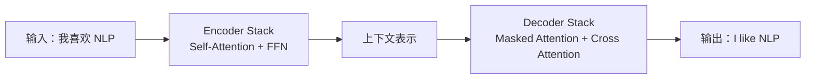
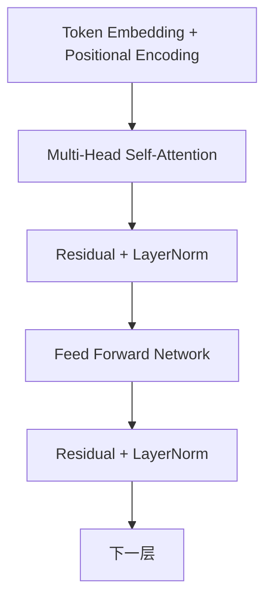

# 3.3 Transformer 架构

### 3.3.1 Transformer 为什么改变了 NLP？

Transformer 以自注意力为核心，不依赖递归读入序列，因此能更好地并行训练，并直接建立远距离 token 之间的联系。BERT、GPT、T5、BART 等现代模型都建立在这一架构思想上。

### 3.3.2 原始 Transformer：Encoder–Decoder



| 架构 | 代表模型 | 强项 |
|---|---|---|
| Encoder-only | BERT | 分类、NER、检索、抽取 |
| Decoder-only | GPT | 对话、续写、代码、开放生成 |
| Encoder-Decoder | T5、BART | 翻译、摘要、改写、生成问答 |

### 3.3.3 一个 Encoder Layer 有哪些组件？



#### Token Embedding

把每个 token 变成向量。例如：

```text
“我 喜欢 NLP” → [e_我, e_喜欢, e_NLP]
```

#### 位置编码（Position Encoding）

自注意力本身不理解先后顺序。没有位置信息，“我喜欢你”和“你喜欢我”可能更难区分。因此输入中会加入位置编码或相对位置机制。

#### 多头注意力（Multi-Head Attention）

多个注意力头可分别学习不同关系：一个可能注意否定词，一个注意主谓关系，一个注意远距离指代。多头结果拼接后再映射到下一层。

#### 前馈网络（FFN）

注意力负责 token 之间的信息交换；FFN 对每个位置进行非线性变换，增强表达能力。

#### 残差与 LayerNorm

- 残差连接帮助深层网络保留原始信息；
- LayerNorm 让训练数值更稳定。

### 3.3.4 为什么 Decoder 要使用 Causal Mask？

生成第 4 个 token 时不能偷看第 5 个 token，否则训练和真实生成不一致。

```text
位置 1：只能看 1
位置 2：只能看 1, 2
位置 3：只能看 1, 2, 3
```

这种“只能看左边”的遮罩，使 Decoder 学会根据已生成内容预测下一个 token。

### 3.3.5 PyTorch：最小 Transformer Encoder

```python
import torch
import torch.nn as nn

class TinyTransformerEncoder(nn.Module):
    def __init__(self, vocab_size=10000, d_model=128, nhead=4, num_layers=2):
        super().__init__()
        self.embedding = nn.Embedding(vocab_size, d_model, padding_idx=0)
        encoder_layer = nn.TransformerEncoderLayer(
            d_model=d_model,
            nhead=nhead,
            dim_feedforward=256,
            dropout=0.1,
            batch_first=True
        )
        self.encoder = nn.TransformerEncoder(encoder_layer, num_layers=num_layers)
        self.classifier = nn.Linear(d_model, 2)

    def forward(self, input_ids, attention_mask=None):
        x = self.embedding(input_ids)
        padding_mask = None
        if attention_mask is not None:
            padding_mask = attention_mask == 0  # True 代表忽略

        hidden = self.encoder(x, src_key_padding_mask=padding_mask)
        cls_state = hidden[:, 0, :]  # 教学简化：取第一个位置分类
        return self.classifier(cls_state)

model = TinyTransformerEncoder()
input_ids = torch.randint(1, 10000, (2, 16))
mask = torch.ones(2, 16, dtype=torch.long)
print(model(input_ids, mask).shape)
```

### 3.3.6 Transformer 的优点与局限

| 优点 | 局限 |
|---|---|
| 能建模远距离依赖 | 长文本时标准注意力成本高 |
| 训练可并行 | 依赖数据与算力 |
| 可统一适配多任务 | 不等于天然掌握真实世界知识 |
| 生态成熟 | 可能生成流畅但不真实的内容 |
