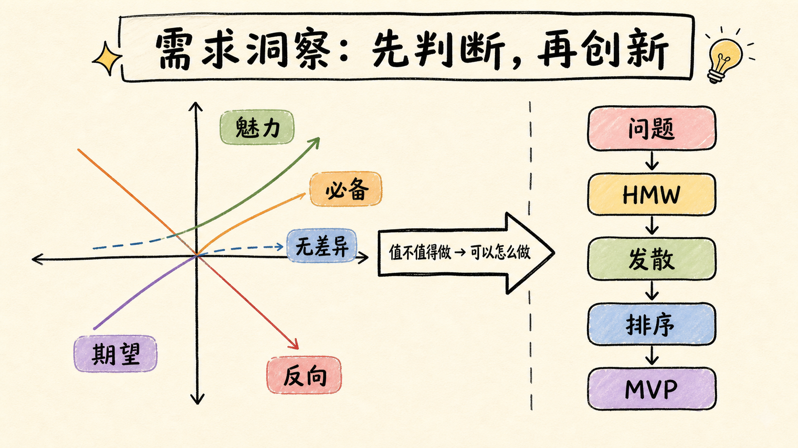
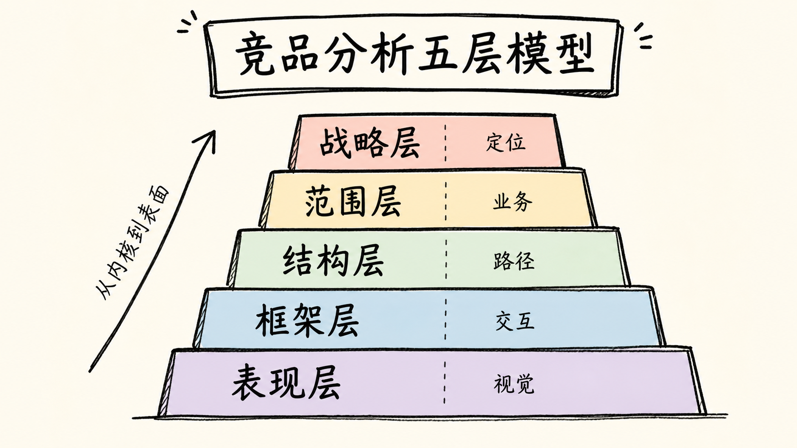

# 第一章：需求洞察与竞品分析

产品失败最常见的原因，不是团队做不出来，而是做出了一个没有足够价值的问题答案。需求分析要解决“什么值得做”，竞品分析要解决“市场已经如何回答，我们应该跟随、差异化还是放弃”。两者共同把产品决策从主观偏好推进到可验证证据。

## 1. 产品的起点：从功能要求回到用户任务

产品可以是实物、软件、内容、服务或一套组织流程。无论形态如何，它必须在特定场景中帮助某类用户完成任务、降低成本、规避风险或获得体验。一个完整需求至少包含六个要素：

| 要素 | 要回答的问题 | 低质量表达 | 可研究的表达 |
| --- | --- | --- | --- |
| 用户 | 谁真正经历问题并使用结果 | 所有职场人 | 每周需要整理多场客户会议的销售主管 |
| 场景 | 何时、何地、什么触发任务 | 写周报时 | 周五下午汇总散落在聊天、会议和 CRM 中的进展时 |
| 任务 | 用户真正想完成什么 | 自动写周报 | 快速还原本周成果、风险和下周计划 |
| 当前方案 | 现在怎么解决 | 手工处理 | 翻聊天记录、复制 CRM、询问同事后拼成文档 |
| 阻碍 | 为什么现有方案不够好 | 太麻烦 | 信息分散、遗漏风险高、成果难量化 |
| 成功标准 | 用户怎样判断结果有用 | 内容不错 | 10 分钟内完成，关键数据可追溯，领导无需二次追问 |

用户说出的通常是解决方案，不一定是底层需求。“增加导出按钮”可能对应跨系统交付，“做一个聊天框”可能对应低学习成本，“用更大的模型”可能对应答案可信度。产品经理要连续追问：用户为什么这样做？不做会有什么损失？现在付出了什么代价？理想结果如何被判断？

### PMF 不是一句“用户喜欢”

产品与市场匹配意味着四件事同时出现：

1. 一群边界清晰的用户反复遇到同类问题；
2. 产品显著优于用户的现有替代方案；
3. 用户形成重复使用、付费或主动推荐等真实行为；
4. 企业能够稳定获客、交付并承担成本。

AI Demo 容易制造“第一次很惊艳”，但 PMF 看的是持续任务。一个会议纪要工具即使摘要流畅，如果发言人识别不稳定、行动项不能回到工作系统、用户每次都要大改，它仍未完成产品价值闭环。

## 2. 需求研究：证据要覆盖“说、做、付出”

需求证据可以分成三层：

- **表达证据**：访谈、问卷、客服工单告诉你用户如何描述问题；
- **行为证据**：路径、停留、放弃、重复操作告诉你用户实际怎样做；
- **代价证据**：时间、金钱、风险、学习成本和切换成本说明问题有多痛。

只依赖访谈，容易把礼貌性认同当需求；只看行为数据，只知道“发生了什么”，不知道“为什么”；只看竞品功能，会把行业习惯误当用户价值。成熟做法是三角验证：定性研究提出假设，行为数据验证规模，原型或付费实验验证行动意愿。

### 常用研究手段如何选择

- 深度访谈适合探索动机、场景与语言，不适合直接估算市场比例；
- 问卷适合验证已知选项的分布，前提是问题定义已经稳定；
- 可用性观察适合发现用户自己意识不到的操作障碍；
- 日志、埋点和工单适合发现高频路径、异常和长期变化；
- 概念测试适合比较价值主张，原型测试适合验证任务流程；
- 预售、预约、试用转付费比“你愿不愿意购买”更接近真实意愿。

## 3. Kano 模型：理解需求与满意度的非线性关系

Kano 模型关注“能力具备程度”与“用户满意度”之间的关系。它不是简单的优先级表，而是帮助团队区分底线、竞争力、惊喜与浪费。

- **必备属性 M**：做到了只是合格，做不到会强烈不满。稳定登录、数据不丢失、核心结果可用通常属于此类。
- **期望属性 O**：表现越好，满意度越高。速度、准确率、价格和覆盖度常见于此类。
- **魅力属性 A**：用户没有预期，出现后明显惊喜。例如 AI 自动识别承诺事项并同步到任务系统。
- **无差异属性 I**：投入变化很少影响满意度，是需求池中最容易造成资源浪费的一类。
- **反向属性 R**：做得越多越令人反感，例如无法关闭的智能推荐、强制自动执行或过密广告。
- **可疑结果 Q**：正反问题回答互相矛盾，通常意味着题目理解错误或问卷质量有问题。

同一能力会随用户、场景和时间迁移。答案引用对研究人员可能是必备属性，对娱乐聊天用户可能只是期望属性；早期的 AI 自动总结曾是魅力属性，普及后会逐渐变为基础预期。因此 Kano 研究要按核心人群分组，并在产品阶段变化后重新测量。

<figure class="article-figure">
  
  <figcaption>先判断需求对满意度的作用，再打开解决方案空间。</figcaption>
</figure>

### Kano 问卷、分类与系数

对同一能力提出一正一反两个问题：具备时感受如何，不具备时感受如何。选项可设为“很喜欢、理应如此、无所谓、勉强接受、很不喜欢”，再通过正反回答交叉表映射分类。

当多个需求需要比较时，可计算：

- `SI = (A + O) / (A + O + M + I)`：增加该能力提高满意度的潜力；
- `DSI = -(M + O) / (A + O + M + I)`：缺少该能力造成不满的程度。

系数不能替代决策。还应叠加目标用户覆盖、战略关联、实现成本、风险、依赖和验证价值。高 SI 的惊喜能力可能成本极高；高 DSI 的必备能力即使不能带来传播，也必须优先守住。

### 从微信核心路径理解需求层级

分析成熟产品时，先找核心路径而不是罗列功能。微信的核心价值围绕好友关系与聊天沟通展开；一对一、群聊、文字、语音、视频、表情、红包等共同服务沟通任务，公众号、小程序和视频号则扩展内容与服务边界。判断优化点时要问：它是否强化核心关系链和沟通效率，还是只增加表面复杂度？

这种方法迁移到 AI 产品，就是先确定核心任务链。例如企业问答产品的核心不是“聊天”，而是“提出业务问题 → 找到有权限的知识 → 生成可验证答案 → 采取行动”。任何功能都应能解释自己强化了哪一步。

## 4. HMW：把抱怨改写为可创新的问题

HMW（How Might We）把封闭问题改写成“我们可以怎样……”。How 假设问题可以改善，Might 保留多种可能，We 强调跨角色共同解决。

### 五步完整流程

1. **明确用户场景问题**：写清用户、触发、现状、障碍和目标，不能预埋方案；
2. **从多个方向拆解**：积极促进、障碍否定、任务拆分、角色转移和极端脑洞；
3. **发散方案**：先追求数量和差异，不在发散阶段过早否决；
4. **分类排序**：按用户价值、业务价值、可行性和风险收敛；
5. **形成 MVP**：把最关键假设变成最小流程、原型、指标和停止条件。

以“群聊中的公众号内容难以再次找到”为例，可以从五个方向提问：

- 积极：怎样奖励用户给内容补充有用标签？
- 否定：怎样让用户不搜索也能重新找到相关内容？
- 拆解：什么叫精准内容，标题、来源、主题还是阅读行为更重要？
- 转移：能否由系统、群管理员或内容发布者完成整理？
- 脑洞：如果群里只能保留十条最有价值内容，会如何选择？

好的 HMW 边界适中。“怎样提升体验”过宽，“怎样把按钮改成红色”已经写死方案。可用表达应包含具体用户、任务和成功标准，例如：“我们可以怎样让第一次使用 AI 搜索的法务人员，在三分钟内提出有效问题并判断答案是否有法规依据？”

## 5. 从胖东来案例理解：需求不是功能，而是一套价值系统

零售服务案例说明，用户价值可以由价格透明、服务体验、员工状态、售后承诺和信任共同构成。标注进货价、控制毛利、为非本店商品提供服务等动作，表面上不是传统“产品功能”，却共同塑造可感知的安全感。

产品经理应学会识别系统性需求：用户想要的可能不是更多 SKU，而是“买得放心”；员工福利也不是内部事务，它会通过服务稳定性影响用户体验。AI 产品同样如此：可信感不仅来自模型准确率，还来自权限说明、引用、错误处理、人工兜底和数据承诺。

## 6. 竞品分析：借已经成立的 PMF 反推产品内核

竞品分析的目标不是抄功能，而是研究别人如何完成用户、价值与商业的匹配，再决定自己的策略。竞品可用“用户是否相同 × 服务是否相同”判断：

| 用户 | 服务 | 关系 |
| --- | --- | --- |
| 相同 | 相同 | 直接、高度竞争 |
| 相同 | 不同 | 竞争同一用户的时间、预算或任务入口 |
| 不同 | 相同 | 能力相似，可借鉴但不必正面对抗 |
| 不同 | 不同 | 通常不构成有效竞品 |

不要只选择行业头部。还应加入新进入者、替代方案、用户的手工作业、跨行业标杆和失败案例。对 AI 知识库而言，竞品不只是其他 AI 问答产品，也包括企业搜索、共享盘、请教专家和工单系统。

### 五层模型：从战略到底层界面

<figure class="article-figure">
  
  <figcaption>界面是结果，战略、用户和商业约束才是原因。</figcaption>
</figure>

1. **战略层**：目标用户、核心需求、产品定位、企业目标和商业模式；
2. **范围层**：核心业务、功能边界、内容与服务能力；
3. **结构层**：信息架构、业务流程、任务链路和功能关系；
4. **框架层**：页面布局、导航、交互、搜索、跳转和反馈；
5. **表现层**：视觉、配色、排版、动效、文案和品牌感受。

在线教育产品真正的差异常出现在范围层：直播还是录播、内容供给还是学习服务、教师质量如何控制，而不是按钮颜色。长视频产品的内核可以拆为内容选择、内容发现、播放体验、传播和变现；采买系统、推荐搜索、二创传播、高清播放和会员广告系统，分别强化这些能力。

### 六步竞品分析闭环

1. 明确本次要支持的决策，并据此选择竞品；
2. 拆解自己与竞品的五层要素；
3. 回看关键版本、关键事件与产品阶段，避免只截取当前页面；
4. 判断自己所处阶段、资源和核心矛盾；
5. 制定跟随、差异化、防御或放弃计划；
6. 上线验证，记录结论是否成立并复盘。

产品阶段会改变策略。初创期验证市场和 MVP；验证后小幅投放、跟随必备能力并做微创新；跑马圈地阶段争夺关键资源；扩张期重视增长获客；高度竞争阶段巩固壁垒；成熟期增加收入与付费；衰退期控制成本并寻找新业务。脱离阶段谈“最佳功能”没有意义。

### 爱奇艺与 B 站：相似界面背后的不同系统

两者都承载视频消费，但目标用户、内容结构、社区关系和变现路径不同。爱奇艺更接近长视频内容平台，核心能力围绕版权内容、播放体验、广告和会员；B 站由中视频、创作者生态与社区互动发展，去中心化流量、UP 主关系和互动文化更关键。由此可见，竞品分析不能在播放页停止，必须解释内容从哪里来、为什么持续供给、用户为何留下、平台怎样获取收入。

AI 产品对比也应如此：同样是对话界面，个人写作助手、企业知识 Copilot 和客服自动化的用户、权限、失败成本、评估标准与收费对象完全不同。

## 7. 怎样写一份能支持决策的竞品报告

一份有效报告应包括：决策问题、选择范围、用户任务、五层对比、版本阶段、核心数据或可观察证据、商业与成本约束、关键差异、可复制条件、不可复制条件、行动建议和验证计划。

结论要从“竞品有某功能”提升为因果判断：

> 竞品把引用置于答案正文旁，是因为其核心用户需要立即核验事实；这项设计降低信任成本，但依赖文档切片、权限与引用定位能力。我们的目标用户具有相同风险，因此应跟随“可验证答案”这一价值，不必照抄其版式。首版先验证引用打开率、引用支持率和人工采纳率。

## 8. 高级 AI 产品经理的需求判断清单

- 模型能力是在解决高价值任务，还是只制造新奇体验？
- 用户是否能判断结果正确，不能判断时由谁承担责任？
- 输入数据是否合法、足够、及时并有明确权限？
- 错误是否可发现、可撤回、可转人工？
- 用户需要生成内容，还是需要完成后续行动？
- 推理成本、等待时间和人工审核是否破坏价值？
- 竞品优势来自模型、数据、工作流、渠道还是组织交付？
- MVP 验证的是最大风险假设，还是只证明团队能做出来？

## 9. 本章交付模板

### 需求证据卡

| 字段 | 内容 |
| --- | --- |
| 目标用户 | 角色、能力、权限和使用频率 |
| 触发场景 | 时间、地点、上下文与任务起点 |
| 当前路径 | 步骤、工具、协作者和耗时 |
| 核心障碍 | 时间、成本、认知、风险或协作问题 |
| 成功标准 | 用户怎样判断任务完成得好 |
| 证据 | 访谈、观察、数据、工单和付费行为 |
| Kano 类型 | 必备、期望、魅力、无差异或反向 |
| 最大假设 | 最可能推翻方案的未知事实 |
| MVP | 最小流程、目标指标与停止条件 |

### 实战练习

选择一个 AI 会议助手：拆出会前、会中、会后任务；对转写、发言人识别、摘要、行动项、同步和提醒做 Kano 分类；选择直接竞品、替代方案和人工流程做五层分析；提出五个 HMW；最后给出一个只验证最大风险的 MVP。

[下一章：行业分析与进入时机 →](./02-industry-analysis)
