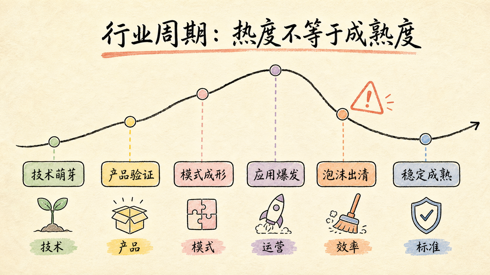

# 第二章：行业分析与进入时机

需求成立，只能证明“有人遇到问题”；行业分析要继续判断“这个问题是否能形成足够大的、可持续的产品机会”。产品经理研究行业，不是为了预测一个精确未来，而是为了识别趋势、约束、利润位置和进入条件，减少在错误方向上高效努力。

## 1. 先定义决策，再开始搜资料

行业研究常服务五类决策：是否进入、选择哪个细分、下一阶段做什么产品、项目能做多大、个人是否进入某个职业方向。研究应坚持“有目标，无预设”：先写要做出的决定和判断标准，再收集支持与反对证据。

低质量问题是“AI 客服行业怎么样”；可执行问题是“拥有 50～300 名坐席的电商企业，未来一年是否存在为售后 Copilot 付费的明确预算？我们的数据接入和交付能力能否在六个月内形成优势？”

## 2. 四个基础指标：规模、趋势、占比、替代

### 市场规模：天花板有多高

市场规模要区分总市场、可服务市场与近期可获得市场。不要把全球宏观数字直接当作项目收入。应说明口径：收入、交易额、用户数、席位数还是任务量；是否含硬件、服务与渠道；时间、地区和币种是什么。

### 发展趋势：速度和方向如何

同比增长看短期变化，复合增长率看多年趋势，渗透率看新方案替代旧方案的进度。增长必须追问来源：新增需求、价格上涨、政策补贴、渠道迁移，还是旧市场转移？高增长若依赖持续补贴或极高获客成本，并不等于高质量机会。

### 细分占比：结构性机会在哪里

总市场会掩盖细分差异。按人群、地区、行业、价格、渠道、产品形态和任务拆分，才能发现高价值缺口。对 AI 助手，应区分个人与企业、通用与垂直、辅助决策与自动执行、公有云与私有化，而不是把所有生成式 AI 收入相加。

### 此消彼长：价值从哪里转移

新旧方案可能替代、互补或重新分工。新能源车增长同时改变燃油车、零部件、能源补给和售后体系；短视频和直播增长会挤压部分中长视频营销预算，却也创造内容生产、交易和服务的新岗位。产品机会常出现在价值迁移链条，而不只在增长最快的终端。

## 3. 资料的九类来源与证据等级

可将资料来源归为：企业经营数据、政府与监管公开数据、行业协会、专业数据库、第三方研究机构、学术与专利资料、专家访谈、用户调研、公开网络与自主抓取数据。搜索工具只能发现线索，不能自动保证口径可靠。

建议按证据强度使用：

1. 法规、统计、公报、企业披露等一手资料；
2. 行业协会、学术研究、可信数据库；
3. 多家第三方报告的交叉验证；
4. 专家和从业者访谈解释因果；
5. 媒体与搜索结果用于发现问题；
6. 单一观点、营销报告和无口径图表只作为假设。

每个数据至少记录来源、时点、范围、单位和定义。若两个报告结论冲突，先检查统计口径，而不是挑选更符合预期的数字。

## 4. 六步行业研究流程

1. **确立目的**：写清要决定什么、最晚何时决定、谁使用结论；
2. **资料收集**：同时寻找支持、反对和不确定性证据；
3. **结构化分析**：使用 PEST、规模趋势、阶段、价值链和竞争格局；
4. **形成结论**：结论后附证据、反证、假设和触发条件；
5. **内容呈现**：总分总，一页一个判断，优先用图表说明关系；
6. **盘点复盘**：哪些信息改变了决定，哪些未知必须通过实验解决。

行业报告的价值不在厚度，而在能否改变资源配置。如果研究完成后只有几十张数据图，没有“进入、暂缓、选择哪个位置、满足什么条件再进入”，它仍不是决策报告。

## 5. 从宏观环境到产业链利润池

### PEST：外部力量如何改变规则

- **政策**：准入、数据、隐私、版权、责任、补贴和采购规则；
- **经济**：客户预算、资本成本、就业、消费能力和成本结构；
- **社会**：人口、文化、信任、工作习惯和代际变化；
- **技术**：性能、成本、基础设施、标准和替代路线。

PEST 不是罗列新闻，而要写影响链。例如“数据跨境规则收紧 → 企业更重视数据边界 → 公有 API 采购受限 → 私有化、混合部署与审计能力成为成交条件”。

### 产业链：谁控制稀缺资源

画出上游供给、中游平台或解决方案、下游渠道和用户，同时标记信息流、资金流、数据流与议价权。AI 产业上游包括算力、模型和数据，中游包括开发平台、评估、安全与集成，下游是行业应用。热点可能在模型层，利润却可能沉淀在拥有专有数据、工作流入口、渠道或交付能力的一方。

分析每一环：集中度多高、切换成本如何、是否依赖牌照、规模经济是否明显、毛利在哪里、主要风险由谁承担。进入点应匹配自己的资产，而不是只追最热位置。

## 6. 行业成熟曲线：热度不等于交付成熟度

<figure class="article-figure">
  
  <figcaption>不同阶段的稀缺能力不同，进入策略也应不同。</figcaption>
</figure>

可把行业演进理解为六个阶段：

1. **技术萌芽期：技术为王**。原理能否实现、性能能否复现是核心；
2. **摸索成长期：产品为王**。开始寻找稳定场景、工作流与用户价值；
3. **上升红利期：模式为王**。供需被验证，商业模式和渠道决定扩张；
4. **应用爆发期：运营为王**。竞争从有没有转向交付、效率和留存；
5. **增长泡沫期：资本为王**。估值和资源推动扩张，也放大虚假繁荣；
6. **成熟工具期：政策与标准为王**。规则清晰、集中度上升，效率与合规成为门槛。

这是判断工具，不是自然定律。阶段证据要同时观察：技术是否稳定且成本下降，需求是否重复付费，制度和生态分工是否清晰。早期创业者获得认知红利但承担教育成本；爆发期机会多但竞争激烈；成熟期增长慢，却适合用效率、细分和稳定交付获利。

### 康波周期应如何使用

长周期理论提醒我们，技术、资本与产业结构会长期联动，但不能拿来精确预测某年涨跌。它更适合做背景假设：当前基础技术是否正在形成广泛生产率提升？新基础设施会催生哪些行业？微观决策仍需回到用户、成本、政策和竞争证据。

## 7. 三个行业案例的结构化启示

### 直播电商：人、货、场缺一不可

直播带货可类比现代货郎：口才与信誉对应“人”，有限时间中的坑位和场景对应“场”，选品、价格、质量和售后对应“货”。主播能力包括专业、沟通、转化和持续输出；平台需要流量、生态与用户心智；供应链决定选品、价格和履约。

行业爆发后出现头部马太效应、明星涌入、刷量、质量和售后问题，说明流量增长不能替代单位经济和信任。后续竞争会转向技术升级、政策治理、行业自律、供应链一体化和直播场景前移。研究新行业时，也要区分表面的流量红利与底层交付能力。

### O2O：履约半径重新定义产品

O2O 是线上下单、线下到店或配送的服务模式。电商从远距物流中心走向近距门店、前置仓，再走向一小时甚至更短的微距履约，改变了商品结构、库存、配送成本和用户预期。产品经理不能只设计下单页面，还要理解门店覆盖、库存准确、拣货、配送和售后。

### 医疗美容：机会可能在服务链的空白处

行业从诊疗导向向消费化、平台化发展后，竞争不只发生在获客。咨询、诊疗、恢复和维持构成完整周期，术后恢复与专业护理可能是被忽视的细分机会。案例说明：画出服务全链路，寻找用户仍需自行拼接、责任不清或供给不足的环节，比笼统追逐“大赛道”更有效。

## 8. AI 行业进入判断：从热潮回到可交付性

高级 AI 产品经理会用五道门筛选机会：

1. **任务门**：是否高频、高价值，或低频但错误代价高？
2. **能力门**：当前模型在限定场景中是否足够稳定？
3. **数据门**：是否拥有合法、及时、可维护的上下文？
4. **工作流门**：结果能否进入用户下一步行动，而不是停在 Demo？
5. **商业门**：付费者明确吗，价值是否覆盖模型、交付与获客成本？

结论最好采用条件句：“如果三个月试点能证明采纳率和节省工时，并确认知识维护责任，则进入；若必须依靠无限人工审核才能达到质量门槛，则暂缓全自动方案，先做 Copilot。”

## 9. 行业分析输出模板

一份面向决策的报告应包含：决策问题、核心结论、市场口径、增长驱动、细分结构、替代关系、PEST、产业链与利润池、竞争壁垒、成熟阶段、单位经济、主要风险、进入方式、验证计划和退出条件。

### 实战练习

选择 AI 客服、AI 销售、AI 教育或 AI 法务，写出：三种市场口径、四项增长驱动、产业链图、阶段证据、三类主要风险、自己的优势资产，以及“现在进入/满足条件后进入/不进入”的结论。

[← 第一章](./01-demand-and-competition) · [下一章：产品拆解与项目管理 →](./03-product-and-project)
