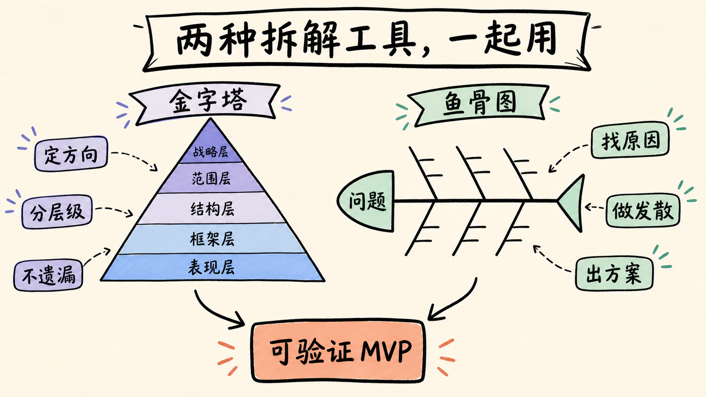
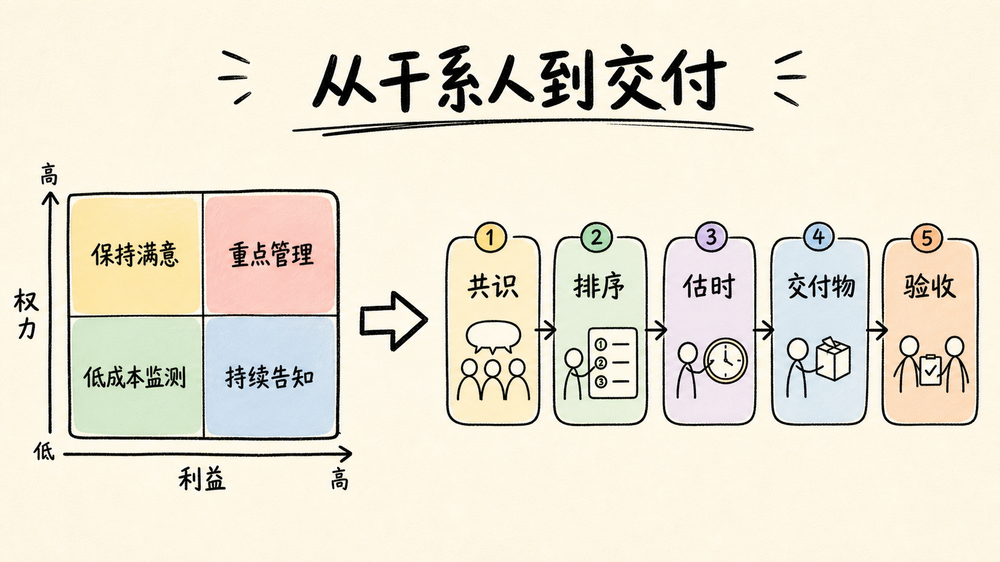

# 第三章：产品拆解与项目管理

需求和行业判断决定“为什么做”，产品拆解与项目管理决定“如何做成”。前者把复杂问题变成结构，后者把结构变成责任、时间、交付物和风险控制。优秀方案若无法被团队理解、实现和验收，仍然没有产品价值。

## 1. 金字塔思维：从中心目标逐层推导

金字塔原理强调结论先行、以上统下、归类分组和逻辑递进。产品拆解时遵循“一个中心、若干同维度分支、层层支持”的结构：

1. 战略层：用户习惯、核心需求、产品定位和商业模式；
2. 范围层：核心业务、重要功能和能力边界；
3. 结构层：功能架构、业务流程与信息关系；
4. 框架层：界面布局、导航、交互和用户流程；
5. 表现层：视觉、内容和反馈细节。

下层必须支持上层，同一层尽量按同一维度拆分并做到不重不漏。AI 知识库的中心目标不是“应用大模型”，而是“让有权限的员工快速获得可信答案”；下一层才是知识接入、权限、检索、生成、引用、反馈与运营。

### 从微信与 App 结构理解拆解

微信可以从通讯定位下钻到微信、通讯录、发现、我，再拆到聊天、关系、内容和服务。页面不是产品的第一层，而是战略和范围的表达。App 的通用拆解也应从产品定位、核心业务、重要功能、内容展示，最后才到功能区和内容页。

## 2. 鱼骨图：从结果问题追到可控原因

鱼骨图适合需求归因、单点问题处理和因果表达。完整六步是：

1. 确立问题与目标，确保鱼头可衡量；
2. 拆出 5～7 个中性大要因，不提前写好坏；
3. 继续追问小要因，区分现象、相关性和原因；
4. 为可控制原因设计解决方案；
5. 用 Kano、价值成本风险或实验价值排序；
6. 转成负责人、计划、埋点和复盘时间。

<figure class="article-figure">
  
  <figcaption>金字塔保证方向和结构，鱼骨图负责追因与方案发散。</figcaption>
</figure>

以智能门锁为例，大要因可以是安全、易用、耐用、电器特性、场景特性、创新和品牌联动；继续拆出锁芯、指纹、密码、临时密码、远程控制、电池管理和异常提醒，再按必备、期望、魅力分类，最终形成行动计划。

对“AI 回答采纳率低”，大要因可分输入、知识、检索、生成、交互、信任和评估。真正原因可能是资料过期、权限过滤召回不足、答案无引用、首字延迟过长，或用户不知道产品边界。不能把所有问题都归因于“模型不够大”。

## 3. 两种拆解合用：短视频电商示例

先用金字塔确定短视频、电商和小程序的定位、业务及功能结构，再用鱼骨图从用户侧和企业侧追问。用户侧关心发现商品、理解信息、观看卖家秀、购买、订单和售后；企业侧关心供给、交易、优惠、分享、直播、运营与数据。

首版可将商品信息、在线购买、订单和基础售后作为必备能力；优惠与分享可能属于期望属性；视频直播和互动可能是魅力或后续能力。行动计划应包含方案细化、人员排期、运营准备、上线埋点与二期范围，而不是停留在功能树。

### 交互层仍需基本规律

抖音页面拆解说明，产品可以同时从用户任务和企业目标理解。交互设计还要考虑费茨定律：目标越大、距离越近，用户完成指向操作所需时间越短。高频、关键动作应处于易到达区域，但不能因此用巨大的强制按钮侵占内容和误导点击。

## 4. 从功能树到 MVP：验证最大风险，不是做最小产品

MVP 应按五个问题筛选：是否直接支持核心任务，是否是闭环必备能力，是否能产生验证数据，是否存在人工替代，失败成本是否可控制。

AI 产品的最大风险通常不是“能否调用模型”，而是结果质量是否达到场景门槛、用户是否信任、数据能否接入、成本是否可控。合理 MVP 常是“有限场景 + 明确引用 + 人工确认 + 可回退”，而不是全场景自动化。

为 MVP 写四个边界：目标用户、覆盖场景、不支持内容、失败后的处理。再写成功阈值和停止条件，防止试点无限延长。

## 5. 项目与日常运作的区别

项目是为了明确目标，在时间和资源约束下完成的一次性任务。日常运作持续重复，项目则有起止、目标、交付和不确定性。产品设计、项目实施和产品发布相连，但产品生命周期通常包含多个项目。

### 工期、成本、质量三重约束

更快且质量不降通常要增加资源；低成本且高质量需要更多时间；时间与成本同时压缩，只能缩小范围或接受质量下降。产品经理应根据阶段选择：验证期压缩范围但守住核心体验；抢占窗口时可用更高成本换速度；高风险 AI 场景可以延后自动化，却不能取消权限、评估和人工兜底。

## 6. 干系人管理：先管理关系，再管理任务

干系人包括参与者、依赖方、决策者、受影响者和可能阻碍项目的人。步骤是识别、梳理、排序和持续管理。登记册至少记录角色、利益、权力、态度、期望、影响、沟通方式、负责人和关键节点。

按权力与利益分四类：

- 高权力高利益：重点管理，共同决策和高频沟通；
- 高权力低利益：令其满意，在关键节点主动同步；
- 低权力高利益：随时告知，建立有效反馈机制；
- 低权力低利益：低成本监督，避免投入过多精力。

<figure class="article-figure">
  
  <figcaption>不同干系人采用不同沟通策略，所有任务最终落到可验收交付。</figcaption>
</figure>

短视频电商项目的内部干系人包括老板、业务负责人、产品、研发、设计和运营；外部还包括用户、商家、厂家、创作者、营销机构和平台生态。AI 项目会再增加算法、数据、安全、法务、采购、模型供应商和知识 Owner。忽略其中任何关键依赖，都可能在上线前形成阻塞。

## 7. 里程碑：用重大事件度量项目进展

里程碑可以是事件、交付成果或决策点。它的作用是拆解目标、保持动力、监管进度、暴露问题和降低风险。制定流程是：团队讨论达成共识，列出并排序里程碑，估算工时和依赖，确认时间点，写清交付物与验收人。

合格里程碑符合 SMART：具体、可衡量、可实现、相关、有时限。“完成开发”不是好标准；“完成 100 条评估样例，业务负责人确认覆盖五类核心问题，引用支持率达到门槛”才可验收。

常见错误是把需求文档、UI、开发、测试简单串成日期，却没有考虑反馈反复、并行工作、依赖资源和验收决策。里程碑必须围绕结果，而不是围绕团队忙碌程度。

## 8. 甘特图：把依赖、并行和关键路径可视化

甘特图至少包含任务、子任务、负责人、开始结束时间、持续时长、依赖关系、进度和里程碑。使用步骤：细化计划，按类别与先后排序，明确前置任务，估算时间，标注可并行工作，持续更新实际进度。

甘特图最重要的价值是暴露关键路径和资源冲突。数据清洗若是评估集和模型调试的共同前置，就应优先解决；法务审批若需要两周，就不能在上线前一天才提出。图表不是承诺不变，而是让变化和影响可见。

## 9. 复杂案例的共同方法

编辑后台建设、卫星发射等复杂项目表面差异很大，但都需要：明确目标、拆工作包、识别干系人、定义里程碑、管理依赖、提前暴露风险和复盘。复杂度越高，越不能靠一个人记住全部信息。

后台产品尤其容易忽视运营链：内容生产、审核、发布、数据反馈和权限必须闭环。AI 后台还要管理提示词、知识版本、模型配置、评估集、发布审批和回滚记录。

## 10. AI 产品交付的阶段门

建议设置六个阶段门：

1. 问题确认：需求证据和目标指标被业务认可；
2. 数据就绪：来源、权限、质量、更新责任明确；
3. 原型验证：核心路径可用，最大风险假设获得初步证据；
4. 评估通过：离线质量、成本、延迟和安全达到门槛；
5. 受控试点：有限用户、人工兜底、日志和回滚完备；
6. 扩大上线：业务指标成立，运营责任和监控机制就绪。

每个阶段门都应写进入条件、交付物、决策人和失败后的处理。

## 11. 本章交付模板

项目计划至少包含：目标与非目标、产品金字塔、问题鱼骨图、MVP 边界、工作分解、干系人登记册、里程碑、甘特图、风险清单、验收标准和复盘时间。

### 实战练习

为 AI 知识库画产品金字塔和“答案不可信”鱼骨图；定义四周 MVP；建立权力利益矩阵；设置需求确认、数据就绪、评估集、内测和上线五个里程碑，并为每项写交付物、负责人、验收标准与失败处理。

[← 第二章](./02-industry-analysis) · [下一章：数据埋点与指标体系 →](./04-data-and-metrics)
