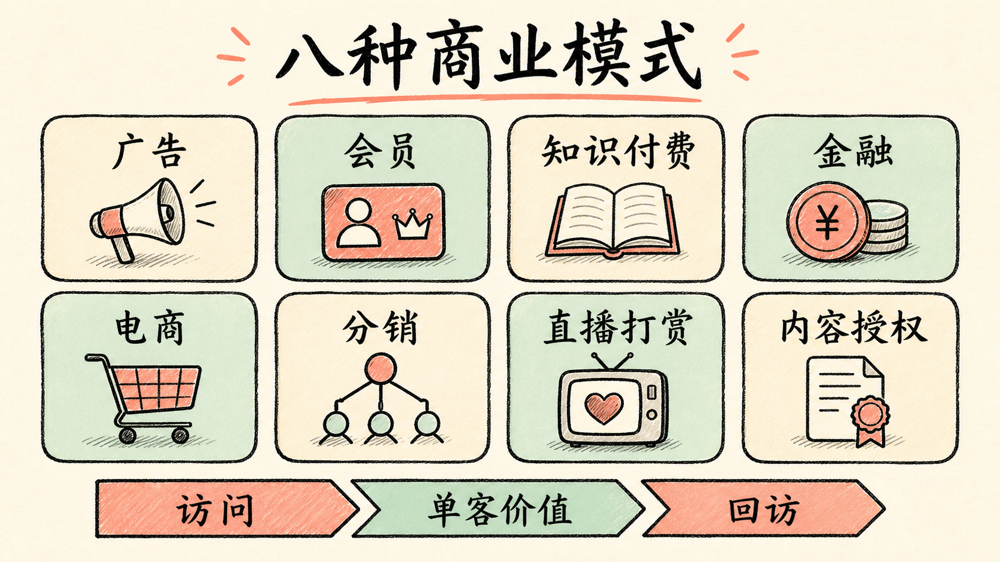

# 第五章：商业模式与效率提升

商业模式不是“加一个付费按钮”，而是企业如何创造价值、交付价值并获取价值。产品经理要回答谁付钱、为什么付钱、怎样持续付钱，以及收入是否覆盖获客、履约、服务和风险成本。

## 1. 八种核心变现模式

<figure class="article-figure">
  
  <figcaption>模式选择取决于价值、付费者、频次、成本和风险。</figcaption>
</figure>

### 广告：把注意力与转化机会卖给广告主

常见广告位包括开屏、横幅、插屏、贴片、信息流、激励视频和搜索广告。计费包括 CPT 时段、CPM 千次展示、CPC 点击、CPA 行为和 CPS 销售分成。

广告收入可拆为商业流量比例 × 人均广告展示 × 点击率 × 单次点击价格。三级优化分别是增加有效曝光、提高点击、提高单价。展示优化要区分场景和频次；点击优化既包括尺寸位置，也包括内容匹配与等价激励；单价提升依赖规模和定向能力。

RTB 实时竞价把广告位按用户和场景标签化，以单次展示机会竞拍，使用户看到更相关内容、媒体提高资源效率、广告主改善 ROI。风险是隐私、误导点击、品牌安全和体验侵蚀。

### 会员：用持续权益锁定高价值用户

会员目标是增加收入、拉新、提高运营效率并锁定高价值用户。内容型会员为持续内容与体验付费，电商型会员通过价格、物流、服务和返利提高消费频次。

会员收入 = 会员数 × 会员单价；会员数又由新增、在订和续订决定。优化包括内外部流量、自传播、时长价格、自动续费、内容排播、续订提醒和权益设计。

高频、价值持续、权益可复用的业务更适合会员。Costco 用精选 SKU、低毛利、售后和返利支撑续费；Amazon Prime 用物流、内容、购物和阅读权益形成业务飞轮。学习重点是权益之间是否共享用户与成本，而不是照抄福利清单。

### 知识付费：把认知转成可验证的学习结果

形态包括专业垂直内容、音频、社区问答、内容打赏、付费社群和系统课程。适用条件是有内容沉淀、价值密度高、需求和渠道稳定。主要问题是同质化、信任危机和低复购。

增长三级是新增、留存和复购：免费或低价体验、渠道与 KOL 拉新；积分、会员和社群留存；内容壁垒、课程体系与应用效果促进复购。不能只刺激焦虑，必须让用户获得可验证改变。

### 电商销售：交易之外还有完整履约

主要形态包括 B2B、B2C、C2C、O2O 和 C2M。商家通过卖货获利，平台可通过排名、推荐、佣金、店铺管理、营销和金融服务获利。适合标准化、便于物流、复购较高的商品。

三级效率是流量、ARPU 和后续使用：爆款、渠道和传播获得流量；选品、体验、价格和组合提高客单；会员、复购和召回延长生命周期。

### 直播打赏：互动、陪伴与身份价值

用户充值购买虚拟礼物，主播提现，平台抽成。适合娱乐性强、互动密度高和流量大的平台。优化包括内容与热点拉新、低门槛和等级提高 ARPU、签到红包和会员促进回访。必须防范未成年人消费、冲动付费、内容治理和诱导风险。

### 金融：以风险、资金和交易能力收费

包括保险、贷款、基金、理财、股票等。保险通过保费与精算管理风险，并进行资金运用。金融通常应建立在稳定主业、头部用户与风控能力之上，且受牌照、适当性、信息披露和系统性风险约束。增长不能以突破合规为代价。

### 分销：用利润换渠道触达

供应商、平台、一级二级分销与消费者构成链路。平台用佣金和奖励换取拉新、卖货与熟人传播。适合毛利较高、消费高频、货源与客群稳定的产品。优势是触达快、精准、现金流回转；风险是层级激励扭曲、虚假宣传和合规问题。

### 内容授权：让 IP 在更多场景中复用

内容授权主要面向企业，与面向消费者的知识付费不同。方式包括衍生品、包装、礼赠、营销、数字虚拟、改编、实体店、主题乐园、交通和冠名。它要求强 IP、版权清晰、持续内容生产和精细运营。迪士尼通过自有、改编和收购 IP，再连接乐园、授权和自营渠道，说明 IP 价值来自长期运营系统。

## 2. 混合模式必须产生协同

企业可以同时使用广告、会员、电商和授权，但多模式只有共享用户、数据、供给、渠道或品牌时才有意义。字节跳动类平台以流量支持广告和交易，云集类社交电商把销售与会员、分销结合。历史案例用于理解结构，不应忽略当时的市场、监管与流量条件。

判断协同要问：新模式是否降低获客成本、提高使用频率、复用已有能力或改善现金流？若需要完全不同用户、销售和履约体系，它更像第二家公司，而不是自然延伸。

### 八种模式怎样选择

| 判断条件 | 更可能匹配的模式 |
| --- | --- |
| 海量免费使用、注意力可定向 | 广告 |
| 高频持续价值、权益可复用 | 会员或订阅 |
| 强内容与专家信任、结果可验证 | 知识付费 |
| 标准商品、供应链和履约稳定 | 电商 |
| 强互动、陪伴和身份表达 | 直播打赏 |
| 高毛利、高频且渠道可裂变 | 分销 |
| 强 IP、版权与跨场景运营能力 | 内容授权 |
| 稳定主业、牌照、资金和风控能力 | 金融 |

选择时还要检查付费者与用户是否相同。企业 AI 工具常由采购、业务负责人付费，一线员工使用，安全法务拥有否决权；如果只优化最终用户体验，却没有满足采购价值与治理要求，商业链路仍然不成立。

### 字节跳动式综合系统

内容与推荐形成高频流量入口，广告把注意力转成现金流，创作者和内容生态反过来增强供给，电商等交易业务继续提高单用户价值。其关键不是“模式多”，而是算法、内容、用户和商业流量在同一基础设施上复用。

### 云集式会员与分销组合

销售收入与会员收入可以组合，分销承担拉新和交易触达。此类结构必须持续检查商品毛利、分佣层级、复购、真实消费与合规边界。若收入主要依赖新增分销者而非终端价值，增长会失去可持续性。

## 3. 三级火箭：访问、ARPU、回访

第一级用高频入口获得访问，第二级用可沉淀的商业场景提升 ARPU，第三级通过复购、生态或低频高价值业务实现长期变现。高频通常推动低频，前一级必须为后一级提供用户或能力。

先写公式再找瓶颈。例如订阅收入 = 有效线索 × 激活率 × 付费转化 × 客单价 × 续费率。激活只有 5% 时继续买流量只会放大浪费。

Apple 用核心硬件建立入口，通过产品线和服务提高价值，再用设备、软件、售后和生态形成回访；餐饮品牌可以用爆款引流、加购提高客单、体验与传播促进复购。表面动作不同，底层都是频次和价值的递进。

## 4. 用户生命周期、LTV 与 RFM

用户经历获客、升值、留存和流失。企业要精准定位用户、选择渠道、刺激需求、提供服务与体验、交叉销售、预警流失、改善服务并理解离开原因。

RFM 用最近一次行为 Recency、频率 Frequency、价值 Monetary 分类客户，决定接触方式、频次、刺激力度、资源、营销优先级、推荐和折扣。AI 产品可把购买替换为“最近一次高价值任务完成”，避免只按调用量判断价值。

## 5. 商业不可能三角：接受约束才能形成战略

项目有质量、工期、成本，医疗有快速、优质、廉价，教育有名师、便宜、小班或个性化。商业系统无法在所有维度同时极致。忽略约束会形成高获客、低毛利、高服务成本的结构性亏损。

AI 服务常见准确、快速、低成本三角。解决方案不是假装约束不存在，而是服务分层、模型路由、缓存、批处理、人工复核和不同 SLA。明确牺牲什么，本身就是定位。

## 6. 六步提升商业效率

1. 写出收入、成本和利润公式；
2. 画出访问、转化、客单、复购的完整链路；
3. 用数据定位弹性最大或损失最大的变量；
4. 结合用户、行业、竞品和现场观察解释原因；
5. 为单一瓶颈设计实验，写成本、周期和护栏；
6. 复盘边际收益，把有效动作固化为系统。

还要警惕四种表象：流量增长但质量下降，收入增长但毛利下降，活跃增长但价值任务不增长，规模增长但组织交付失控。下沉市场可借鉴“时间机器”逻辑，把成熟市场已验证的模式迁移到供给尚未充分的市场，但必须重新验证购买力、渠道和文化。

效率诊断不能只坐在办公室看报表。需要同时“看数字、看用户、看现场、看竞品”：数字定位异常，用户解释动机，现场暴露流程和供给问题，竞品提供可行解法。餐饮门店的标题、图片、评论、选址、店头、传单、堆头、货架关联、配送与促销，分别作用于访问、转化、客单和回访；只有先定位瓶颈，动作才不会变成无差别优化。

## 7. 单位经济：增长是否越做越健康

至少计算 LTV、CAC、毛利率、回收周期和直接服务成本。AI 产品还要计入模型推理、检索、存储、工具调用、重试、人工审核、客户成功、销售和合规成本。

增长健康的最低条件是客户生命周期毛利长期大于获客与服务成本。高调用量可能让公司亏得更多，因此定价要同时反映交付成本和客户获得的时间、收入与风险价值。

## 8. AI 产品定价与包装

- 按席位：适合稳定协作工具；
- 按用量：适合 API 和使用差异大的服务；
- 按任务或结果：适合价值可计量的工作；
- 基础费 + 用量：兼顾收入稳定和成本传导；
- 企业合同：覆盖部署、权限、集成、SLA 和服务；
- 增值模块：高级模型、知识库、审计、评估和自动化。

定价实验不能只看转化，还要看目标客户结构、使用深度、毛利、续费和支持成本。低价吸引来的用户若不匹配产品，反而会破坏服务质量。

## 9. 商业画布练习

为 AI 销售助手写出用户与付费者、核心价值、替代方案、收费模式、收入公式、主要成本、三级火箭、RFM 分群、不可能三角取舍和三种用量情景下的单客户毛利。

[← 第四章](./04-data-and-metrics) · [下一章：汇报沟通与情绪管理 →](./06-communication)
