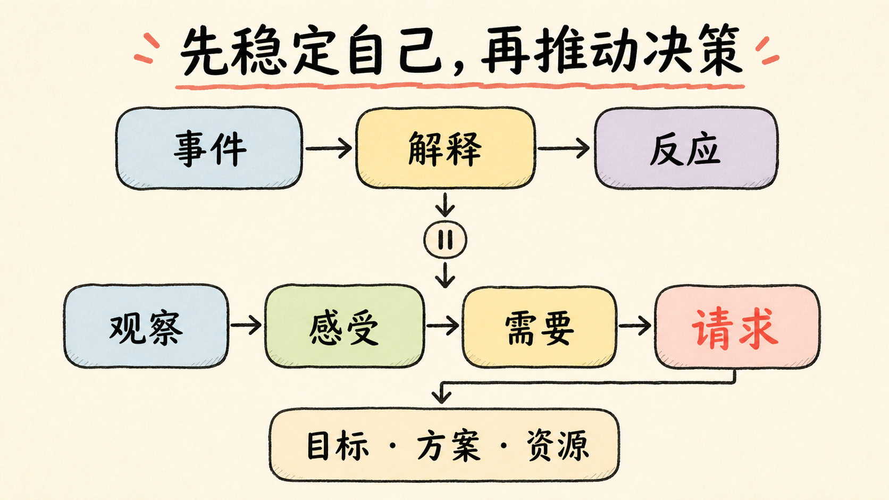

# 第六章：汇报沟通与情绪管理

产品工作建立在大量协作之上。正确方案如果不能被理解、不能获得资源、不能处理冲突，就无法产生结果。沟通的目的不是让自己说得舒服，而是让信息被准确理解，让双方形成决定和下一步行动。

## 1. 汇报是一种决策产品

领导需要的不是工作流水账，而是对目标、进度、风险和选择的可控感。好的汇报能让努力被看见，更重要的是让努力与组织目标产生关系。表达力会转化为影响力，影响力又决定资源、信任和执行效率。

汇报前先判断本次目标：同步进度让对方放心，请求帮助解决困难，对无法实现的目标请求决策，或在成果充分时提出认可和发展诉求。一个汇报只能有一个首要目标。

## 2. “四元素”构成完整叙事

### 背景

从公司阶段、部门重点和共同目标出发，说明为什么现在要讨论。背景不是长篇历史，而是让对方迅速理解决策上下文。

### 过程

选择突破性事件、里程碑和客观数据，说明已经完成什么、解决什么问题、还有什么未解决。过程展示用于建立可信度，不是证明自己很忙。

### 期望

明确需要的结果：资源、决策、认可、协调还是风险共担。期望不能埋在最后一句，更不能让对方猜。

### 计划

说明决定后怎样落地：步骤、负责人、时间、交付物、风险和复盘。没有行动计划的资源请求，很难获得信任。

四元素形成“全局背景 → 事实过程 → 决策期望 → 落地计划”的链路。背景引发兴趣，过程建立信任，期望让对话聚焦，计划增强可信度。

## 3. “三重点”确保汇报有用

### 目标：先把共同方向说清楚

目标能聚焦主题、提高效率并促成一致。区分“想要”和“需要”：表面想要“不加班”，真实需要可能是减少范围、增加人力或调整期限。目标应具体、与组织一致，并在沟通过程中保持坚定，不随情绪漂移。

### 方法：用总分总表达

先概述结论和请求，再用不超过三组分论点提供证据，最后重申建议与下一步。分论点应同维度、互相独立并共同支持结论。适用于对话、演讲、文档和报告。

### 资源：把投入与结果连接

资源包括人、资金、设备、数据、权限、时间和其他团队支持。请求时先统一目标，再说明资源缺口如何影响结果、有哪些替代方案，最后明确需要谁在何时批准什么。

## 4. 一个 AI 项目的决策汇报

> 客服知识库试点覆盖了退款场景（背景）。200 条评估集的引用支持率由 72% 提升到 89%，坐席平均检索时间下降 35%；但商品知识每周变化，目前没有维护责任人（过程）。需要决定由业务人工维护，还是投入接口自动同步（期望）。方案 A 两周可上线、成本低但依赖人工；方案 B 稳定性更高但需要四周研发。我建议先做 A 验证维护流程，同时设计 B，今天需要客服部门确认一名知识 Owner（计划）。

这里同时包含目标、方法和资源，也把事实、解释、方案和请求分开。

## 5. 汇报时机：开始前、过程中、结束后

- 开始前：确认整体思路、目标、边界和验收，防止方向错误；
- 过程中：同步突破、阶段成果、困难、风险和方案；
- 结束后：交付结果、业务影响、遗留问题和复盘。

关键风险不应等待固定周会。越晚暴露，组织可选择的空间越小。高质量主动汇报不是频繁打扰，而是在信息变化足以影响目标、资源或决定时及时同步。

## 6. 四个职场沟通陷阱

1. **不汇报或不及时**：把独立解决误解为隐藏风险；
2. **无主题、结构混乱**：背景过长、观点跳跃，对方不知道要决定什么；
3. **只报问题、没有方案**：把分析责任完整转给决策者；
4. **急于表达、缺少倾听**：只准备自己要说的，没有理解反馈和隐含约束。

改进方法是开头先说目标，使用总分总或 5W2H，带着 2～3 个方案、推荐项和取舍汇报，并在关键段落确认理解。让领导做选择题，不是把未经分析的问题扔回去。

## 7. 区分事实、解释和建议

“研发总是拖延”是评价；“接口原定周三交付，截至周五尚未完成”是观察；“可能影响周一联调”是风险判断；“建议缩小范围或增加一名开发”是方案。四类内容混在一起会制造防御。

AI 产品汇报尤其要避免用单一指标包装成功。“准确率很好”必须说明评估集、口径、样本结构和错误分布；业务价值还要结合采纳、时间、成本和风险。

## 8. 非暴力沟通：不是退让，而是降低防御

<figure class="article-figure">
  
  <figcaption>先区分事件和解释，再用观察、感受、需要、请求推动行动。</figcaption>
</figure>

非暴力沟通包含观察、感受、需要、请求四要素。

### 观察：描述能被共同核验的事实

不要把推测、预测、形容词和评价当事实。“张三经常迟到”边界模糊；“张三本周三次在 9:20 后签到”可以核验。“她无法完成工作”是推测；“她说目前无法按期完成”是观察。

### 感受：表达自己的状态，不用感受包装评价

“我觉得你不负责”仍是评价；“我焦虑、失望或担心”才是感受。建立更细的情绪词汇，可以减少只用“生气”覆盖所有体验。

### 需要：为自己的感受负责

感受由事件与自己对安全、尊重、清晰、支持、公平或效率的需要共同产生。“你来晚让我很郁闷”把责任全交给对方；更准确的是“会议没有按时开始，我很焦虑，因为我需要可预测的联调窗口”。

### 请求：具体、可执行、可反馈、可拒绝

“希望你理解我”无法执行，“不要再拖延”只是禁止。可用请求是：“请在今天 17 点前确认新的交付时间，并列出仍缺少的输入。”若对方不能拒绝，那更接近命令，不利于真实协作。

## 9. 情绪管理不等于压制

情绪是信息，情绪化是在强烈状态下失去对表达和行为的控制。长期压制会让需要无法被识别；直接爆发会损害信任。目标是识别情绪、有控制地表达，并把能量转成问题解决。

情绪管理既是投资管理，决定长期能创造多少价值；也是保险管理，降低一次失控破坏关系和职业信誉的风险。

## 10. 情绪粒度与 ABC 理论

情绪粒度越高，越能区分愤怒、失望、羞耻、焦虑、恐惧、被忽视或无力，并选择合适行动。提高方法包括学习词汇、定期监控、用 1～10 评分并记录触发和身体反应。

ABC 理论把过程拆为激发事件 A、信念或解释 B、情绪和行动后果 C。同一场面试可以被解释为“我一定会搞砸”，也可以理解为“一次双向验证”；同一领导追问可以是“不信任我”，也可以是“需要降低不确定性”。改变不合理信念，会改变反应。

检查是否存在读心、灾难化、以偏概全、绝对化和不当归因。不是强行积极，而是寻找更完整、更可行动的解释。

## 11. 情绪即将失控时的三步应急

1. **以静制动**：停止回复，倒数十秒，延迟不可逆行动；
2. **激活理性分析**：写下事件、解释、证据和下一步，或先做整理文件等机械任务；焦虑时完成一个可控小动作；
3. **获得外部视角**：观察自己的表情和语气，想象对方如何接收信息，必要时离开现场再沟通。

如果情绪持续影响睡眠、工作和关系，应寻求专业支持，沟通模型不能替代医疗或心理帮助。

## 12. 四个高情商习惯

1. 带着同理心倾听，不急着准备反驳；
2. 充分表达具体感激，而不是空泛赞美；
3. 用观察、感受、需要、请求表达愤怒；
4. 培养对自己的关怀，明确并负责地表达需要。

高情商不是操控别人，而是在理解双方需要的基础上寻找可持续合作。

## 13. 可复用决策汇报模板

> 背景：共同目标和当前状态。
> 结果：关键动作、数据和里程碑。
> 问题：事实、影响和不确定性。
> 选项：A/B/C 的收益、成本、风险。
> 建议：推荐项和理由。
> 请求：谁在什么时间前做什么决定。
> 下一步：决定后由谁交付什么结果。

### 实战练习

针对一次 AI 项目延期，分别写向领导请求决策和向依赖团队协调的沟通稿。标出观察、解释、风险、感受、需要、方案、资源与具体请求。

[← 第五章](./05-business-model) · [下一章：产品高手的长期修养 →](./07-professional-growth)
