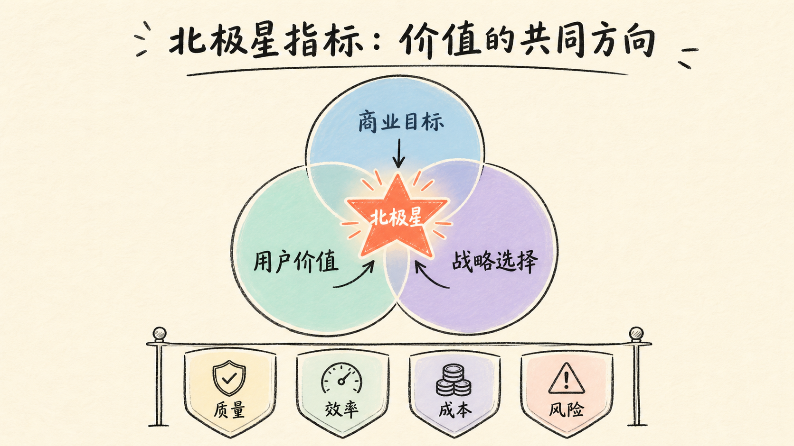

# 产品经理核心方法论：从需求洞察到商业闭环

这是一套为产品新人整理的完整方法论教材。它不是把课件上的名词换成列表，而是试图回答产品工作里真正困难的几个问题：**为什么做、为谁做、先做什么、怎么推进、如何衡量、怎样赚钱，以及如何让组织愿意支持你继续做。**

全文依据 13 份课件、共 862 页内容重组为七章。原课件中的品牌数据与行业案例主要来自课程制作时点，因此本文把它们当作“方法演示”，不把旧数字当成当前市场结论。真正值得带走的是分析框架、推理链条和行动模板。

::: tip 建议的学习方式
第一次阅读先建立全景；第二次选择一个自己熟悉的 AI 产品，完成每章末尾的练习；第三次把练习整合成一份产品方案。方法只有在真实问题中反复使用，才会从“知道”变成“能力”。
:::

## 一张图看懂七章关系

七章并不是七组孤立知识。它们共同构成一个产品经营闭环：

1. **需求与竞品**回答“用户的问题是否真实，市场上已有方案如何满足它”；
2. **行业分析**回答“现在是不是合适的进入时点，外部力量会不会改变胜负”；
3. **产品与项目**回答“如何把模糊想法拆成方案，再把方案按时交付”；
4. **数据分析**回答“产品是否创造价值，问题究竟出在哪一环”；
5. **商业设计**回答“谁愿意为什么价值付钱，增长能否持续”；
6. **汇报沟通**回答“怎样形成共识、争取资源、处理冲突”；
7. **自我修养**回答“怎样把产品思维变成长期职业能力”。

---

## 第一章 需求洞察与竞品分析：从“我觉得”走向证据

### 1.1 产品的起点不是功能，而是需求

产品可以是有形商品、软件、服务、组织方式或一整套体验。不同形态背后的共同点是：它们都在特定场景里帮助某类人完成任务、解决问题或获得某种体验。因此，产品经理的第一项工作不是画页面，而是确认四件事：

- **谁**遇到了问题，用户是否足够具体；
- **在什么场景**下发生，触发条件和上下文是什么；
- **用户原本怎样解决**，现有方案的成本和缺口是什么；
- **解决后产生什么价值**，用户是否愿意改变行为或付出代价。

“用户说想要某个功能”只是线索，不等于需求本身。例如，用户说“我想要一个自动写周报按钮”，更深层任务可能是减少信息整理时间、让工作成果被看见，或避免遗漏风险。产品经理需要从功能表达继续追问到任务、动机和评价标准。

在 AI 产品中，这一步尤其重要。模型能力容易制造令人惊艳的 Demo，但“模型能生成”不代表“用户会采用”。真正的 PMF（Product-Market Fit）意味着产品能力、用户任务与可持续市场之间形成匹配：目标用户反复使用，价值可被感知，产品有稳定的交付与获客路径。

### 1.2 用 Kano 模型判断需求层级

Kano 模型不只是给需求贴标签，它研究的是“功能具备程度”与“用户满意度”之间的非线性关系。

- **必备属性（Must-be）**：具备时用户觉得理所当然，缺失时强烈不满。账号安全、数据不丢失、核心任务可完成通常属于这一类。
- **期望属性（One-dimensional）**：做得越好，满意度越高；做得越差，满意度越低。例如响应速度、准确率、内容丰富度。
- **魅力属性（Attractive）**：用户没有明确期待，缺失也不抱怨，但出现时带来惊喜和传播。例如 AI 主动把会议纪要转成可执行任务并自动标出负责人。
- **无差异属性（Indifferent）**：做与不做都很少影响满意度，常是团队自我感动的来源。
- **反向属性（Reverse）**：增加后反而降低满意度。强制弹窗、过度自动化、无法关闭的 AI 建议都可能属于这一类。

同一项能力对不同用户、不同阶段可能属于不同类别。引用来源对法律从业者可能是必备属性，对日常灵感聊天用户可能只是期望属性；在市场早期令人惊艳的魅力属性，经过普及后也可能变成必备属性。因此 Kano 结论需要定期复测，不能永久固化。

<figure class="article-figure">
  
  <figcaption>先用 Kano 判断“值不值得做”，再用 HMW 探索“可以怎么做”。</figcaption>
</figure>

#### Kano 问卷怎么设计

对同一能力提出一正一反两个问题：

1. 如果产品具备这项能力，你的感受是什么？
2. 如果产品不具备这项能力，你的感受是什么？

选项可使用“很喜欢、理应如此、无所谓、勉强接受、很不喜欢”。把正向与反向答案交叉映射到 Kano 分类表，再统计不同类别所占比例。不要只问“你想不想要”，因为用户通常会对免费的好处说“想要”，却不会因此改变行为。

当需要比较多个需求时，可以计算满意与不满意系数：

- 满意系数 `SI = (A + O) / (A + O + M + I)`，越高表示增加功能越可能提高满意度；
- 不满意系数 `DSI = -(M + O) / (A + O + M + I)`，绝对值越大表示取消功能越可能引发不满。

其中 A、O、M、I 分别表示魅力、期望、必备和无差异回答数。把多个需求放入 SI/DSI 四象限，可以辅助排序。但数字不是决策本身，还要结合战略、成本、风险、用户规模与依赖关系。

### 1.3 用 HMW 从问题走向方案

HMW 是 “How Might We” 的缩写。它把抱怨改写为开放而可行动的问题：**我们可以怎样……？**

- **How** 假定问题可以被改善；
- **Might** 保留多种可能，不急着锁定唯一答案；
- **We** 强调跨角色共同解决，而不是把责任推给某个人。

完整流程可以分成五步：

1. **明确问题**：写清用户、场景、行为、障碍和目标，不把方案写进问题。
2. **改写 HMW**：从积极促进、障碍消除、任务拆解、角色转移、极端假设等角度改写。
3. **发散方案**：先追求数量与差异，再讨论可行性。
4. **收敛排序**：结合用户价值、业务价值、实现成本和风险筛选。
5. **形成 MVP**：把最佳假设转成最小流程、原型与验证指标。

例如，原问题“用户不会使用 AI 搜索”太笼统。更可用的表达是：“我们可以怎样让第一次使用 AI 搜索的研究人员，在 3 分钟内知道该如何提问，并判断答案是否可信？”它自然引出示例问题、引导模板、引用展示、置信提示等方向。

### 1.4 竞品分析不是抄功能，而是借假修真

竞品分析的核心不是“别人有什么按钮”，而是通过已经存在的产品，反推其用户选择、价值主张、商业约束和增长路径。分析对象不只包括直接竞品：

- 同一用户、同一服务：直接竞争；
- 同一用户、不同服务：竞争用户时间或预算；
- 不同用户、同一服务：可借鉴能力，但未必直接竞争；
- 用户与服务均不同：通常不构成有效竞品。

#### 五层模型

1. **战略层**：企业愿景、目标用户、产品定位、核心需求、商业模式。
2. **范围层**：核心业务、主要功能、次级功能、业务流程和能力边界。
3. **结构层**：信息架构、任务链路、功能关系、用户流程。
4. **框架层**：页面布局、导航、交互、查询、跳转与反馈。
5. **表现层**：视觉、配色、排版、动效和品牌语气。

<figure class="article-figure">
  
  <figcaption>越靠上越接近产品内核；界面相似不代表战略、用户和商业模式相同。</figcaption>
</figure>

新人最常见的问题是把 80% 精力放在框架层和表现层。真正有价值的竞品结论应该能回答：“它为什么这样做？”例如两个 AI 写作工具都有对话框，但一个服务个人创作者、靠订阅收费，另一个嵌入企业内容流程、按席位与用量收费；它们的权限、模板、协作、审核和质量指标必然不同。

#### 六步竞品分析法

1. 明确目的并选择竞品；
2. 按五层模型拆解当前产品；
3. 回看关键版本与发展阶段，识别策略变化；
4. 判断自己产品所处阶段和资源条件；
5. 制定跟随、差异化或放弃的针对性计划；
6. 上线验证并复盘结论。

跟随适合补齐用户已经视为必备的能力；差异化适合目标用户、场景或价值链存在明显空缺的情况。差异化不是“为了不一样而不一样”，而是用不同方式服务不同需求。

### 1.5 第一章练习：拆一个 AI 会议助手

请完成一页分析：列出会议前、会议中、会议后的用户任务；用 Kano 判断转写准确、发言人识别、行动项提取、自动提醒分别属于什么属性；选择两款竞品做五层比较；最后写出三个 HMW 问题和一个可验证 MVP。

---

## 第二章 行业分析：判断天花板、速度与进入时机

### 2.1 产品判断为什么必须放进行业环境

优秀产品也可能败给技术迁移、监管变化、渠道重构或用户习惯改变。行业分析的目的不是预测一个精确未来，而是减少只从单个产品体验出发的盲点。

开始研究前先明确决策：是判断要不要进入、选择细分赛道、规划产品路线、评估融资空间，还是寻找职业机会？应坚持“有目标、无预设”——先定义要回答的问题，避免只搜集支持既定观点的材料。

### 2.2 四个基础指标

- **市场规模**：当前市场总量和可服务市场，帮助判断天花板。
- **发展趋势**：同比、复合增长率、渗透率、供需变化，帮助判断速度与方向。
- **细分占比**：不同人群、地区、渠道、产品形态所占份额，帮助找到结构性机会。
- **此消彼长**：新旧方案之间的替代、互补和价值转移，帮助识别增长来自新增需求还是存量迁移。

规模大不等于值得进入。一个大而停滞、集中度极高的市场，可能不如一个规模较小但渗透率快速提升、价值链仍有空位的市场。反过来，高增长也不等于好生意：增长可能依赖补贴、政策窗口或不可持续的获客成本。

### 2.3 从宏观到产业链的结构化分析

可以组合使用以下视角：

1. **PEST**：政策、经济、社会、技术分别带来哪些推动与约束；
2. **生命周期**：萌芽、验证、快速增长、竞争、成熟和衰退阶段各自的关键任务；
3. **产业链**：上游供给、中游平台/解决方案、下游渠道与用户，利润和话语权集中在哪里；
4. **竞争格局**：参与者数量、集中度、差异化维度、替代品与进入壁垒；
5. **单位经济**：一个客户或一笔交易是否能产生正向价值。

对 AI 行业而言，上游可能包括算力、模型与数据；中游包括模型服务、开发平台、评估和安全工具；下游是具体行业应用。产品机会不一定在最热的模型层，也可能出现在数据治理、工作流集成、质量评估或垂直交付中。

### 2.4 用技术成熟曲线理解“热度”和“成熟度”

课件借 Gartner 技术成熟度曲线说明：一项新技术通常经历创新触发、预期膨胀、幻灭低谷、稳步复苏和生产成熟。课件进一步把竞争重点概括为技术、产品、模式、运营、资本与政策的阶段迁移。

<figure class="article-figure">
  
  <figcaption>热度是情绪信号，成熟度是交付信号；进入时点取决于你的资源和目标。</figcaption>
</figure>

这类曲线是思考工具，不是自然定律。判断行业阶段时，应观察三组证据：

- **供给证据**：核心技术是否可复现，成本是否下降，人才和基础设施是否成熟；
- **需求证据**：是否出现稳定付费、重复使用和明确采购预算；
- **制度证据**：标准、监管、合同、责任和生态分工是否逐渐清晰。

早期进入者可能获得认知和技术红利，但要承受需求教育与基础设施不成熟；爆发期机会多、竞争也最激烈；成熟期增长放缓，却更适合靠效率、细分服务和稳定交付获利。没有对所有人都最好的时间点，只有与能力结构匹配的时点。

### 2.5 六步行业研究流程

1. **确立目的**：把研究问题写成需要做出的决策。
2. **收集资料**：优先一手数据、企业披露、监管文件、行业协会和专家访谈；第三方报告用于补充。
3. **结构化分析**：按规模、趋势、阶段、产业链、竞争和单位经济归类。
4. **形成结论**：写出结论、证据、反证、假设和不确定性。
5. **内容呈现**：一页一个结论，数据标明口径与时点，图表服务于判断。
6. **盘点复盘**：记录哪些信息改变了决策、哪些假设仍需验证。

一份好的行业结论不应是“AI 客服市场很大”，而应是：“中型电商客服在售后高峰存在明确降本需求；知识更新与系统集成是交付瓶颈；我们适合先做人工坐席 Copilot，而不是全自动替代，因为错误成本和权限依赖尚未解决。”

### 2.6 第二章练习：AI 行业机会卡

选择一个场景（AI 客服、AI 销售、AI 教育或 AI 法务），写清市场规模口径、增长驱动、替代关系、产业链位置、阶段证据、三项主要风险，以及“现在进入/暂缓进入”的条件化结论。

---

## 第三章 产品拆解与项目管理：把思路变成可交付结果

### 3.1 金字塔：从定位逐层推导功能

金字塔思维强调结论先行、以上统下、归类分组和逻辑递进。用于产品设计时，可以从战略层逐步展开到范围、结构、框架和表现层。

一个正确的拆解应满足两点：下层内容共同支持上层目标；同一层级按同一维度划分，尽量不重不漏。比如 AI 知识库的顶层目标不是“使用大模型”，而是“让有权限的员工快速获得可信答案”。下层才是资料接入、权限、检索、生成、引用、反馈和运营。

### 3.2 鱼骨图：从问题追到原因和方案

鱼骨图适合处理“为什么结果不好”或“这个产品需要哪些能力”。操作步骤是：

1. 写清问题或目标，作为鱼头；
2. 拆出不超过 5～7 个中性的大类原因；
3. 继续追问形成中因、小因；
4. 为可控制原因设计解决方案；
5. 按价值、成本、风险和依赖排序；
6. 转成负责人、交付物、时间和验证指标。

<figure class="article-figure">
  
  <figcaption>金字塔保证方向和结构，鱼骨图帮助追因与发散，两者最终汇合到可验证方案。</figcaption>
</figure>

以“AI 回答采纳率低”为例，大类原因可分为输入问题、知识问题、检索问题、生成问题、交互问题和评估问题。继续拆解后，可能发现真正瓶颈是文档过期、权限导致召回不足、答案缺引用，或用户不理解适用边界。只有定位到可控制原因，优化才不再是“换一个更大模型”。

### 3.3 从功能树到 MVP

拆解后不要把所有叶子节点都做进第一版。MVP 的本质是用最小代价验证最大风险假设。可以按以下顺序筛选：

1. 是否直接支持核心用户任务；
2. 是否是完成闭环的必备能力；
3. 是否能产生可观察数据；
4. 是否存在人工或低成本替代；
5. 失败成本是否可控制。

AI 产品 MVP 常见的合理形态是“有限场景 + 人工确认 + 明确引用 + 可回退”，而不是“一开始就全自动覆盖所有问题”。

### 3.4 项目管理的三重约束

项目是在时间和资源约束下，为明确目标完成的一次性任务。质量、工期和成本构成经典三重约束：希望更快且质量不降，通常意味着增加资源；希望低成本且高质量，通常需要更多时间；时间与成本都极低时，只能缩小范围或接受较低质量。

产品经理的特殊职责不是机械守住日期，而是根据产品阶段决定取舍。验证期可以降低功能完整度，但不能牺牲要验证的核心体验；高风险 AI 动作可以延后自动化，却不能省略权限、审计和人工确认。

### 3.5 干系人管理：产品不是一个人做出来的

干系人包括直接参与项目的人，也包括会被项目结果影响的人。识别后，可按权力与利益分成四类：

- 高权力、高利益：重点管理，共同决策、频繁沟通；
- 高权力、低利益：保持满意，关键节点主动同步；
- 低权力、高利益：持续告知，吸收一线反馈；
- 低权力、低利益：低成本监测，不消耗过多精力。

<figure class="article-figure">
  
  <figcaption>先明确谁影响结果，再用里程碑、交付物和决策点控制推进。</figcaption>
</figure>

AI 项目的干系人往往比普通功能更多：业务、产品、工程、算法、数据、安全、法务、采购、模型供应商、知识负责人和最终用户都可能影响交付。只画用户流程而忽略数据权限、知识维护责任和采购周期，项目通常会在上线前卡住。

### 3.6 里程碑与甘特图

里程碑不是“工作了五天”，而是可验证的重大交付或决策点。一个合格里程碑应具体、可衡量、可实现、相关且有时限，例如：“完成 100 条评估样例并通过业务负责人确认，核心场景正确率达到约定门槛”。

制定顺序是：团队达成目标共识 → 列出里程碑并排序 → 估算工时与依赖 → 确认日期 → 写清交付物和验收人。甘特图用来显示任务、起止时间、负责人和依赖，重点是发现前置条件、资源冲突和可并行工作，而不是画一张漂亮时间表。

### 3.7 第三章练习：AI 知识库交付计划

画出产品金字塔与“答案不可信”的鱼骨图；定义一个四周 MVP；建立干系人矩阵；设置需求确认、数据准备、评估集完成、内测和上线五个里程碑，并为每个里程碑写出交付物与验收标准。

---

## 第四章 数据埋点与指标体系：用证据定位问题

### 4.1 埋点不是收集一切，而是记录关键事实

数据埋点是在关键行为发生时记录事件及其属性，用来还原用户路径、计算指标和验证假设。最基本的三类事件是：

- **曝光**：页面、模块或内容真正进入可见范围；
- **点击**：用户对按钮、卡片或操作入口进行交互；
- **停留**：用户在页面、内容或任务阶段花费的有效时间。

事件本身回答“发生了什么”，属性回答“在什么条件下发生”。例如 `answer_adopted` 是事件，`user_role`、`task_type`、`model_version`、`has_citation`、`latency_bucket` 是属性。没有属性，数据难以解释；属性无限扩张，又会造成成本和口径混乱。

### 4.2 三种采集方式

- **代码埋点**：灵活、可记录业务属性，适合核心链路；代价是开发和维护成本高。
- **可视化埋点**：通过页面圈选配置，适合标准点击与曝光；复杂动态页面和自定义属性能力有限。
- **全埋点**：SDK 自动采集大量行为，适合探索；数据量大、语义弱，仍无法替代业务事件设计。

实际项目常采用混合方案：核心业务和 AI 质量事件用代码埋点，通用页面交互用可视化或全埋点补充。

### 4.3 一份可用的埋点方案

先梳理业务问题，再设计事件，而不是看见按钮就埋。流程是：业务梳理 → 指标定义 → 事件与属性设计 → 开发实施 → 测试验收 → 发布监控 → 查漏补缺。

埋点表至少包含：事件名称、中文含义、触发时机、去重口径、公共属性、业务属性、上报端、负责人和验证方式。命名应稳定可读，统计口径要写清用户、时间窗口、是否排除内部账号、成功状态如何定义。

常见错误包括：前后端口径不一致、同名事件定义不同、采集机制引入误差、认为暂时不用就不记录，以及认为线下业务无法记录数据。修复这些问题依赖数据字典、版本管理、自动校验和定期审计。

### 4.4 用户、增长、营收三大系统

<figure class="article-figure">
  
  <figcaption>北极星指标连接用户价值、商业目标和战略选择，三大系统提供解释它的上下游信号。</figcaption>
</figure>

- **用户系统**回答“在为谁服务、体验如何”：画像、活跃、留存、任务完成率、满意度。
- **增长系统**回答“用户从哪里来、如何激活与传播”：新增、注册、激活、渠道质量、病毒系数。
- **营收系统**回答“价值如何转化为收入”：GMV、付费人数、ARPU、LTV、CAC、毛利与回收周期。

三者可能冲突。增加广告会提升短期收入，却可能降低留存；降低价格会提升转化，却可能破坏单位经济。产品团队需要一个北极星指标统一方向，同时用护栏指标防止局部最优。

### 4.5 如何定义北极星指标

北极星指标是在当前阶段最能代表产品持续创造核心价值的指标。它应当：

1. 体现用户真正获得了价值，而不是只完成浅层动作；
2. 与长期商业结果有关，是先导而非纯滞后指标；
3. 团队能够理解并通过行动影响；
4. 口径稳定、可持续测量；
5. 配有质量、成本和风险护栏。

例如，对 AI 会议助手，“生成纪要次数”容易被虚高使用误导；“被用户确认并产生至少一个后续行动的会议数”更接近价值。护栏指标可以包括人工修改率、错误行动项率、平均延迟和单次处理成本。

北极星不是永远唯一不变。初创期重点验证目标用户与留存；成长期重视获取、激活、留存和传播；成熟期更多关注转化、LTV、ROI 与召回；衰退或转型期关注成本、迁移与新业务验证。

### 4.6 漏斗、AARRR 与 AI 质量指标

漏斗把总结果拆成连续转化率。例如外卖收入可拆为曝光 → 进店 → 下单 → 支付，每一环都能定位损失。AARRR 则覆盖获取、激活、留存、收入和推荐，强调增长闭环。

AI 产品还必须补充四类指标：

- **质量**：正确性、完整性、引用支持率、任务完成率、人工采纳率；
- **效率**：首字延迟、总耗时、节省时间、自动化比例；
- **成本**：单任务模型成本、重试成本、人工复核成本；
- **风险**：幻觉率、越权调用、敏感输出、不可回滚操作。

不要用单个离线准确率代替产品成功。模型回答正确但用户找不到入口、等待太久、无法编辑或不信任来源，产品仍然失败。

### 4.7 第四章练习：设计 AI 助手埋点

为“提问 → 检索 → 生成 → 查看引用 → 采纳/编辑 → 反馈”设计事件表；定义一个北极星指标、两个驱动指标和四个护栏指标；最后写出一次指标下降时的排查顺序。

---

## 第五章 商业模式与效率：让价值交换可持续

### 5.1 商业模式的三个问题

任何变现设计都应先回答：谁付钱、为什么价值付钱、收入是否覆盖交付与增长成本。收费方式只是表面，背后是价值创造、价值交付和价值获取。

### 5.2 八种常见变现模式

<figure class="article-figure">
  
  <figcaption>选择模式时先看价值、付费者与成本结构，再看行业惯例。</figcaption>
</figure>

| 模式 | 付费者与价值 | 适用条件 | 核心风险 |
| --- | --- | --- | --- |
| 广告 | 广告主为注意力、触达或转化付费 | 流量大、使用频次高、可定向 | 侵蚀体验、虚假点击、隐私风险 |
| 会员/订阅 | 用户为持续权益和稳定服务付费 | 高频价值、内容/服务持续更新 | 续费弱、权益同质化 |
| 知识付费 | 用户为结构化知识与学习结果付费 | 内容壁垒、信任、可验证获得感 | 同质化、低复购、承诺过度 |
| 金融 | 用户或机构为风险管理、资金与交易服务付费 | 牌照、风控、稳定主业和数据 | 合规、坏账、系统性风险 |
| 电商 | 消费者买商品，平台收佣金或服务费 | 标准供给、履约、复购 | 库存、物流、价格竞争 |
| 分销 | 品牌用佣金换渠道触达与销售 | 毛利足够、货源稳定、规则透明 | 激励扭曲、合规与信任风险 |
| 直播打赏 | 观众为互动、陪伴和身份表达付费 | 高互动内容、规模流量 | 冲动消费、内容治理 |
| 内容授权 | 企业为 IP 使用权与衍生价值付费 | 强 IP、版权清晰、运营能力 | 侵权、过度授权、价值稀释 |

课件使用字节跳动、Costco、Amazon、迪士尼、云集等历史案例说明混合模式。应该学习的是结构，不是复制结果：同一公司可以用广告获取现金流、订阅提高稳定性、电商扩大交易、授权延伸 IP，但多模式只有在共享用户、能力或渠道时才会产生协同，否则只是分散资源。

### 5.3 AI 产品常见收费方式

AI 产品通常把传统模式进一步组合：

- 按席位订阅：适合稳定协作工具；
- 按调用量或 Token：适合 API 和用量差异大的服务；
- 按任务/结果：适合价值可清晰计量的文档处理、线索生成；
- 平台基础费 + 用量：兼顾收入稳定和成本传导；
- 企业合同：包含部署、权限、集成、SLA 与服务；
- 增值模块：高级模型、私有知识库、审计、评估和自动化工作流。

定价不能只参考模型成本。还要计算检索、存储、工具调用、人工审核、客户成功、销售和合规成本，并把客户节省时间、增加收入或降低风险的价值纳入价格锚点。

### 5.4 三级火箭：访问、ARPU、回访

课件用“三级火箭”统一拆解商业效率：

1. **提高访问/新增**：让更多目标用户进入；
2. **提高 ARPU/单次价值**：提升转化、客单、使用深度或价值模块；
3. **提高回访/复购**：延长生命周期、降低流失并形成传播。

不要同时堆动作。先写出收入公式，再找敏感变量。例如：

`订阅收入 = 有效线索 × 试用激活率 × 付费转化率 × 客单价 × 续费率`

如果试用激活率只有 5%，继续扩大流量可能只是放大浪费。先修复用户首次价值体验，往往比购买更多流量更有效。

RFM 模型可用于精细化回访：Recency 看最近一次有效使用，Frequency 看使用频率，Monetary 看贡献价值。AI 产品可以把“消费”替换为“完成高价值任务”，并据此区分新用户、活跃用户、潜在流失用户和高价值用户。

### 5.5 商业中的不可能三角

项目管理的质量、工期、成本约束也存在于商业设计。便宜、优质、完全定制通常难以同时成立；AI 服务还常见准确、快速、低成本三者冲突。产品经理应明确优先级，通过模型路由、缓存、人工复核和服务分层实现不同套餐，而不是承诺所有维度都极致。

### 5.6 单位经济与增长边界

至少关注：

- `LTV`：客户整个生命周期贡献的毛利；
- `CAC`：获得一个付费客户的销售与营销成本；
- 毛利率：收入扣除直接交付成本后的比例；
- 回收周期：多久收回获客投入；
- 服务成本：模型、基础设施、人工审核和客户成功。

增长只有在边际收入长期大于边际成本时才健康。高 GMV、高调用量或高注册数都可能掩盖亏损。AI 产品尤其要防止用户越活跃、推理成本越高、公司亏得越多的倒挂结构。

### 5.7 第五章练习：AI 产品商业画布

为一个 AI 销售助手写出付费者、用户、核心价值、收费方式、收入公式、主要成本、三级火箭动作和不可能三角取舍。再计算三种用量情景下的单客户毛利。

---

## 第六章 汇报沟通与情绪管理：让正确方案被理解和支持

### 6.1 汇报的目标是促成决策

工作汇报不是把做过的事情按时间复述，而是帮助对方理解现状、判断风险并做出决定。课件提出“4 元素 + 3 重点”：

- 四元素：**背景、过程、期望、计划**；
- 三重点：**目标、方法、资源**。

背景要连接公司目标和业务问题；过程突出关键动作、里程碑与客观结果；期望说清需要什么决定或支持；计划说明资源到位后如何行动。目标要具体并与共同目标一致，方法采用总—分—总结构，资源要说清人、钱、时间、数据或权限及其回报。

一个可用的 AI 项目汇报示例是：“客服知识库试点已覆盖退款场景，200 条评估集的引用支持率从 72% 提升到 89%。当前最大风险是商品知识每周更新但无人负责同步。建议方案 A 由业务指定知识 Owner，方案 B 接入商品系统自动同步；我推荐先做 A，在两周内验证维护流程，需要客服部门确认一名负责人。”

### 6.2 四个常见错误

1. **不汇报或太晚汇报**：方向偏差与风险在最后一刻暴露；
2. **没有主题、结构混乱**：对方听完仍不知道需要做什么；
3. **只报问题、不带方案**：把分析责任完整转给决策者；
4. **只顾表达、不听反馈**：信息没有形成双向闭环。

工作开始前同步方向，过程中同步里程碑、风险和选择，结束后同步结果与复盘。遇到问题时尽量给出 2～3 个选项、推荐项、依据和风险，让领导做选择题而不是问答题。

表达应把模糊判断改成可核验事实。不要只说“效果不错”，而要说“试点任务完成率为 78%，较旧流程提高 12 个百分点，但高风险问题仍有 6% 需要人工纠正”。同时区分事实、解释和建议，避免把个人判断伪装成客观结论。

### 6.3 非暴力沟通：观察、感受、需要、请求

<figure class="article-figure">
  
  <figcaption>先稳定自己，再把事实、感受、需要和具体请求说清楚。</figcaption>
</figure>

非暴力沟通（NVC）不是压住情绪，也不是一味退让，而是把攻击性判断转成四部分：

1. **观察**：描述可核验事实，不贴标签；
2. **感受**：说出自己的真实感受，不用“我觉得你……”伪装评价；
3. **需要**：指出感受背后未被满足的价值或需要；
4. **请求**：提出具体、可执行、可拒绝的行动。

例如，不说“研发总是拖延”，而说：“原定周三交付的接口到周五仍未完成（观察），我很焦虑（感受），因为联调需要稳定的时间窗口（需要）。你能否在今天 17 点前确认新的交付时间，并列出仍缺少的输入？（请求）”

### 6.4 情绪 ABC：改变信念，改变反应

ABC 理论把过程分成激发事件（A）、信念或解释（B）和情绪/行动后果（C）。同一个“领导追问进度”，可以被解释为“他不信任我”，也可以解释为“他需要降低项目不确定性”。事件没有改变，但信念改变会影响情绪和行为。

管理情绪的第一步是提高情绪粒度：不要只说“不爽”，而是分辨愤怒、失望、羞耻、担忧、被忽视或不确定。可以用 1～10 记录强度，再检查自己是否在读心、灾难化、以偏概全或错误归因。

情绪强烈时，先暂停和延迟行动；把事实与解释写开；做一个可控制的小动作；等生理唤醒下降后再沟通。若情绪问题持续影响睡眠、工作或关系，应寻求专业帮助，不能把沟通模型当成医疗建议。

### 6.5 第六章练习：一次项目延期沟通

分别用“4 元素 + 3 重点”和 NVC 写两版沟通稿：一版向领导请求决策，一版与依赖团队协调。标出事实、推断、风险、推荐方案、所需资源和具体请求。

---

## 第七章 产品高手的自我修养：把自己当作长期产品

### 7.1 产品思维的本质是价值交换

课程结语把产品思维概括为从供给侧自我表达转向需求侧价值创造：不假设“所有人都像我”，不按自己的偏好替用户做决定，而是理解他人的情境，在创造价值的同时合理获取价值。

这不意味着无原则迎合。真正的用户中心还包括辨别长期利益、拒绝有害需求、建立安全边界，并让用户理解取舍。AI 产品尤其需要在便利、透明、隐私和责任之间保持清醒。

### 7.2 智、信、仁、勇、严

- **智**：理解事实、模型与因果，知道何时使用何种方法；
- **信**：建立可信的承诺、数据口径和协作关系；
- **仁**：保有同理心与服务意识，理解不同角色的处境；
- **勇**：面对不确定性做选择，也敢于暴露风险和承认错误；
- **严**：对目标、质量、边界和复盘保持纪律。

这五项可以落到日常：重要结论写证据，承诺记录交付物，决策前问受影响者，失败时主动复盘，高风险动作设置验收与回滚。

### 7.3 势、道、术：三层职业能力

- **取势**：理解行业趋势、技术迁移和组织机会；
- **明道**：理解用户底层需求、价值交换和长期原则；
- **优术**：持续提升调研、分析、设计、数据、项目和表达技能。

只学术，容易在错误方向上高效努力；只谈势，容易追逐热点而没有交付能力；只讲道，容易停留在正确但空泛的价值观。成熟产品人需要让三层相互校验。

### 7.4 把自己的职业发展当作产品迭代

1. **用户研究自己**：哪些任务让你长期投入，哪些能力得到真实正反馈；
2. **分析市场**：目标岗位解决什么问题，企业愿意为什么能力付费；
3. **定义定位**：选择一个主战场和清晰价值主张；
4. **设计 MVP**：用小项目、作品集或内部改进验证能力；
5. **建立指标**：用交付结果、影响范围、复用次数和反馈衡量成长；
6. **持续复盘**：保留有效方法，淘汰无差异努力，补齐下一阶段能力。

对 AI 产品经理而言，一个更可靠的成长组合是：产品基本功 + AI 能力边界 + 数据评估 + 业务理解 + 沟通推进。工具会快速变化，但把模糊问题转成可验证产品闭环的能力更持久。

### 7.5 七章最终实践：完成一份 AI 产品方案

选择一个真实业务问题，输出以下内容：

1. 用户、场景、现状路径与问题证据；
2. Kano 分类、HMW 问题与竞品五层分析；
3. 行业阶段、产业链位置和进入条件；
4. 产品金字塔、鱼骨图、MVP 与失败兜底；
5. 干系人、里程碑、资源与风险；
6. 埋点表、北极星、驱动指标与护栏指标；
7. 付费者、商业模式、收入公式和单位经济；
8. 面向领导的 3 分钟决策汇报。

如果这八项能够互相一致——需求支持方案、方案支持指标、指标支持商业价值、项目计划能够落地——你就不再只是“会写 PRD”，而是在经营一个完整产品。

---

## 附录：可直接复用的工作模板

### A. 需求证据卡

| 字段 | 要填写的内容 |
| --- | --- |
| 目标用户 | 角色、能力、权限，不只写年龄性别 |
| 触发场景 | 何时、何地、因为什么开始任务 |
| 当前方案 | 用户现在怎么做，使用哪些工具 |
| 主要障碍 | 时间、成本、认知、协作或风险 |
| 成功标准 | 用户怎样判断任务完成得好 |
| 证据 | 访谈原话、行为数据、工单、观察 |
| 假设 | 哪些结论尚未验证 |

### B. 竞品分析报告目录

1. 决策问题与范围；
2. 竞品选择依据；
3. 战略、范围、结构、框架、表现五层对比；
4. 关键版本与阶段变化；
5. 用户任务链路与差异；
6. 商业模式、指标和成本约束；
7. 可跟随项、差异化项、不应复制项；
8. 实验计划与复盘日期。

### C. 埋点事件表

| 事件名 | 触发时机 | 关键属性 | 统计口径 | 用于回答的问题 |
| --- | --- | --- | --- | --- |
| `ai_task_started` | 用户提交有效任务 | 任务类型、入口、用户角色 | 排除测试账号 | 哪类任务被启动 |
| `ai_answer_shown` | 完整答案展示 | 模型、延迟、是否有引用 | 一次请求一次 | 生成是否成功 |
| `ai_answer_adopted` | 用户确认使用结果 | 编辑比例、去向 | 同一答案只计一次 | 用户是否获得价值 |
| `ai_answer_feedback` | 用户主动反馈 | 正负向、原因 | 允许多原因 | 质量问题在哪里 |

### D. 决策型汇报模板

> **背景**：我们要实现什么业务目标，目前处于什么状态。
> **结果与证据**：完成了哪些关键动作，数据说明什么。
> **问题与影响**：若不处理，会影响什么目标、时间或风险。
> **选项**：方案 A/B/C 的收益、成本和风险。
> **建议**：推荐哪个方案，依据是什么。
> **请求**：需要谁在什么时间前做出什么决定。
> **下一步**：决定后由谁在何时交付什么结果。

### E. 产品复盘清单

- 原假设是什么，哪些被证实或推翻？
- 用户是否完成核心任务，还是只产生表面活跃？
- 最大损失发生在哪个漏斗环节？
- 质量、速度、成本和风险是否有一项恶化？
- 哪个动作产生最大边际价值？
- 哪些功能属于无差异属性，应停止投入？
- 下一轮只验证哪一个最重要的不确定性？

---

## 结语

产品经理的价值不是拥有最多框架，而是在复杂信息里找出真正问题，组织证据做出取舍，带领不同角色交付结果，并通过数据和市场反馈不断修正。七章方法最终指向同一件事：**理解需求、创造价值、验证价值，并让价值交换长期成立。**
