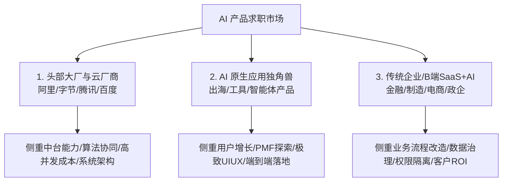

# 真实大厂与独角兽面经追问链复盘

> 本篇汇总了来自科技大厂（字节/阿里/腾讯/百度）、AI 原生独角兽（月之暗面/智谱/MiniMax/百川）以及头部出海与 B 端团队的真实面试复盘。
> 
> 在 2024~2026 年的 AI PM 面试中，考点已经从早期的“问大模型概念（什么是 Temperature/Embedding）”全面演进为 **“追问生产环境真实脏数据处理、评测闭环构建、Token 成本控制与业务 ROI 落地”**。

---

## 一、 三类主流招聘方的面试画像与考察侧重

| 企业类型 | 典型岗位方向 | 核心考察偏好 | 面试淘汰率最高点 |
| :--- | :--- | :--- | :--- |
| **头部大厂与云平台** | 模型平台 PM、AI 中台 PM、企业级 Copilot PM | - 复杂的跨职能协同与算法沟通 - 评测体系（Eval）与基准建设 - 百万级并发与 Token 成本极致优化 | 只会写 PRD，不懂算法边界与底层工程架构，无法应对深挖。 |
| **AI 原生应用独角兽** | C 端 AI 原生应用 PM、AI 搜索/生图 PM、Agent PM | - 对最新模型能力（如多模态/推理模型）的极致敏锐度 - 极简的人机交互与流式体验打磨 - 留存率、病毒式增长与快速冷启动能力 | 习惯做传统重度功能，缺乏对 AI 不确定性交互的灵活创新。 |
| **传统业务 + AI 赋能** | 垂直行业 AI PM（金融/医疗/法律/客服/CRM） | - 传统业务痛点拆解与真伪需求甄别 - 私有化/混合云部署与企业权限合规 - 商业化毛利与人效 ROI 证明 | 满口算法八股，但落不到具体业务流程，做不出客户买单的方案。 |

---

## 二、 核心高频连环追问链（深度还原真实面试）

面试中，最能拉开候选人差距的往往不是第一个主问题，而是面试官针对你的回答进行的 **3~4 轮深挖追问（Follow-up Chains）**。以下提炼了三大最高频的追问链路：

### 追问链 1：RAG 落地与检索召回深挖

::: info 🎯 真实面试场景重现
- **主问题**：“在你的知识库项目中，如何保证用户问答的准确率？”
- 候选人回答：“我们搭建了基于向量数据库的 RAG 检索增强架构，通过召回文档片段传给大模型回答。”
:::

::: warning ⚠️ 核心连环追问点：
1. **追问 1（切分与解析）**：“你们知识库里如果有大量的嵌套表格、扫描件 PDF 或者跨页的长流程图，单纯按字符长度切分会把表格切碎导致含义丢失，你们是怎么做文档解析和 Chunking 的？”
2. **追问 2（召回策略）**：“如果用户输入的是专有名词或特定缩写（如产品内部型号代号），向量语义检索经常召回不准，你们怎么解决？”
3. **追问 3（冲突处理）**：“如果检索出来的 Top-3 片段中，有一篇是 2023 年旧制度，一篇是 2025 年新制度，内容直接冲突，你怎么确保模型给出最新最准确的答案？”
4. **追问 4（指标闭环）**：“你们怎么衡量‘检索没召回’和‘召回了但模型胡说八道’各自的比例？这俩问题由谁负责修？”
:::

::: tip 💡 通关答题要点
- 点出 **Layout-aware 智能解析** 与 **父子切块（Parent-Child Chunking）**；
- 强调 **Dense（向量） + Sparse（BM25） + Rerank 重排序** 的混合检索方案；
- 引入 **文档时效性 Metadata 时间衰减加权** 与知识治理下架机制；
- 明确划分 **Context Relevance（检索层算法责任）** 与 **Faithfulness（生成层 Prompt/模型责任）** 的归因界限。
:::

---

### 追问链 2：评测体系与 Bad Case 治理深挖

::: info 🎯 真实面试场景重现
- **主问题**：“你们上线前是怎么做模型评测的？怎么判断新版本可以上线？”
- 候选人回答：“我们构建了一个 500 道题的评测集，用大模型和人工打分，准确率达到 90% 就可以上线。”
:::

::: warning ⚠️ 核心连环追问点：
1. **追问 1（评测集构建）**：“这 500 道题是怎么来的？如果大部分都是简单的高频问答，怎么防止评测集虚高‘刷分’？”
2. **追问 2（LLM-as-a-Judge 偏置）**：“你说用大模型当裁判打分，大模型本身有‘位置偏置’和‘字数多就打高分’的偏好，你怎么纠偏？”
3. **追问 3（回归退化）**：“算法同学为了修复线上某一个严重 Bad Case 改动了 Prompt，导致评测集里原本能答对的另外 5 道题答错了，这个版本能发吗？你们的容忍阈值是什么？”
:::

::: tip 💡 通关答题要点
- 阐述 **分层抽样原则**（头部流量 40% + 复杂长尾 30% + 越权与拒答边界 15% + 对抗安全 15%）；
- 给出 **LLM-as-a-Judge 纠偏方案**（正反位置双向交换盲测、固定 Few-shot 打分细则 Rubric、定期计算与人类专家打分的 Kappa 一致性系数）；
- 阐明 **CI/CD 自动化回归机制与阻断门禁**（核心关键用例 0 退化容忍度，综合 F1 波动 $< 1\%$）。
:::

---

### 追问链 3：商业化与 ROI 落地深挖

::: info 🎯 真实面试场景重现
- **主问题**：“这个 AI 功能上线后，为公司带来了什么业务价值？”
- 候选人回答：“提升了员工工作效率，用户满意度很高，日均调用量达到了几万次。”
:::

::: warning ⚠️ 核心连环追问点：
1. **追问 1（价值量化）**：“‘提升了效率’怎么量化？折算成具体节省的工时是多少？这部分释放的人力转化为实际收益了吗？”
2. **追问 2（成本核算）**：“日均几万次调用，每次调用平均消耗多少输入/输出 Token？算上 GPU/云服务成本，单次任务的边际成本是多少？算过毛利率吗？”
3. **追问 3（商业决策）**：“如果业务方告诉你，他们其实用一套几千块钱的自动化 Python 脚本也能完成 80% 的工作，你如何向高管证明继续投入几十万做 AI 大模型的必要性？”
:::

::: tip 💡 通关答题要点
- 给出清晰的 **FTE（全职人力等效）折算逻辑与端到端工单解决时长降幅**；
- 详述 **Token 成本分层治理**（通过模型路由将 70% 高频简单请求分流至廉价小模型，单次会话成本控制在分/厘级）；
- 对比说明 **AI 的核心壁垒在于‘应对高度非结构化、长尾多变自然语言’的泛化适应力**，这是传统硬编码脚本无法规模化维护的。
:::

---

## 三、 面试高频被挂点与通关 Checklist

通过对多份未通过面试案例的复盘，总结出候选人最常踩的“四大雷区”：

| 典型翻车表现 | 面试官真实内心 OS | 正确应对策略 |
| :--- | :--- | :--- |
| **1. 简历全篇堆砌热词（Agent/RAG/MCP/Fine-tune）** | “问两个具体参数和切分策略就答不上来，明显只是浅层调包调用，没有深入思考。” | 简历中少堆技术词，讲清**业务痛点、选型对比（为什么不用更简单方案）、指标与踩坑教训**。 |
| **2. 把大模型当成百分之百准确的魔法** | “完全没有做生产环境落地的经验，对概率性错误、幻觉和长尾缺乏敬畏。” | 始终强调**‘确定性工程托底不确定性模型’**，主动阐述人机协同、拒答机制与降级策略。 |
| **3. 只讲技术实现，缺乏业务与数据闭环** | “更像一个算法助理，而不是能对商业结果和用户体验负责的产品经理。” | 随时将算法指标（如准确率 92%）翻译为业务指标（如自助解决率 38%、人效提升 2.5 倍）。 |
| **4. 无法清晰说明自己的独特贡献** | “整个项目都是算法主导，看不出产品经理在里面起到了什么关键决策作用。” | 突出自己在**需求真伪甄别、黄金评测集构建、交互创新（UX）、Bad Case 归因与跨部门协同**中的主导价值。 |
