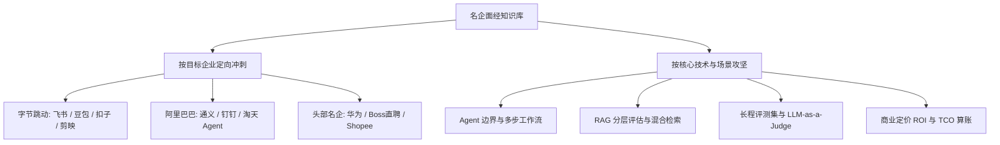

# 真实名企 AI 产品经理面经与真题推演专栏

::: info 📌 专栏导读与个人实践说明
本专栏为个人在 AI 产品经理领域的 **「每周深度刻意练习与真实大厂真题推演」**。

所有题目均来源于一线名企（字节跳动、阿里巴巴、华为、淘天集团、钉钉、Boss直聘、Shopee 等）的真实社招面试复盘。针对每一道真题，均结合了一线生产环境中的**业务逻辑、工程边界约束（如幂等、权限、降级、时效）、评测数据与口述纪律**进行了二次重构与深度解答，旨在建立高标准的 AI PM 实战解题框架。
:::

---

## 📅 每周面经归档索引（持续扩容更新）

| 归档归属 | 覆盖周期 | 包含专场与重点方向 | 题目数量 | 直达链接 |
| :--- | :--- | :--- | :--- | :--- |
| **2026 年第 36 周** | 2026.08.28 ~ 2026.09.02 | • DeepSeek 峰谷定价与商业化 • 字节剪映/豆包与钉钉 AI 助手 • 淘天与美团图灵长程 Agent 评测 • 腾讯微信流式风控 / 可灵视频大模型 • Kimi 深度搜索与滴滴/蚂蚁等名企真题 | 80 题 | [查看 2026-W36 深度面经](/interview/experiences/2026-w36) |
| **2026 年第 35 周** | 2026.08.24 ~ 2026.08.27 | • 白板 Agent 设计与三问法则 • 字节飞书多维表格与 Agent 弊端 • 阿里通义 Agent 与记忆分层成本 • 华为 AI Agent 二面与金融写操作接管 | 40 题 | [查看 2026-W35 深度面经](/interview/experiences/2026-w35) |

---

## 🧭 按核心能力与企业分类快速检索

### 1. 字节跳动专场（飞书 / 豆包 / 扣子 Coze / 剪映）
- **Agent 选型**：工作中有搭 Agent，为什么不用 Workflow 或 Prompt+大模型？$\rightarrow$ [W35-题1](/interview/experiences/2026-w35#题-1-为什么搭了-agent-不用-workflow--prompt)
- **多维表格**：飞书多维表格用过哪些模块？AI 字段与自动化如何协同？$\rightarrow$ [W35-题4](/interview/experiences/2026-w35#题-4-飞书多维表格用过哪些模块)
- **产品落地**：在抖音/剪映中深度集成 AI 脚本生成，需与技术对齐什么？$\rightarrow$ [W36-题25](/interview/experiences/2026-w36#题-25-在-抖音-剪映-深度集成-ai-脚本生成产品要和技术对齐什么)
- **增长指标**：AI 功能上线后，次日/首周/首月分别看哪些核心数据？$\rightarrow$ [W36-题21](/interview/experiences/2026-w36#题-21-上线-ai-新功能后次日-首周-首月分别看哪些核心数据)

### 2. 阿里巴巴与 ToB 协同专场（通义 Agent / 钉钉 AI / 淘天）
- **记忆成本**：长期记忆中向量检索成本与召回精度如何权衡？$\rightarrow$ [W35-题21](/interview/experiences/2026-w35#题-21-长期记忆成本与召回精度权衡)
- **Agent vs RPA**：哪些具体场景必须上 Agent，而不是继续用 RPA？$\rightarrow$ [W35-题23](/interview/experiences/2026-w35#题-23-哪些具体场景必须上-agent-而不是继续用-rpa)
- **数据安全**：钉钉 AI 助手旁听会议的隐私顾虑与权限第一原则 $\rightarrow$ [W36-题33](/interview/experiences/2026-w36#题-33-会旁听会议的-ai-员工隐私顾虑如何用产品设计建立信任)
- **淘天 Agent**：单次 LLM 打分算不算 Agent，评测指标差在哪？$\rightarrow$ [W36-题41](/interview/experiences/2026-w36#题-41-单次-llm-打分算不算-agent评测指标差在哪)

### 3. 评测体系与治理专场（华为 / 美团图灵 / 质量监控）
- **高危接管**：金融写操作 JSON 结构异常时，人工接管流程设计 $\rightarrow$ [W35-题33](/interview/experiences/2026-w35#题-33-金融写操作-json-异常时人工接管怎么设计)
- **过程归因**：选错工具但最终结果碰巧对，数据该如何归因？$\rightarrow$ [W35-题35](/interview/experiences/2026-w35#题-35-选错工具但结果正确这类数据该如何归因)
- **长程评测**：为什么长程 Agent 评测不能只看最终答案（美团图灵方法论）$\rightarrow$ [W36-题45](/interview/experiences/2026-w36#题-45-为什么-agent-评测不能只看最终答案结果-过程-效率-安全)

### 4. 商业模式与定价（DeepSeek 峰谷定价 / ROI）
- **算力经济**：DeepSeek 开始峰谷定价，怎么看 AI 商业模式演进？$\rightarrow$ [W36-题1](/interview/experiences/2026-w36#题-1-deepseek-峰谷定价你怎么看-ai-商业模式)
- **计费选型**：Token 计费 vs 订阅制如何选择与组合？$\rightarrow$ [W36-题7](/interview/experiences/2026-w36#题-7-token-计费-vs-订阅制怎么选)
- **自动化边界**：为什么企业场景不能承诺 100% 自动化？$\rightarrow$ [W36-题10](/interview/experiences/2026-w36#题-10-为什么不能-100-自动化怎么灰度放量)
