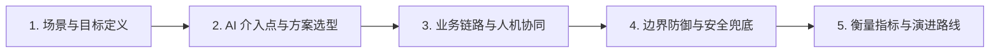
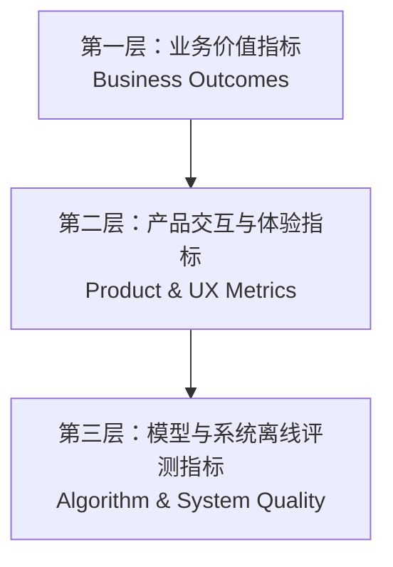
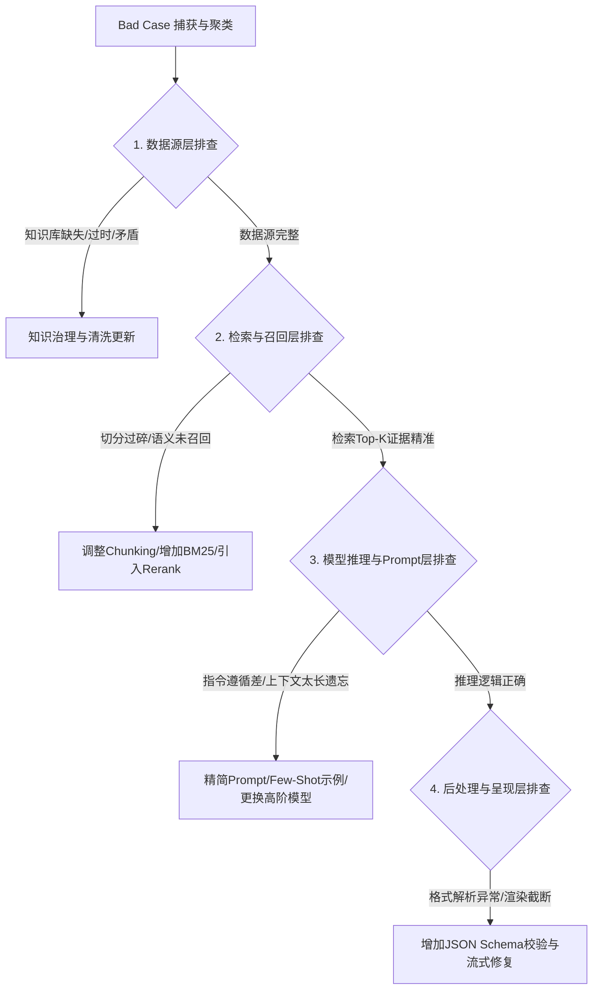

# AI 产品经理面试黄金答题框架

在 AI 产品经理面试中，面试官最反感的两类回答是：**“把大模型当魔法的空洞畅想”** 与 **“背诵算法八股的工程师视角”**。

优秀的 AI 产品经理回答，必须体现出清晰的**系统化思维（Structured Thinking）**、**技术边界感知（Technical Boundary）**以及**工程与业务闭环能力（Business & Engineering Feasibility）**。

本篇提炼了 AI 产品经理在面试中的 **五套核心解题框架**。掌握这些结构，能让你在面对任何陌生的 AI 面试题时都能从容破题。

---

## 1. AI 产品与场景设计框架：五维系统设计法

当面试官提出 *“请你从 0 到 1 设计一个企业 AI 知识库 / 智能客服 Bot / AI 搜索产品”* 时，切忌一上来就罗列功能。建议按照以下五步递进展开：



::: info 🎯 框架拆解与要点
1. **场景与目标定义（Context & Goal）**：
   - 用户是谁？在什么具体业务节点遇到痛点？
   - 核心任务是什么？期望达成什么商业目标（提效/降本/增收）？
2. **AI 介入点与方案选型（AI Value & Architecture）**：
   - 为什么必须用 AI？传统规则/搜索引擎为什么做不好？
   - 技术路径选型：Prompt 工程 / RAG 检索增强 / Agent 工具链 / 微调微调？开源模型还是商用 API？为什么？
3. **业务链路与人机协同（Workflow & Human-in-the-loop）**：
   - 输入端：多模态/长文本/用户意图理解与分流。
   - 处理端：知识检索、工具调用、Agent 拆解步骤。
   - 交互端（UX）：生成式流式输出、中间状态可见性、人工确认（HITL）机制、结果可编辑性。
4. **边界防御与安全兜底（Safety & Fallback）**：
   - 模型幻觉与未命中如何处理（拒答机制/置信度门槛/转人工）？
   - 敏感信息过滤、数据隐私与企业多租户权限隔离。
5. **衡量指标与演进路线（Metrics & Roadmap）**：
   - 离线质量指标（准确率/召回率/评测集评分） + 在线业务指标（答案采纳率/自助解决率/ROI）。
   - MVP 验证范围及后续迭代规划。
:::

::: tip 💡 高分表达金句
> “在设计任何 AI 原生功能时，我始终坚持 **‘确定性兜底不确定性’** 的原则：用传统工程与规则系统保证流程下限，用大模型泛化能力拉高体验上限，并在核心卡点设置人机协同闭环。”
:::

---

## 2. 项目经历与深挖表达：STAR-D 框架

面对 *“讲一个你做过最成功/最具挑战的 AI 项目”* 时，传统的 STAR 框架容易陷入单纯叙事，必须加入 **D (Decision & Trade-off，决策与权衡反思)**。

```markdown
- **S (Situation 业务背景)**：业务面临的核心瓶颈，现有方案的局限与代价。
- **T (Task 核心目标)**：量化的业务目标与技术交付边界（切忌空泛写“实现智能化”）。
- **A (Action 关键动作与架构决策)**：
  - 技术方案选型：为什么选用此技术栈（如放弃微调改用 GraphRAG + 混合检索）？
  - 核心攻坚点：切分策略、Prompt 结构、工具链编排、冷启动数据治理。
  - 协同与推进：如何与算法、工程及业务一线对齐交付标准。
- **R (Result 业务与质量成果)**：
  - 质量指标：评测集分数提升、采纳率、准确率。
  - 业务结果：工单处理提效 X%、挽回流失率 Y%、成本降低 Z（可核验数据）。
- **D (Decision & Reflection 关键决策与教训复盘)**：
  - 项目中最艰难的技术/产品权衡是什么？
  - 最大的 Bad Case 事故或踩坑教训是什么，如何建立长效防护机制？
```

::: warning ⚠️ 避坑提示
- ❌ **千万不要只讲 Demo 效果**，面试官最看重上线到生产环境后遇到的真实摩擦（如并发成本激增、长尾幻觉爆发、业务方信任危机）。
- ❌ **不要把“接入了 OpenAI/DeepSeek API”当成自己的核心贡献**，要讲清系统编排、评测闭环、Prompt 迭代和人机交互上的关键产品决策。
:::

---

## 3. 评估与指标体系设计：三层金字塔框架

当面试官问 *“你怎么评估这个 AI 产品的效果好不好？”* 或 *“上线前后怎么监控质量？”* 时，使用三层金字塔模型作答：



::: info 🎯 三层指标体系拆解
1. **第三层：底层算法与系统质量（离线与近线评测）**：
   - **RAG 场景**：检索上下文相关性（Context Relevance）、生成忠实度（Faithfulness，无幻觉）、答案相关性（Answer Relevance）。
   - **分类/抽取场景**：Precision、Recall、F1-score、字段准确率。
   - **工程性能**：TTFT（首字延迟）、TPOT（吞吐延迟）、单次会话 Token 消耗成本。
2. **第二层：产品交互与行为指标（在线行为监控）**：
   - **显式反馈**：点赞率 / 点踩率 / 一键复制率 / 重新生成率 / 修改后采纳率。
   - **隐式行为**：多轮会话轮数、放弃率、人工编辑距离（Levenshtein Distance）。
3. **第一层：最终业务价值（商业与组织影响）**：
   - **降本提效**：端到端工单解决时长缩短 %、人工替代率、单任务综合成本降低。
   - **增收与转化**：转化率提升、用户留存增加、NPS（净推荐值）变化。
:::

---

## 4. 业务可行性与场景选型论证框架：四象限评估法

当被问到 *“老板/业务方想在 XX 场景上大模型，你觉得合适吗？怎么判断？”* 时，使用**技术确定性**与**错误容忍度**双轴进行四象限评估：

| 错误容忍度 \ 任务确定性 | **任务高度确定（有标准规则/公式）** | **任务高度发散（需语义理解与泛化）** |
| :--- | :--- | :--- |
| **低容忍度（金融合规/医疗诊断/财务计税）** | **传统代码/规则引擎**<br>（绝对不用 LLM，成本高且不稳定） | **大模型生成 + 强制规则校验 + 人工确认 (HITL)**<br>（如智能合同审查辅助、法务条款初筛） |
| **高容忍度（头脑风暴/文案初稿/闲聊陪伴）** | **简单脚本/模版工具**<br>（轻量自动化即可） | **大模型的主战场（AI 原生体验）**<br>（如广告营销文案生成、游戏 NPC 对话、智能头脑风暴） |

::: tip 💡 判定场景是否适合 AI 的“三问法则”
1. **非 AI 方案是否已经能很好解决？**（如果 SQL 或正则表达式就能搞定，绝不用大模型）。
2. **错误成本是否在业务承受范围内？**（是否有低成本的人工校验或系统兜底路径）。
3. **边际成本与边际收益是否可算清？**（单次 Token 调用成本 + 运维成本，是否显著低于节约的人工工时或带来的新增收益）。
:::

---

## 5. Bad Case 归因与闭环排查框架：四层漏斗法

当被问到 *“上线后用户反馈 AI 给出的答案错误百出，你怎么排查和解决？”* 时，切忌回答“改改 Prompt 或重新微调”，必须按四层漏斗逐级定位：



::: warning ⚠️ 面试官最看重的长效机制
解决完单个 Bad Case 不是结束，高分回答一定要带上 **“防退化闭环”**：
- 将每一个典型 Bad Case 转为标准评测集用例（Golden Case）。
- 每次 Prompt 或算法管线变更时，自动化跑一遍回归测试集，确保“修复一个 Bug 不会搞坏其他九个 Case”。
:::
