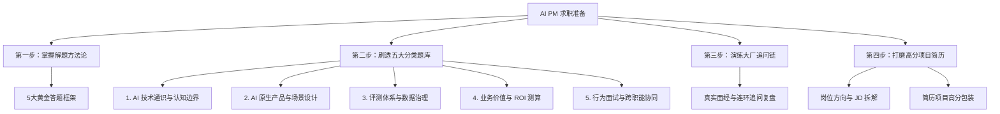

# AI 产品经理面试与求职指南

欢迎来到 AI 产品经理面试指南模块。
本模块系统整理了 AI 产品经理在求职面试中的**核心考察维度、经典题型解题框架、高频分类题库精析、名企实战面经以及项目经历表达范例**，帮助你建立结构化的面试准备体系。

---

## 🗺️ 面试准备全景导航

---

## 📚 核心模块索引

### 1. 黄金解题方法论
在开始刷题前，先掌握通用的思考骨架，遇到任何陌生题目都能从容应对：
- [AI 产品经理面试黄金答题框架](/interview/frameworks) —— 掌握系统设计五步法、STAR-D 项目深挖框架、指标金字塔与 Bad Case 闭环排查法。

### 2. 模块化高频题库精析（五步解题卡）
每道精选题均采用 **🎯 核心考察意图 + 💡 参考回答示范 + ⚠️ 踩坑提示与高频追问链** 的标准结构：
- [① AI 技术通识与认知边界](/interview/questions/ai-tech) —— 大模型原理、RAG vs 微调选型、幻觉治理、Function Calling & MCP 协议。
- [② AI 原生产品与场景设计](/interview/questions/product-design) —— 企业知识库、销售 Agent 工作流、AI 搜索、人机协同与优雅降级。
- [③ 评测体系、指标与数据治理](/interview/questions/eval-and-data) —— 黄金评测集构建、LLM-as-a-Judge 纠偏、指标看板与 RCA 归因。
- [④ 业务价值、场景选型与 ROI](/interview/questions/business-roi) —— 伪需求识别、开源自建 vs 商业 API 选型、B 端数据安全与 ROI 测算。
- [⑤ 行为面试、项目深挖与跨职能协同](/interview/questions/behavioral-projects) —— 算法瓶颈破局、线上重大事故复盘、转型差异化优势表达。

### 3. 名企真题与每周深度推演（持续更新）
- [🔥 真实名企面经推演专栏总览](/interview/experiences/) —— 字节、阿里、华为、淘天、钉钉、Boss直聘等名企社招真题与口述库。
- [📅 2026-W36 周报（8.28~9.01）](/interview/experiences/2026-w36) —— DeepSeek峰谷定价、剪映短视频脚本集成、钉钉AI数据安全、淘天长程Agent评测（50题）。
- [📅 2026-W35 周报（8.24~8.27）](/interview/experiences/2026-w35) —— 白板Agent设计、飞书多维表格、通义Agent记忆成本、华为金融写操作评测（40题）。
- [💡 大厂高频追问链复盘](/interview/experience-summary) —— 深度还原 RAG 落地、评测体系与商业化三大连环追问链。

### 4. 岗位洞察与简历包装
- [AI 产品经理细分岗位方向与 JD 拆解](/interview/roles) —— 模型层 / 应用层 / 中台层 / 评测层能力模型对照与求职策略。
- [简历项目包装与高分表达范例](/interview/resume-projects) —— 掌握 STAR-E 高分公式、避雷对照表与三大标杆级项目实写模板。

---

::: tip 💡 备考建议
建议学习顺序：**掌握框架 $\rightarrow$ 刷透分类题库 $\rightarrow$ 针对目标岗位修改简历 $\rightarrow$ 对照大厂追问链进行模拟面试（Mock Interview）**。
:::
