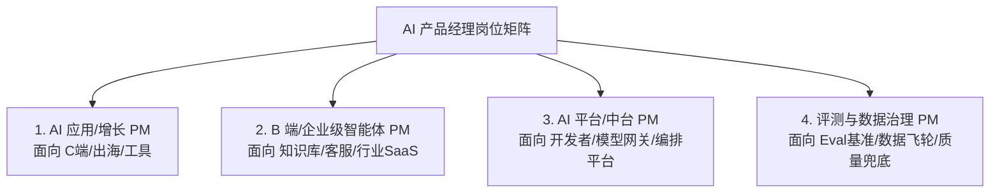

# AI 产品经理细分岗位方向与 JD 深度拆解

“AI 产品经理”不是一个单一的岗位，不同细分方向对技术深度、业务理解与工程协同的要求差异极大。
了解各方向的**核心职责、JD 真实诉求与面试考核侧重点**，能够帮助你在简历与面试中做到“精准卡位”。

---

## 一、 AI PM 四大细分方向全景对比

| 细分方向 | 核心业务场景 | 核心考核硬实力 | 适合人群画像 |
| :--- | :--- | :--- | :--- |
| **① AI 原生应用 PM** | C 端 AI 搜索、内容生成、智能体陪伴、出海效率工具 | 极简人机交互（UI/UX）、Prompt 体验打磨、用户增长漏斗、病毒式传播机制 | 传统 C 端产品经理、增长 PM、交互体验设计背景 |
| **② B 端企业智能体 PM** | 企业知识库、智能客服、销售/合同 Copilot、垂直行业 AI 方案 | 复杂业务流程梳理、系统权限隔离、客户交付落地、人效 ROI 测算模型 | 传统 B 端 SaaS 产品、企业中台 PM、行业咨询顾问 |
| **③ AI 平台与中台 PM** | 大模型纳管平台、API 网关、Agent 低代码编排画布、模型路由引擎 | LLM 生态与协议理解（MCP/Function Calling）、高并发工程架构、成本控制与开发者体验（DX） | 技术背景出身（研发/架构师转型）、开放平台 PM |
| **④ 评测与数据治理 PM** | 黄金评测基准库（Eval Benchmark）、数据标注飞轮、Bad Case 闭环流转 | 统计学指标体系、LLM-as-a-Judge 纠偏、数据标注一致性把控、CI/CD 自动化门禁 | 数据产品经理、策略产品经理、算法测试专家 |

---

## 二、 典型岗位 JD 深度拆解与答题侧重

### 1. AI 应用层产品经理（To C / 出海）

::: info 📋 典型 JD 要求提炼
- **岗位职责**：负责 AI 创作/搜索/对话产品的端到端设计，探索生成式技术在用户日常场景中的高频切入点；持续优化流式响应、人机交互与首屏生成体验；制定冷启动与留存增长策略。
- **面试考核重心**：
  1. 能否用极简的交互解决大模型输入门槛高（Prompt 编写难）的问题；
  2. 如何在用户遇到生成不满意（Bad Case）时降低流失；
  3. 产品的首次成功体验（First-Mile Experience）与付费转化漏斗。
:::

::: tip 💡 核心准备建议
- **重点讲交互细节**：例如如何用预置建议词（Prompt Chips）、划词润色、画布双栏（Canvas）降低认知负荷。
- **准备一个高频场景**：讲清“用户在什么时刻使用 $\rightarrow$ 首次生成如何惊艳 $\rightarrow$ 为什么会反复回来 $\rightarrow$ 为什么愿意订阅付费”。
:::

---

### 2. B 端企业级 AI 产品经理（To B / Enterprise）

::: info 📋 典型 JD 要求提炼
- **岗位职责**：负责企业知识库、智能客服、业务 Copilot 等生产力工具的产品规划与交付；与企业客户、业务一线对齐需求边界；设计安全合规、权限隔离与运营后台；对客户满意度与人效 ROI 负责。
- **面试考核重心**：
  1. 对企业业务流程的深刻理解，能否分清核心主流程与长尾分支；
  2. 多租户权限、数据脱敏与数据合规能力；
  3. 如何向企业决策者证明投资回报率（ROI）并推动一线员工实际采纳。
:::

::: tip 💡 核心准备建议
- **讲流程、权限、交付与 ROI**：不要只讲模型多么智能，必须详细说明角色划分、现有 IT 系统集成（CRM/ERP/OA）、上线推进阻力与实际释放的 FTE 人力。
- **准备一个真实冲突案例**：例如业务一线员工担心被 AI 取代而抵触使用，你如何通过人机协同激励机制破局。
:::

---

### 3. AI 平台与中台产品经理（Platform & Infra）

::: info 📋 典型 JD 要求提炼
- **岗位职责**：负责公司内部大模型中台/Agent 编排平台的产品建设；提供统一的模型调用网关、模型路由（Routing）、Prompt 模板管理、知识库检索与工具链集成能力；降低上层业务接入 AI 的研发成本。
- **面试考核重心**：
  1. 技术架构认知：理解 Token 计费、并发限流（Rate Limit）、KV Cache 优化与模型路由机制；
  2. 开发者体验（DX）：API 接口设计的一致性、文档与 SDK 质量、中间件生态（如 MCP 协议兼容）。
:::

::: tip 💡 核心准备建议
- **突出工程化与成本意识**：展示你如何通过设计模型路由（小模型意图分流 + 大模型兜底），为全公司节省数十万元的 API 调用成本。
:::

---

## 三、 面试前三份核心准备材料（必背）

::: warning ⚠️ 面试前务必在脑海中固化以下三份材料：
1. **一个最强主打项目的 10 分钟完整叙述**：严格按照 STAR-D 框架准备，包含业务痛点、为什么不用传统方案、方案选型、评测集数据、可核验的业务成果与最大的复盘教训。
2. **两个真实的团队冲突/踩坑案例**：
   - *案例 A*：与算法团队在评测标准或上线指标上的博弈与达成共识过程；
   - *案例 B*：上线后遭遇线上长尾幻觉客诉，如何四层排查并建立长效防退化机制。
3. **一个针对目标公司的行业 AI 方案提案**：
   - 提前研究目标公司的核心业务线，构思一个高价值 AI 赋能场景（列出目标、非目标、AI 介入点、人机交互与衡量指标）。
:::
